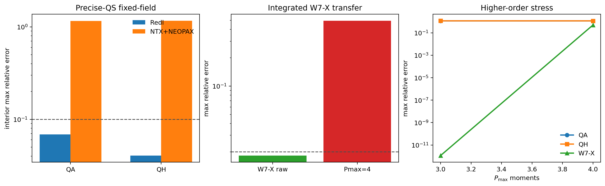

[](https://github.com/uwplasma/NTX/releases)
[](https://github.com/uwplasma/NTX/blob/main/LICENSE)
[](https://github.com/uwplasma/NTX/actions/workflows/tests.yml)
[](https://ntx.readthedocs.io/en/latest/)
[](https://ntx.readthedocs.io/en/latest/testing.html)
[](https://pypi.org/project/ntx/)

# NTX

NTX is a JAX-native monoenergetic neoclassical transport solver for stellarator
flux surfaces. It implements the Legendre-space formulation described in Javier
Escoto's PhD thesis, [Fast monoenergetic neoclassical transport coefficients in
stellarators](https://arxiv.org/abs/2510.27513).

NTX is intended to be useful in two modes:

- a straightforward command-line workflow for production solves
- an imported Python/JAX workflow for scans, autodiff, optimization, NEOPAX
  coupling, and throughput-oriented parallel execution

## Fastest Start

Install:

```bash
python -m pip install ntx
```

Run the smallest bundled case:

```bash
ntx examples/example_surface.toml
```

That command:

- prints a Rich summary to the terminal
- solves one monoenergetic case
- writes `examples/example_surface.npz`

Inspect the output graphically:

```bash
python examples/plot_output_npz.py examples/example_surface.npz
```

## What NTX Computes

For a single flux surface and monoenergetic case, NTX computes:

- `D11`
- `D31`
- `D13`
- `D33`
- `D33_spitzer`

plus diagnostics and, optionally, the low-order Legendre modes used in the
coefficient calculation.

## Physics Gates

NTX keeps solver-side and closure-side validation separate.

The active gate hierarchy is:

- analytical identities:
  - Onsager symmetry
  - exact generated `P=2` Sonine/Hankel recovery of the current three-moment
    closure
  - fixed observable map `U_parallel = n c_0`
- independent-code comparison gates:
  - precise-QS Redl vs archived SFINCS on the interior benchmark window
- integrated-workflow transfer gate:
  - rebuilt W7-X raw-branch imported workflow
- closure stress test:
  - precise-QS fixed-field `NTX+NEOPAX` current benchmark

Inspect the tracked artifact-backed gates locally:

```bash
python scripts/check_physics_gates.py
```

That report is the quickest way to see which comparisons are hard acceptance
gates and which are monitored closure stress tests.

## Installation

Basic install:

```bash
python -m pip install ntx
```

Editable install with test and docs tools:

```bash
python -m pip install -e ".[dev,docs,io]"
```

Install the optional JAX VMEC/Boozer geometry helpers directly when needed:

```bash
python -m pip install git+https://github.com/uwplasma/vmec_jax.git
python -m pip install git+https://github.com/uwplasma/booz_xform_jax.git
```

## Simplest Way To Run The Code

The main command is:

```bash
ntx input.toml
```

Minimal input file:

```toml
[surface]
type = "example"

[grid]
n_theta = 9
n_zeta = 9
n_xi = 8

[case]
nu_hat = 1e-2
epsi_hat = 0.0
```

The CLI writes a compressed `.npz` file containing:

- transport coefficients
- residual and Onsager diagnostics
- resolved electric-field normalization
- geometry arrays on the angular grid
- run metadata and the original input text

## Main Inputs

The CLI supports:

- the built-in analytic sample surface
- DKES-style Boozer harmonic files
- VMEC `wout` files through `vmec_jax`

Imported Python workflows additionally support direct Boozer-file loading and
in-memory surface construction.

Important numerical knobs:

- `n_theta`, `n_zeta`, `n_xi`
- `nu_hat`
- `epsi_hat` or `er_hat`
- VMEC radial and mode-selection options

Full schema:

- [docs/input-file.md](docs/input-file.md)

## Ways To Run NTX

### 1. CLI solve from TOML

```bash
ntx examples/sample_dkes.toml
ntx examples/sample_vmec.toml
```

### 2. Python single-case solve

```python
from ntx import GridSpec, MonoenergeticCase, example_surface, solve_monoenergetic

surface = example_surface()
grid = GridSpec(n_theta=17, n_zeta=25, n_xi=32)
case = MonoenergeticCase(nu_hat=1e-3, epsi_hat=0.0)
result = solve_monoenergetic(surface, grid, case)

print(result.D11, result.D31, result.D13, result.D33)
```

### 3. Batched differentiable JAX scans

```python
import jax.numpy as jnp
from ntx import GridSpec, example_surface, solve_monoenergetic_scan

surface = example_surface()
grid = GridSpec(17, 25, 16)
nu_hat = jnp.logspace(-5, -2, 8)
epsi_hat = jnp.zeros_like(nu_hat)
coefficients = solve_monoenergetic_scan(surface, grid, nu_hat, epsi_hat=epsi_hat)
```

### 4. Throughput-oriented multiprocess scans

```python
import jax.numpy as jnp
from ntx import GridSpec, example_surface, solve_monoenergetic_multiprocess_scan

surface = example_surface()
grid = GridSpec(17, 25, 16)
nu_hat = jnp.logspace(-5, -2, 64)
epsi_hat = jnp.zeros_like(nu_hat)
coefficients = solve_monoenergetic_multiprocess_scan(
    surface,
    grid,
    nu_hat,
    epsi_hat=epsi_hat,
    backend="cpu",
    workers=4,
)
```

### 5. NEOPAX coupling

NTX exposes direct scan builders and mapping helpers for NEOPAX-style
monoenergetic databases:

- `build_ntx_neopax_scan(...)`
- `build_ntx_neopax_scan_from_surfaces(...)`
- `scan_to_neopax_arrays(...)`
- `to_neopax_monoenergetic(...)`
- `write_neopax_scan_hdf5(...)`

Run:

```bash
python examples/neopax_with_ntx.py
```

### 6. Autodiff and optimization workflows

Run:

```bash
python examples/autodiff_inverse_problem.py
python examples/neopax_autodiff_profiles.py
python examples/derivative_audit.py
python examples/derivative_path_benchmark.py
python examples/geometry_family_breadth_summary.py
python examples/geometry_family_transport_convergence.py --preset paper
python examples/prepared_geometry_reuse_profile.py --preset paper
python examples/ambipolar_profile.py
python examples/ambipolar_profile_family.py
python examples/profile_control_optimization.py
python examples/profile_basis_optimization.py
python examples/profile_transport_loop.py
python examples/primitive_profile_transport.py
python examples/bootstrap_current_optimization.py
python examples/bootstrap_current_with_neopax.py
```

These generate figures for:

- inverse problems
- sensitivity analysis
- direct autodiff versus finite-difference derivative audits
- direct reverse-mode versus prepared custom-VJP derivative timing
- artifact-backed geometry-family derivative breadth status
- VMEC geometry-family `D11/D31/D33` convergence stress scans
- prepared-geometry and compiled-solver reuse performance profiling
- ambipolar residual landscapes and bootstrap-current-proxy profile solves
- controlled families of ambipolar and bootstrap-current-proxy profiles
- differentiable optimization of scalar profile controls
- low-dimensional radial-basis optimization of profile controls
- accepted-step transport iteration of the radial profile closure with radial smoothing
- primitive density/temperature transport workflows with explicit source-target closure
- differentiable bootstrap-current optimization
- radial bootstrap-current profiles from NTX + NEOPAX

The geometry-family breadth summary reads the committed analytic, file-backed,
boundary-projected, explicit-relaxed, and implicit-equilibrium derivative
artifacts and makes the current validation scope explicit:

- active stress cases stay below the committed derivative thresholds
- the implicit-volume objective closes on the committed QA case
- implicit Boozer and NTX transport objectives are closed as non-shipping
  diagnostics until residual contraction and tangent parity pass
- broad W7-X/QI/omnigenous geometry-family validation remains planned work


The direct VMEC geometry-family transport diagnostic discovers reusable local
examples from the surrounding `vmec_jax`, STELLOPT, and SIMSOPT checkouts and
runs a `D11/D31/D33` grid ladder:

```bash
python examples/geometry_family_transport_convergence.py --preset paper
```

The current artifact solves tokamak, precise-QS QA/QH, QI-style, W7-X
EIM/EJM, LHD, HSX, and NCSX-family cases when those local public inputs are
available. It is intentionally reported as a reduced NTX convergence stress
diagnostic, not as hidden parity with an independent solver; paper-resolution
independent parity and an owned W7-X KJM input remain explicit promotion
requirements.


## Bootstrap-Current Validation

Fixed-field precise-QS benchmark against archived SFINCS, SFINCS-JAX reruns,
Redl, and `NTX+NEOPAX`:

```bash
python examples/bootstrap_current_fixed_field_validation.py
```

This uses the local precise-QS Zenodo archive and writes:

- `docs/_static/bootstrap_current_fixed_field_validation.png`
- `docs/_static/bootstrap_current_fixed_field_validation.pdf`
- `docs/_static/bootstrap_current_fixed_field_validation.json`

The database-facing normalization now follows the actual NEOPAX loader path:

- `D11 -> D11 * drds^2`
- `D13 -> D13 * drds`
- `D33 -> nu * D33`

That closes the integrated W7-X database handoff, but it also makes the
precise-QS fixed-field benchmark a stricter closure test than before. On that
archive-backed benchmark, the present interior max relative errors versus
archived SFINCS are:

- QA: `1.16e+0`
- QH: `1.16e+0`

Redl remains closer on the same family (`6.86e-2` on QA and `4.06e-2` on QH,
interior-window metric). So this figure should now be read as a closure stress
test, not as a parity claim.

The benchmark keeps a monotone `PCHIP` radial postprocessing map by default,
since the interpolation audit showed that neither the final radial remap nor
the internal NTSS-style versus direct 3D interpolation choice is the dominant
error source here.

A dedicated W7-X rebuild audit now exists in:

- `examples/bootstrap_current_w7x_rebuild_audit.py`

That script rebuilds a NEOPAX-format W7-X database with NTX and compares it
against the shipped external database on the same momentum-corrected workflow.
With the physically correct `D13` database normalization, the integrated W7-X
transfer now closes on the raw branch:

- shipped external database: `1.18e-12` max relative error against the frozen
  W7-X reference current
- NTX-rebuilt W7-X, `d33_mode="raw"`: `6.58e-6`
- NTX-rebuilt W7-X, `d33_mode="spitzer"`: `5.77e-1`
- NTX-rebuilt W7-X, `d33_mode="conductivity_difference"`: `2.67e+0`

At the worst shipped W7-X coefficient points, the direct solver and the scan
builder both reproduce the frozen reference table on the benchmark grid
`25x25x63` to about `1e-6` relative error. Lower-resolution scans are
under-resolved, and blindly increasing the angular/Legendre grid does not
reproduce the frozen benchmark monotonically on every point, so the W7-X audit
is now anchored to the actual reference grid rather than to a naive
monotonic-refinement assumption.

The compact closure-validation report is now tracked in:

- `scripts/build_closure_validation_report.py`

It writes:

- `docs/_static/closure_validation_report.json`
- `docs/_static/closure_validation_report.txt`
- `docs/_static/closure_validation_report.png`
- `docs/_static/closure_validation_report.pdf`

and freezes the current model-family reading in one place:

- precise-QS Redl vs archived SFINCS stays inside the `1e-1` gate
- rebuilt W7-X raw-branch transfer stays inside the `2e-2` gate
- fixed-field `NTX+NEOPAX` remains a monitored closure stress test
- fixed-field closure diagnostics show that thermal-source reweighting can
  reduce the stress metric on the archive, but that diagnostic is not a
  transferable production closure
- the first `Pmax>2` tail extension remains rejected because it regresses W7-X




Streamlined radial-profile example with NEOPAX:

```bash
python examples/bootstrap_current_with_neopax.py
```

This shows the direct NTX scan -> NEOPAX closure workflow and writes:

- `docs/_static/bootstrap_current_with_neopax.png`
- `docs/_static/bootstrap_current_with_neopax.pdf`
- `docs/_static/bootstrap_current_with_neopax.json`


W7-X bootstrap-current convergence audit:

```bash
python examples/bootstrap_current_reference_audit_w7x.py
```

This rebuilds a reduced W7-X scan at several NTX resolutions and writes a
two-panel convergence figure showing the bootstrap-current profile and the
maximum relative error versus grid resolution:


## Parallelization

NTX supports:

- serial batched JAX scans
- guarded single-process device-parallel scans
- multiprocess CPU/GPU scans for larger throughput jobs

Current practical guidance:

- use serial batched JAX for small and medium studies
- compile and reuse prepared fixed-geometry closures for repeated
  monoenergetic scans and optimization loops
- use the multiprocess lane for larger throughput-oriented jobs

See:

- [docs/performance.md](docs/performance.md)
- [docs/gpu.md](docs/gpu.md)

## NEOPAX Connection

NTX is designed to provide monoenergetic coefficient tables to
[NEOPAX](https://github.com/uwplasma/NEOPAX). The dedicated interface is
documented in:

- [docs/neopax.md](docs/neopax.md)

## Documentation

Full documentation:

- [ntx.readthedocs.io/en/latest/](https://ntx.readthedocs.io/en/latest/)

## Local Quality Checks

```bash
python -m ruff check .
python -m mypy src/ntx
python -m pytest -q
python -m sphinx -b html docs docs/_build/html
```
