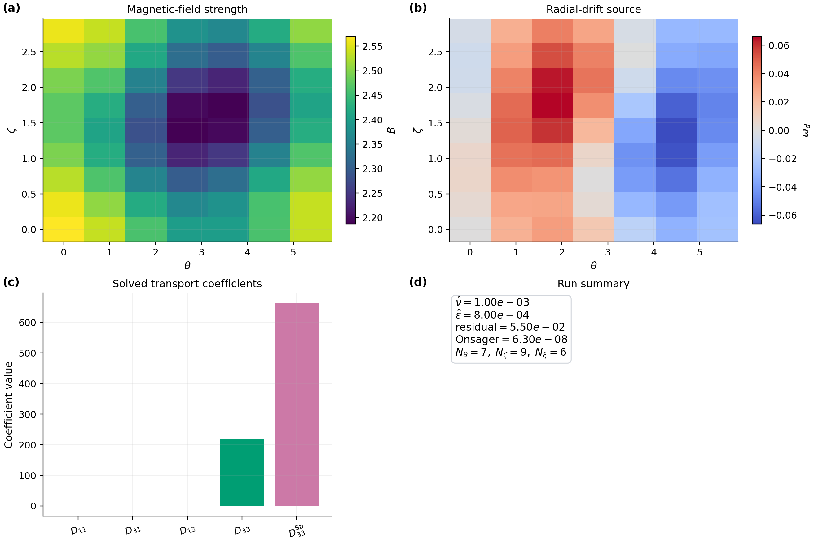

# NTX

NTX is a JAX-native monoenergetic neoclassical transport solver for stellarator
flux surfaces. It implements the Legendre-space formulation described in Javier
Escoto's PhD thesis, [Fast monoenergetic neoclassical transport coefficients in
stellarators](https://arxiv.org/abs/2510.27513).

NTX is intended to be useful in two modes:

- a straightforward command-line workflow for production solves
- an imported Python/JAX workflow for scans, autodiff, optimization, NEOPAX
  coupling, and throughput-oriented parallel execution

## Fastest Start

Install:

```bash
python -m pip install ntx
```

Run the smallest bundled case:

```bash
ntx examples/example_surface.toml
```

That command:

- prints a Rich summary to the terminal
- solves one monoenergetic case
- writes `examples/example_surface.npz`

Inspect the output graphically:

```bash
python examples/plot_output_npz.py examples/example_surface.npz
```

This writes a publication-style multi-panel summary figure.



## What NTX Computes

For a single flux surface and monoenergetic case, NTX computes:

- `D11`
- `D31`
- `D13`
- `D33`
- `D33_spitzer`

plus diagnostics and, optionally, the low-order Legendre modes used in the
coefficient calculation.

## Installation

Basic install:

```bash
python -m pip install ntx
```

Editable install with test and docs tools:

```bash
python -m pip install -e ".[dev,docs,io]"
```

Install the VMEC/Boozer geometry helpers:

```bash
python -m pip install -e ".[geometry]"
```

## Simplest Way To Run The Code

The main command is:

```bash
ntx input.toml
```

Minimal input file:

```toml
[surface]
type = "example"

[grid]
n_theta = 9
n_zeta = 9
n_xi = 8

[case]
nu_hat = 1e-2
epsi_hat = 0.0
```

The CLI writes a compressed `.npz` file containing:

- transport coefficients
- residual and Onsager diagnostics
- resolved electric-field normalization
- geometry arrays on the angular grid
- run metadata and the original input text

## Main Inputs

The CLI supports:

- the built-in analytic sample surface
- DKES-style Boozer harmonic files
- VMEC `wout` files through `vmec_jax`

Imported Python workflows additionally support direct Boozer-file loading and
in-memory surface construction.

Important numerical knobs:

- `n_theta`, `n_zeta`, `n_xi`
- `nu_hat`
- `epsi_hat` or `er_hat`
- VMEC radial and mode-selection options

Full schema:

- [docs/input-file.md](docs/input-file.md)

## Ways To Run NTX

### 1. CLI solve from TOML

```bash
ntx examples/sample_dkes.toml
ntx examples/sample_vmec.toml
```

### 2. Python single-case solve

```python
from ntx import GridSpec, MonoenergeticCase, example_surface, solve_monoenergetic

surface = example_surface()
grid = GridSpec(n_theta=17, n_zeta=25, n_xi=32)
case = MonoenergeticCase(nu_hat=1e-3, epsi_hat=0.0)
result = solve_monoenergetic(surface, grid, case)

print(result.D11, result.D31, result.D13, result.D33)
```

### 3. Batched differentiable JAX scans

```python
import jax.numpy as jnp
from ntx import GridSpec, example_surface, solve_monoenergetic_scan

surface = example_surface()
grid = GridSpec(17, 25, 16)
nu_hat = jnp.logspace(-5, -2, 8)
epsi_hat = jnp.zeros_like(nu_hat)
coefficients = solve_monoenergetic_scan(surface, grid, nu_hat, epsi_hat=epsi_hat)
```

### 4. Throughput-oriented multiprocess scans

```python
import jax.numpy as jnp
from ntx import GridSpec, example_surface, solve_monoenergetic_multiprocess_scan

surface = example_surface()
grid = GridSpec(17, 25, 16)
nu_hat = jnp.logspace(-5, -2, 64)
epsi_hat = jnp.zeros_like(nu_hat)
coefficients = solve_monoenergetic_multiprocess_scan(
    surface,
    grid,
    nu_hat,
    epsi_hat=epsi_hat,
    backend="cpu",
    workers=4,
)
```

### 5. NEOPAX coupling

NTX exposes direct scan builders and mapping helpers for NEOPAX-style
monoenergetic databases:

- `build_ntx_neopax_scan(...)`
- `build_ntx_neopax_scan_from_surfaces(...)`
- `scan_to_neopax_arrays(...)`
- `to_neopax_monoenergetic(...)`
- `write_neopax_scan_hdf5(...)`

Run:

```bash
python examples/neopax_with_ntx.py
```

### 6. Autodiff and optimization workflows

Run:

```bash
python examples/autodiff_inverse_problem.py
python examples/neopax_autodiff_profiles.py
python examples/derivative_audit.py
python examples/derivative_path_benchmark.py
python examples/ambipolar_profile.py
python examples/ambipolar_profile_family.py
python examples/profile_control_optimization.py
python examples/bootstrap_current_optimization.py
```

These generate publication-ready figures for:

- inverse problems
- sensitivity analysis
- direct autodiff versus finite-difference derivative audits
- direct reverse-mode versus prepared custom-VJP derivative timing
- ambipolar electric-field and bootstrap-current-proxy profile solves
- controlled families of ambipolar and bootstrap-current-proxy profiles
- differentiable optimization of scalar profile controls
- differentiable bootstrap-current optimization

For lower-level imported workflows, the prepared differentiable interface now
includes:

- `prepare_monoenergetic_system(...)`
- `solve_prepared_coefficient_vector(...)`
- `solve_prepared_coefficient_vector_vjp(...)`
- `examples/derivative_path_benchmark.py`
- `solve_ambipolar_er_profile(...)`
- `solve_ambipolar_profile_family(...)`
- `bootstrap_current_objective(...)`
- `apply_profile_control(...)`
- `optimize_profile_control(...)`
- `examples/ambipolar_profile.py`
- `examples/ambipolar_profile_family.py`
- `examples/profile_control_optimization.py`

## Bootstrap-Current Examples

Pure NTX workflow from VMEC or Boozer input to radial profiles:

```bash
python examples/bootstrap_current_from_vmec_or_boozmn.py
```

This plots:

- `D11`
- `D13`
- `nu_hat * D33`
- a compact bootstrap-current proxy


W7-X bootstrap-current convergence audit:

```bash
python examples/bootstrap_current_reference_audit_w7x.py
```

This rebuilds a reduced W7-X scan at several NTX resolutions and writes a
publication-ready convergence figure:


## Parallelization

NTX supports:

- serial batched JAX scans
- guarded single-process device-parallel scans
- multiprocess CPU/GPU scans for larger throughput jobs

Current practical guidance:

- use serial batched JAX for small and medium studies
- use the multiprocess lane for larger throughput-oriented jobs

See:

- [docs/performance.md](docs/performance.md)
- [docs/gpu.md](docs/gpu.md)

## NEOPAX Connection

NTX is designed to provide monoenergetic coefficient tables to
[NEOPAX](https://github.com/uwplasma/NEOPAX). The dedicated interface is
documented in:

- [docs/neopax.md](docs/neopax.md)

## Documentation

The full documentation in [`docs/`](docs/) covers:

- [installation](docs/install.md)
- [input schema and outputs](docs/input-file.md)
- [physics model and equations](docs/physics.md)
- [geometry handling](docs/geometry.md)
- [algorithm overview](docs/algorithm.md)
- [numerics and algorithms](docs/numerics.md)
- [source-code map](docs/source-map.md)
- [autodiff workflows](docs/autodiff.md)
- [profile workflows](docs/profiles.md)
- [examples](docs/examples.md)
- [validation](docs/validation.md)
- [testing and QA](docs/testing.md)
- [NEOPAX workflows](docs/neopax.md)
- [GPU](docs/gpu.md)
- [performance](docs/performance.md)
- [research roadmap](docs/research-roadmap.md)
- [publication figures](docs/manuscript.md)
- [literature](docs/literature.md)

## Local Quality Checks

```bash
python -m ruff check .
python -m mypy src/ntx
python -m pytest -q
python -m sphinx -b html docs docs/_build/html
```
