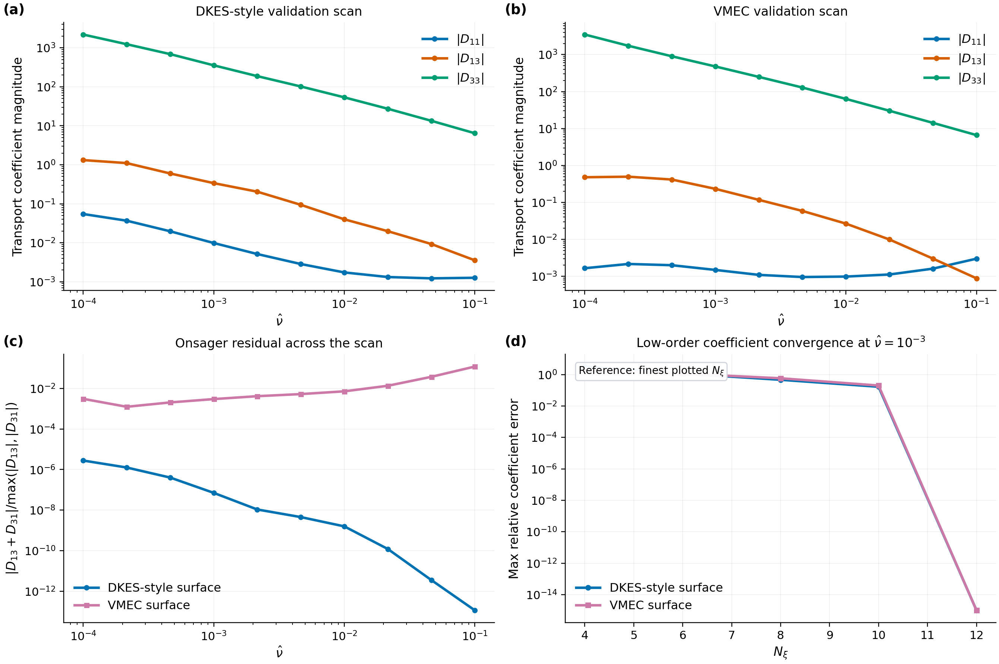
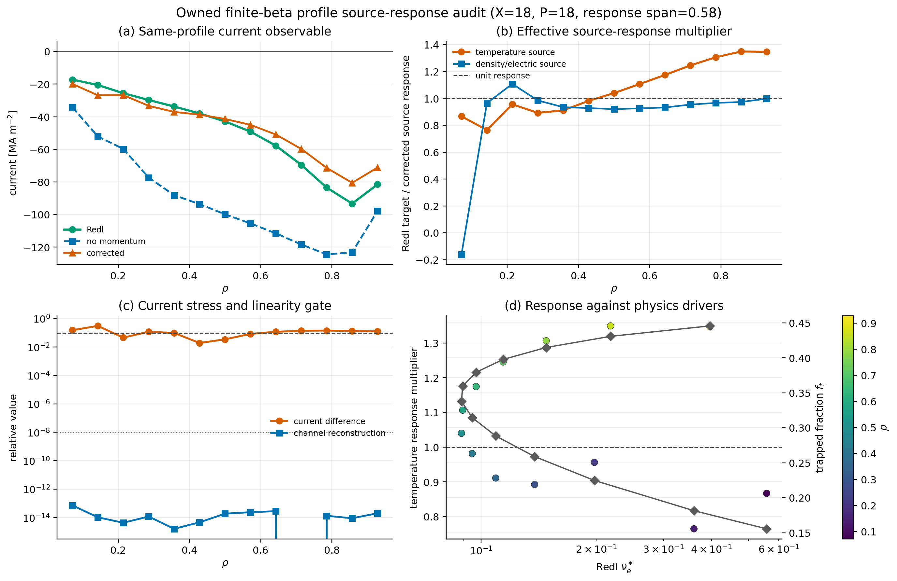

[](https://github.com/uwplasma/NTX/releases)
[](https://github.com/uwplasma/NTX/blob/main/LICENSE)
[](https://github.com/uwplasma/NTX/actions/workflows/tests.yml)
[](https://ntx.readthedocs.io/en/latest/)
[](https://ntx.readthedocs.io/en/latest/testing.html)
[](https://pypi.org/project/ntx/)

# NTX

NTX is a JAX-native monoenergetic neoclassical transport solver for stellarator
flux surfaces. It solves the Legendre-space formulation described in Javier
Escoto's PhD thesis, [Fast monoenergetic neoclassical transport coefficients in
stellarators](https://arxiv.org/abs/2510.27513).

Use NTX as:

- a command-line solver for file-backed transport calculations,
- a Python/JAX library for scans, autodiff, uncertainty propagation, and
  optimization,
- a NEOPAX-compatible monoenergetic database builder for bootstrap-current
  workflows.

## Install

```bash
pip install ntx
```

For local development:

```bash
pip install -e ".[dev,docs,io]"
```

Optional geometry-coupled examples use upstream JAX geometry tools:

```bash
pip install git+https://github.com/uwplasma/vmec_jax.git
pip install git+https://github.com/uwplasma/booz_xform_jax.git
```

## Quick Start

Run the smallest bundled case:

```bash
ntx examples/example_surface.toml --plot
```

This writes `examples/outputs/example_surface.nc` plus a PDF summary panel.
Choose the output format by filename:

```bash
ntx examples/example_surface.toml --output examples/outputs/example_surface.npz --plot
ntx examples/example_surface.toml --output examples/outputs/example_surface.h5 --plot
python examples/plot_output_file.py examples/outputs/example_surface.nc
```

Use NTX from Python:

```python
from ntx import GridSpec, MonoenergeticCase, example_surface, solve_monoenergetic

surface = example_surface()
grid = GridSpec(n_theta=17, n_zeta=25, n_xi=32)
case = MonoenergeticCase(nu_hat=1e-3, epsi_hat=0.0)

result = solve_monoenergetic(surface, grid, case)
print(result.D11, result.D31, result.D13, result.D33)
```

For JAX scans:

```python
import jax.numpy as jnp
from ntx import GridSpec, example_surface, solve_monoenergetic_scan

surface = example_surface()
grid = GridSpec(17, 25, 16)
nu_hat = jnp.logspace(-5, -2, 8)

coefficients = solve_monoenergetic_scan(
    surface,
    grid,
    nu_hat,
    epsi_hat=jnp.zeros_like(nu_hat),
)
```

## Outputs

For each monoenergetic case, NTX computes:

- `D11`, `D31`, `D13`, `D33`, and `D33_spitzer`,
- residual and Onsager diagnostics,
- resolved electric-field normalization,
- geometry arrays and run metadata in NetCDF, NPZ, or HDF5 outputs.

The input schema is documented in [docs/input-file.md](docs/input-file.md).

## Physics In One Paragraph

NTX solves the local monoenergetic drift-kinetic equation on one flux surface,
keeping parallel streaming, mirror force, radial-electric-field precession, and
Lorentz pitch-angle scattering at fixed speed. The unknown non-adiabatic
response is projected onto Legendre polynomials in pitch angle, giving the
block-tridiagonal system solved by the code. The two right-hand sides are the
radial-transport drive and the parallel-flow/bootstrap-current drive; NTX
returns the monoenergetic coefficients consumed by profile and NEOPAX workflows.
The full equation, ordering, normalizations, and coefficient definitions are in
[docs/physics.md](docs/physics.md).

## Validation Snapshot

Validation claims are tracked in the maintained
[benchmark matrix](docs/benchmark-matrix.md) and
[physics-gate summary](docs/physics-gates.md). The README keeps only the
highest-signal artifacts:

| Solver validation | Fixed-field current comparison |
| --- | --- |
|  |  |

| Owned finite-beta bootstrap stress | Differentiable geometry/current path |
| --- | --- |
|  |  |

| Owned finite-beta source response | Same-grid SFINCS-JAX input generation |
| --- | --- |
|  |  |

Current promoted validation includes monoenergetic convergence and identities,
the fixed-field Redl/SFINCS comparison on the precise-QS benchmark family, the
scoped fixed-field `NTX+NEOPAX` total-current stress gate, the integrated W7-X
workflow transfer, and prepared derivative agreement against direct
reverse-mode differentiation. Current comparisons use documented
normalizations and moment-closure conventions; fitted bridge constants are not
used in the runtime.

The owned finite-beta stellarator lane now has same-grid SFINCS-JAX input
generation, completed coefficient ladders, Redl and `NTX+NEOPAX` current
audits, source-channel decompositions, and radial-interpolation diagnostics.
That lane is intentionally reported as a reduced-closure stress benchmark: the
monoenergetic coefficient differences are below `2.1e-2`, while the
quadrature-stable profile-current stress remains about `3.1e-1`. The detailed
interpretation and open promotion gates are in [docs/validation.md](docs/validation.md).

Run the local gate summary with:

```bash
python scripts/check_physics_gates.py
```

## Common Workflows

CLI solves:

```bash
ntx examples/sample_dkes.toml
ntx examples/sample_vmec.toml
```

NEOPAX database and bootstrap-current examples:

```bash
python examples/neopax_with_ntx.py
python examples/owned_geometry_neopax_dataset.py
python examples/owned_finite_beta_bootstrap_comparison.py
python examples/owned_finite_beta_source_response_profile_audit.py
python examples/bootstrap_current_with_neopax.py
python examples/bootstrap_current_from_vmec_or_boozmn.py
```

The full finite-beta validation sequence, including same-grid SFINCS-JAX input
generation and matched-radius closure audits, is documented in
[docs/validation.md](docs/validation.md).

Autodiff and optimization examples:

```bash
python examples/derivative_audit.py
python examples/explicit_relaxed_boundary_current_derivative_benchmark.py
python examples/bootstrap_current_optimization.py
```

Performance examples:

```bash
python examples/prepared_geometry_reuse_profile.py --preset smoke
python scripts/benchmark_scaling.py --help
```

Full example coverage is in [docs/examples.md](docs/examples.md).

## Current Open Research Lanes

The major open lanes are:

- full geometry-family reproduction on paper-resolution W7-X, QI, QA/QH, and
  additional stellarator-family inputs,
- reusable hidden-symmetry and omnigenous benchmark families,
- broader geometry-control autodiff with direct AD, prepared adjoints, and
  finite-difference agreement on reusable geometry families,
- restoration of implicit-equilibrium sensitivities only after residual
  contraction and Boozer/NTX transport finite-difference agreement pass,
- additional dedicated GPU nodes with healthy multi-GPU execution and
  device-memory timelines,
- broader fixed-field NTX+NEOPAX closure transfer, including species-resolved
  current decomposition and any future default closure, without regressing the
  integrated W7-X workflow,
- broader profile, uncertainty, and robust-design studies before promoting
  stellarator-design claims.

The live roadmap is in [docs/research-roadmap.md](docs/research-roadmap.md).

## Documentation

- Documentation: [ntx.readthedocs.io/en/latest/](https://ntx.readthedocs.io/en/latest/)
- Validation: [docs/validation.md](docs/validation.md)
- Performance: [docs/performance.md](docs/performance.md)
- GPU notes: [docs/gpu.md](docs/gpu.md)
- NEOPAX bridge: [docs/neopax.md](docs/neopax.md)
- Source map: [docs/source-map.md](docs/source-map.md)

## Local Checks

```bash
python -m ruff check .
python -m mypy src/ntx
python -m pytest -q
python -m sphinx -b html docs docs/_build/html
```
