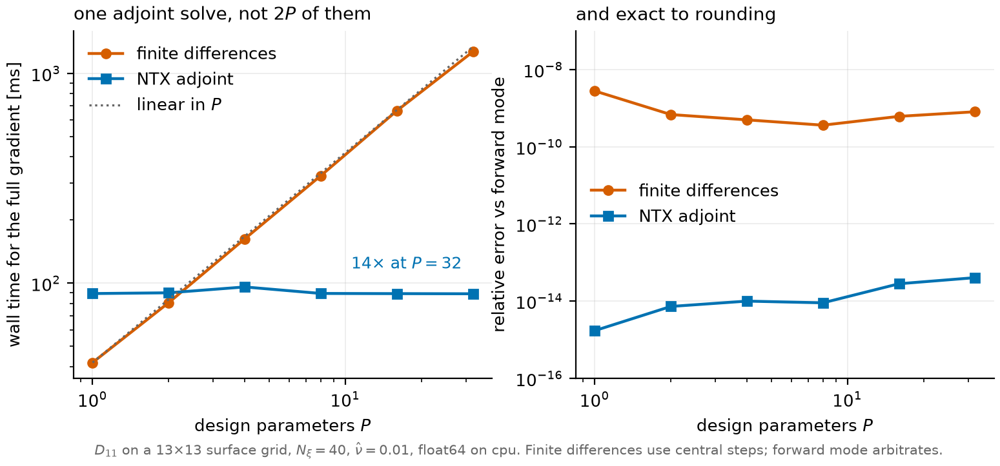

[](https://github.com/uwplasma/NTX/releases)
[](https://github.com/uwplasma/NTX/blob/main/LICENSE)
[](https://github.com/uwplasma/NTX/actions/workflows/tests.yml)
[](https://ntx.readthedocs.io/en/latest/)
[](https://ntx.readthedocs.io/en/latest/testing.html)
[](https://pypi.org/project/ntx/)

# NTX

A JAX-native monoenergetic neoclassical transport solver for stellarator flux
surfaces — and a differentiable one, so a whole design gradient costs one solve
instead of one solve per parameter.

```bash
pip install ntx
ntx solve --example --nu-hat 1e-2
```

## Why differentiability changes the cost model

Conventional monoenergetic solvers are forward maps: given a surface, they
return `D11`, `D31`, `D13`, `D33`. Sensitivities then cost one re-solve per
parameter, which is why neoclassical optimization is usually done with a
handful of shape coefficients rather than a realistic boundary.

NTX carries an adjoint through the block-tridiagonal solve, so the gradient
with respect to *every* parameter costs one extra solve — and is exact rather
than step-size limited.



| Design parameters | Finite differences | NTX adjoint | |
| ---: | ---: | ---: | --- |
| 1 | 42 ms | 89 ms | below the crossover, finite differences win |
| 8 | 325 ms | 89 ms | 3.6× |
| 32 | 1269 ms | 89 ms | **14×** |
| relative error | ~5×10⁻¹⁰ | ~2×10⁻¹⁴ | exact to rounding |

Reproduce: `python benchmarks/bench_design_derivatives.py --params 1,2,4,8,16,32`.
The crossover sits near two parameters; below it, finite differences are
simpler and perfectly fine.

## What else the solver structure buys

| | How | Why it matters |
| --- | --- | --- |
| **Reverse memory independent of `n_xi`** | exact-window adjoint over the Legendre chain | refine pitch-angle resolution without the reverse pass growing with it |
| **A window you can prove** | `certify_adjoint_window(prepared, case, rtol=1e-6)` | a window whose gradient error is *provably* within `rtol`, or the exact window when it cannot prove one |
| **Batched scans** | `compile_prepared_scan_solver` | one compilation, many collisionalities; CPU, GPU, or multiprocess |
| **Double precision by default** | x64 enabled at import | geometry built before the first solve stays float64 instead of being silently truncated |
| **Composable with JAX** | `jit`, `grad`, `vmap` throughout | drop the solve inside an optimizer or a UQ loop without a wrapper |

```python
import ntx

prepared = ntx.prepare_monoenergetic_system(ntx.example_surface(), ntx.GridSpec(9, 9, 48))
case = ntx.MonoenergeticCase(nu_hat=1e-1, epsi_hat=0.0)

window = ntx.certify_adjoint_window(prepared, case, rtol=1e-6)
print(int(window), window.certified_relative_error)     # 25, 3.2e-07

result = ntx.solve_prepared(prepared, case, adjoint_window=window)
```

The certificate is honest about its limits. It is a worst-case bound, so it
returns a wider window than an oracle would; and on a weakly collisional chain
that does not localize it returns the exact window — correct, and no saving.
`advise_adjoint_window` remains the cheap, uncertified estimate.

## Physics and scope

NTX solves the local monoenergetic drift-kinetic equation on one flux surface
at fixed speed: parallel streaming, mirror force, radial-electric-field
precession, and Lorentz pitch-angle scattering. A finite Legendre expansion in
pitch angle produces the block-tridiagonal system.

| Scope | What NTX provides |
| --- | --- |
| Solved directly | `D11`, `D31`, `D13`, `D33`, `D33_spitzer`, with residual and Onsager diagnostics |
| Downstream closure | species/profile integration, ambipolar `E_r`, bootstrap current, through NTX profile tools and NEOPAX |
| Validated comparisons | analytical limits, convergence ladders, independent fixed-field comparisons, geometry-family convergence, derivative checks |
| Research scope | full-collision closure, implicit-equilibrium sensitivities, and broader stellarator-family promotion remain outside shipping claims |

[Physics and normalizations](docs/physics.md) ·
[convergence and residual semantics](docs/convergence.md)

## Validation

Every promoted claim maps to a script, test, committed artifact, acceptance
threshold, and documentation entry in the
[benchmark matrix](docs/benchmark-matrix.md). Runtime
code does not use fitted
bridge constants to force agreement with a benchmark.

| Monoenergetic convergence and identities | Fixed-field current comparison |
| --- | --- |
|  |  |

The fixed-field result is a scoped reduced-closure comparison, not
species-resolved or full-collision parity; assumptions and provenance are in
[validation](docs/validation.md). Run the gates with:

```bash
python scripts/check_physics_gates.py
```

## Choose A Workflow

| Goal | Start here |
| --- | --- |
| One coefficient set | `ntx solve --example --nu-hat 1e-2` |
| A collisionality or `E_r` scan | [Python API and performance](docs/performance.md) |
| VMEC or Boozer geometry | [Geometry and inputs](docs/geometry.md) |
| Bootstrap-current profile | [Profile workflows](docs/profiles.md) |
| Differentiate or optimize | [Autodiff](docs/autodiff.md) |
| Resolution and validation | [Physics gates](docs/physics-gates.md) |
| CPU/GPU profiling | [Performance](docs/performance.md) · [GPU notes](docs/gpu.md) |

Full runnable catalog: [docs/examples.md](docs/examples.md).

## Outputs

NetCDF, NPZ, and HDF5, selected by filename suffix, carrying transport
coefficients, diagnostics, resolved electric-field normalization, geometry
arrays, and run metadata. Schema in [docs/input-file.md](docs/input-file.md).

From a source checkout, the bundled TOML writes NetCDF and PDF; choose the
format by suffix:

```bash
ntx examples/example_surface.toml --plot
ntx examples/example_surface.toml --output result.h5 --plot
```

## Documentation

[Getting started](https://ntx.readthedocs.io/en/latest/) ·
[physics](docs/physics.md) ·
[numerics](docs/numerics.md) ·
[autodiff](docs/autodiff.md) ·
[API](docs/api.rst) ·
[examples](docs/examples.md) ·
[validation](docs/validation.md) ·
[glossary](docs/glossary.md) ·
[source map](docs/source-map.md)

## Development

```bash
pip install -e ".[dev,docs,io]"
python -m ruff check .
python -m mypy src/ntx
python scripts/test_lane_manifest.py --check
python -m sphinx -W -b html docs docs/_build/html
```

Optional geometry backends:

```bash
pip install git+https://github.com/uwplasma/VMEX.git
pip install git+https://github.com/uwplasma/booz_xform_jax.git
```
