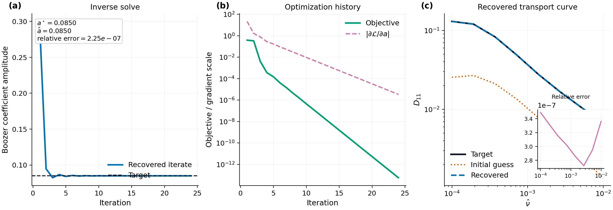
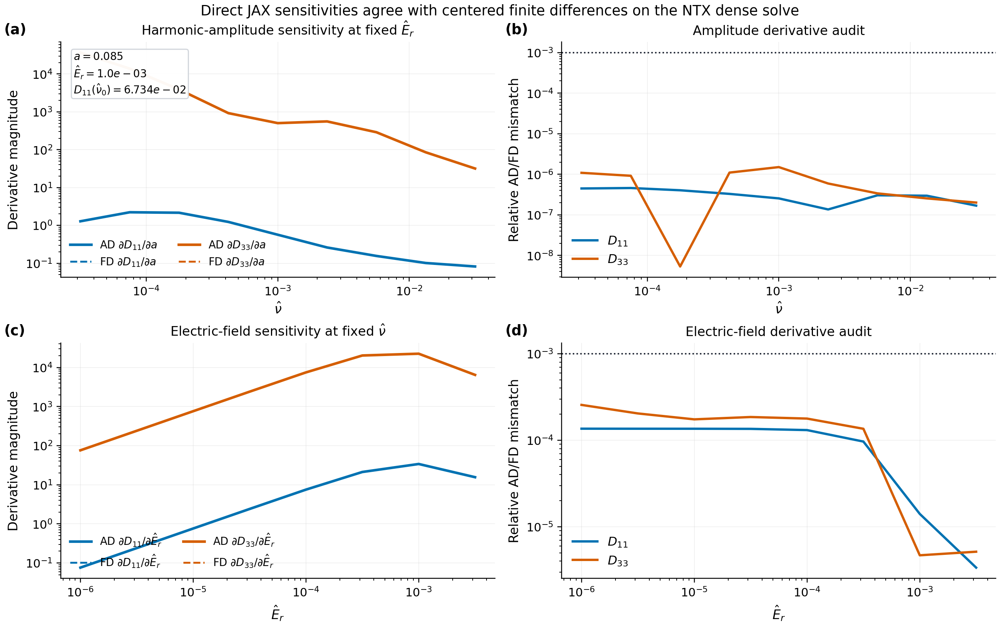
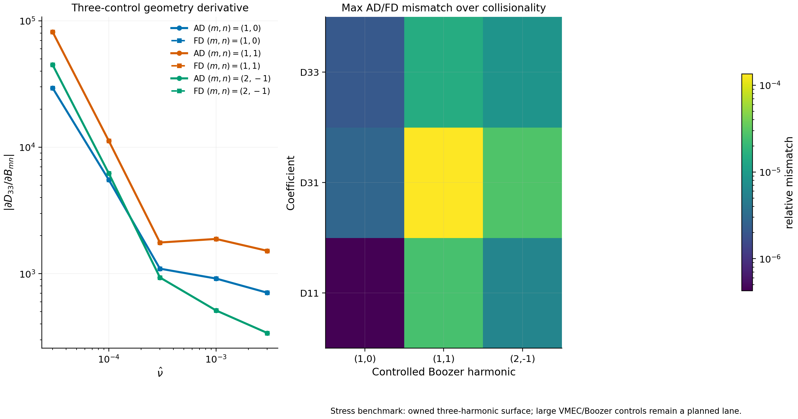
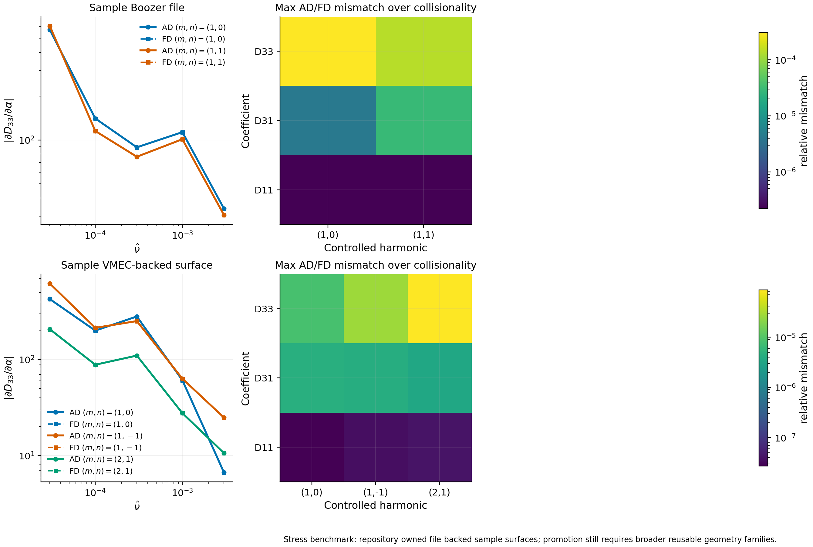
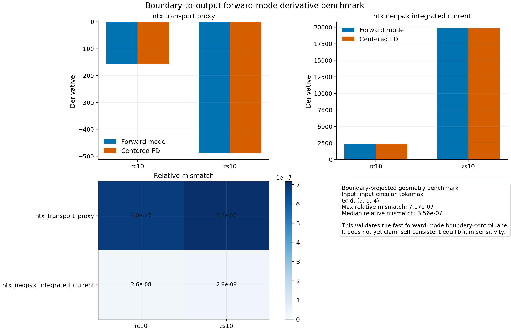
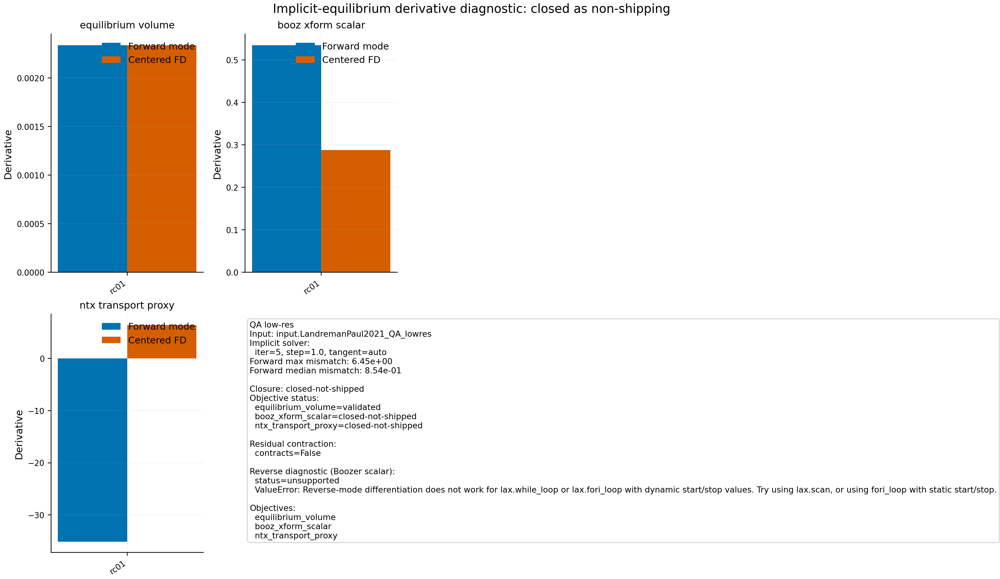
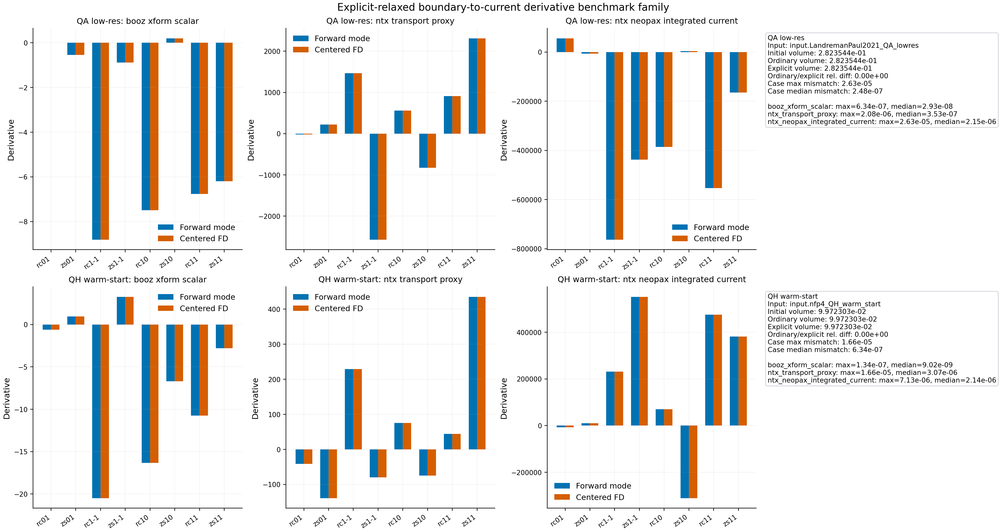
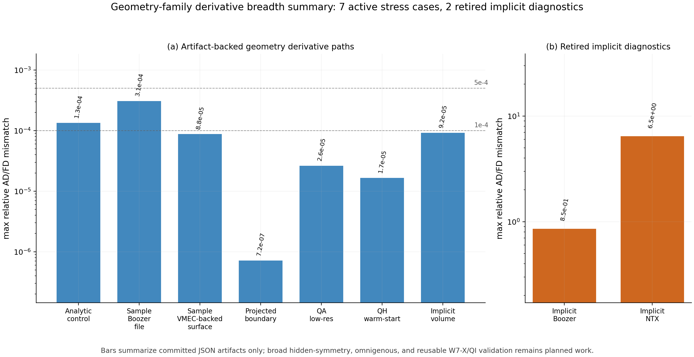
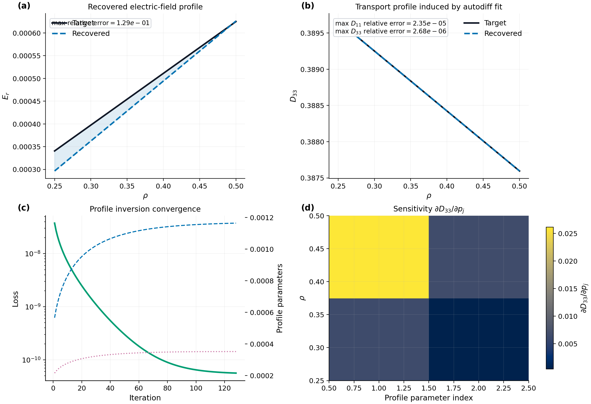
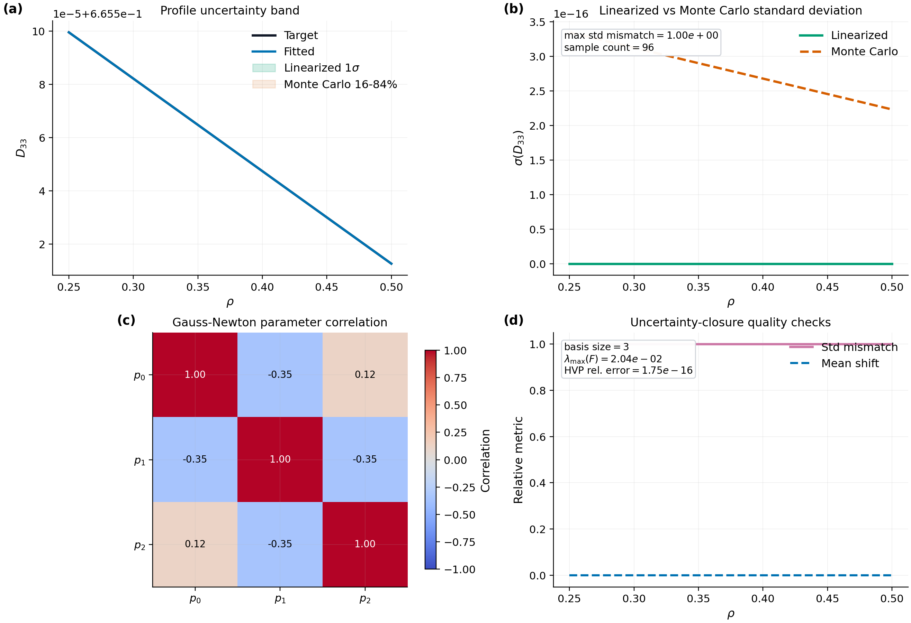

# Autodiff

NTX keeps the imported solve lane differentiable so transport coefficients can
be embedded in inverse problems, sensitivity analysis, and profile workflows.

## Inverse Problem Example

The script:

```bash
python examples/autodiff_inverse_problem.py
```

solves a small synthetic inverse problem on the analytic sample surface. One
Fourier amplitude is treated as an unknown parameter, synthetic `D11`
observations are generated from a target surface, and JAX gradients are used to
recover the amplitude.

The figure is written to:

```text
docs/_static/autodiff_inverse_problem.png
docs/_static/autodiff_inverse_problem.pdf
```

It shows:

- parameter convergence
- objective reduction
- recovered transport response against the target response



## Derivative Audit

The script:

```bash
python examples/derivative_audit.py
```

compares direct JAX gradients of the dense monoenergetic solve against centered
finite differences for two practically important controls:

- a Boozer harmonic amplitude at fixed electric field,
- and the radial electric field at fixed collisionality.

The example does not rely on one hidden helper. It walks through the explicit
prepared-solver workflow:

```python
from ntx import (
    GridSpec,
    MonoenergeticCase,
    example_surface,
    prepare_monoenergetic_system,
    solve_prepared_coefficient_vector,
    solve_prepared_coefficient_vector_vjp,
)
```

That is the contract point for the prepared implicit-adjoint derivative path:
the forward solve remains the same, while the backward rule stays isolated from
user-facing optimization scripts.

The low-level operator derivative used by this path is now test-gated directly:
`tests/test_operators.py` requires the hand-coded `dD_k/dnu_hat` and
`dD_k/depsi_hat` blocks to match JAX differentiation of the assembled
Legendre-space operator. This keeps the collisionality and radial-electric-field
normalizations tied to the implemented equations rather than to a downstream
finite-difference fit.

The figure is written to:

```text
docs/_static/derivative_audit.png
docs/_static/derivative_audit.pdf
```

It shows:

- gradient magnitude across collisionality for `D11` and `D33`,
- relative mismatch between autodiff and finite differences,
- electric-field sensitivities across `\hat E_r`,
- and the current numerical agreement used to validate the prepared
  implicit-adjoint path.



## Prepared-Derivative Benchmark

The script:

```bash
python examples/derivative_path_benchmark.py
```

keeps the same prepared surface and the same `D33` electric-field derivative,
then times two user-visible paths:

- direct reverse-mode through `solve_prepared_coefficient_vector(...)`,
- and the prepared custom-VJP path through
  `solve_prepared_coefficient_vector_vjp(...)`.

The example is intentionally explicit. It shows how to:

- prepare a reusable system with `prepare_monoenergetic_system(...)`,
- define scalar coefficient objectives,
- wrap them with `jax.grad(...)` and `jax.vmap(...)`,
- JIT the resulting scan kernels,
- and compare timing and agreement on the same `\hat E_r` scan.

The figure is written to:

```text
docs/_static/derivative_path_benchmark.png
docs/_static/derivative_path_benchmark.pdf
```

It shows:

- best-of-three wall times versus scan size,
- speedup of the prepared custom-VJP path,
- and the max relative mismatch between the two derivative paths.

The JSON sidecar is now checked by the physics-gate registry. The promoted
release claim is derivative agreement, not benchmark-machine timing: the maximum
prepared-vs-direct relative mismatch must remain below `1e-4`; the reported
speedup is retained as performance evidence.

## Geometry-Control Derivative Benchmark

The script:

```bash
python examples/geometry_control_derivative_benchmark.py
```

extends the derivative checks from one scalar control to three independent
Boozer-harmonic amplitudes on the owned analytic surface. It compares direct
JAX geometry-control derivatives against centered finite differences for
`D11`, `D31`, and `D33` across collisionality.

The figure is written to:

```text
docs/_static/geometry_control_derivative_benchmark.png
docs/_static/geometry_control_derivative_benchmark.pdf
docs/_static/geometry_control_derivative_benchmark.json
```

This is an artifact-backed autodiff stress benchmark. It is not yet a
large-geometry-control validation claim; the open lane is to transfer the same
audit to reusable VMEC/Boozer geometry-control families and to compare geometry
pullbacks with a prepared implicit-adjoint path once that pullback exists.
The JSON sidecar is checked by the physics-gate registry with a current
acceptance threshold of `2e-4` maximum relative direct-AD/finite-difference
mismatch on this owned analytic surface.



## File-Backed Geometry-Control Benchmark

The script:

```bash
python examples/file_backed_geometry_control_derivative_benchmark.py
```

takes the next step on the geometry-control autodiff lane. Instead of the owned
analytic surface, it loads two repository-owned file-backed cases:

- a Boozer-file sample surface,
- and a VMEC-backed sample surface.

For each case, NTX selects the dominant non-axisymmetric harmonics, perturbs
them through dimensionless scale factors, and compares direct JAX derivatives
against centered finite differences for `D11`, `D31`, and `D33`.

The figure is written to:

```text
docs/_static/file_backed_geometry_control_derivative_benchmark.png
docs/_static/file_backed_geometry_control_derivative_benchmark.pdf
docs/_static/file_backed_geometry_control_derivative_benchmark.json
```

This closes part of the previous open lane: the derivative audit now transfers
from an owned analytic surface to repository-owned file-backed magnetic
geometry. It is still a stress benchmark rather than a promoted design claim,
since the remaining open work is a reusable family of VMEC/Boozer controls plus
prepared implicit-adjoint geometry pullbacks.
The committed JSON sidecar is now a physics gate with a `5e-4` maximum relative
direct-AD/finite-difference mismatch threshold on the file-backed samples.



## Boundary Forward-Mode Benchmark

The script:

```bash
python examples/boundary_forward_mode_current_derivative_benchmark.py
```

checks the next imported differentiable lane built on the upstream
`vmec_jax` and `booz_xform_jax` packages. It treats two low-order boundary
controls from the repository-owned sample input as independent variables,
builds the boundary-projected VMEC state, transforms it to Boozer
coordinates, and then differentiates two scalar outputs with respect to those
controls:

- an NTX monoenergetic transport proxy,
- and an NTX+NEOPAX integrated-current objective.

The figure is written to:

```text
docs/_static/boundary_forward_mode_current_derivative_benchmark.png
docs/_static/boundary_forward_mode_current_derivative_benchmark.pdf
docs/_static/boundary_forward_mode_current_derivative_benchmark.json
```

This is an artifact-backed stress benchmark for the boundary-to-output lane.
It is intentionally scoped to the boundary-projected geometry map, where
forward-mode autodiff matches centered finite differences on the committed
sample case. It does not yet claim a fully validated self-consistent
equilibrium sensitivity workflow for bootstrap current.
The committed JSON sidecar is checked with a `1e-5` maximum relative
forward-mode/finite-difference mismatch threshold.



## Implicit Equilibrium Forward-Mode Benchmark

The script:

```bash
python examples/implicit_equilibrium_forward_mode_derivative_benchmark.py
```

adds the next implicit-equilibrium diagnostic on the committed QA case. It uses
the same low-order boundary controls, but now routes them through the implicit
fixed-boundary `vmec_jax` residual solve with
`residual_tangent_mode="auto"`. The benchmark then differentiates three scalar
outputs with respect to those controls:

- equilibrium volume,
- a Boozer-space scalar built from the implicit equilibrium,
- and an NTX monoenergetic transport proxy.

The figure is written to:

```text
docs/_static/implicit_equilibrium_forward_mode_derivative_benchmark.png
docs/_static/implicit_equilibrium_forward_mode_derivative_benchmark.pdf
docs/_static/implicit_equilibrium_forward_mode_derivative_benchmark.json
```

This closes the implicit-equilibrium lane as a non-shipping diagnostic, not as a
supported optimization path. The current JSON artifact shows a mixed result on
the committed QA case:

- the equilibrium-volume derivative matches centered finite differences,
- the Boozer scalar fails tangent parity on the implicit lane,
- the NTX transport observable fails more strongly on the same lane,
- the residual history does not contract under the committed iteration ladder,
- and the matching reverse-mode Boozer-scalar diagnostic is unavailable because
  the dynamic-loop implicit solve is not a valid promoted reverse-mode path.

The JSON sidecar is intentionally registered as a monitored diagnostic, not an
acceptance gate. The supported self-consistent equilibrium derivative route is
the explicit-relaxed fixed-boundary lane below. The implicit lane should only be
restored after the backend residual solve contracts and Boozer/NTX centered-FD
tangent parity passes.



## Explicit-Relaxed Equilibrium Benchmark

The script:

```bash
python examples/explicit_relaxed_boundary_current_derivative_benchmark.py
```

closes the next imported lane on two repository-owned non-axisymmetric cases:
a low-resolution QA family input and a lighter QH warm-start input. It uses
the same low-order boundary controls, but instead of stopping at the
boundary-projected VMEC state it runs an explicitly relaxed fixed-boundary
`vmec_jax` solve in a stable forward-mode regime and then differentiates three
scalar outputs on each case:

- a Boozer-space scalar built from the relaxed surface,
- an NTX monoenergetic transport proxy,
- and an `NTX+NEOPAX` integrated-current objective.

The figure is written to:

```text
docs/_static/explicit_relaxed_boundary_current_derivative_benchmark.png
docs/_static/explicit_relaxed_boundary_current_derivative_benchmark.pdf
docs/_static/explicit_relaxed_boundary_current_derivative_benchmark.json
```

This is the first committed self-consistent boundary-to-current forward-mode
benchmark family. The JSON artifact records that the ordinary and explicit
relaxed primal volumes agree on both committed cases, so the benchmark is not
just an internally consistent autodiff loop on a different equilibrium branch.
The remaining open work is now narrower:

- widen from the committed QA/QH cases to additional geometry families,
- add integrated-current objectives on the supported explicit-relaxed lane,
- and repair reverse mode on the relaxed-equilibrium lane.

The committed JSON sidecar is now checked by the physics-gate registry with a
`1e-4` maximum relative forward-mode/finite-difference mismatch threshold. The
artifact also reports the ordinary-vs-explicit-relaxed volume difference, which
is currently zero on the committed cases.

At the moment, the reverse-mode implicit diagnostic remains non-shipping for a
concrete reason: the matching QA Boozer-scalar probe is unavailable or guarded
to zero while centered finite differences are nonzero, so it is not a promoted
sensitivity workflow.



## Geometry-Family Breadth Summary

The script:

```bash
python examples/geometry_family_breadth_summary.py
```

does not rerun expensive equilibrium solves. It reads the committed derivative
artifacts and summarizes the current geometry-breadth status in one
publication-ready figure:

- analytic geometry-control derivatives,
- file-backed Boozer and VMEC geometry-control derivatives,
- boundary-projected current derivatives,
- explicit-relaxed QA/QH boundary-to-current derivatives,
- and the implicit-equilibrium diagnostic split into the validated volume
  objective and the retired non-shipping Boozer/NTX transport diagnostics.

The figure is written to:

```text
docs/_static/geometry_family_breadth_summary.png
docs/_static/geometry_family_breadth_summary.pdf
docs/_static/geometry_family_breadth_summary.json
```

This closes the artifact-backed geometry-breadth summary lane, not the full
geometry-family validation lane. The remaining promotion requirements are
explicit in the JSON sidecar: broader W7-X/QI/omnigenous inputs, direct
`D11/D31/D33` parity and convergence ladders, and implicit Boozer/transport
derivative parity.



## Geometry-Family Transport Convergence

The script:

```bash
python examples/geometry_family_transport_convergence.py --preset paper
```

discovers reusable VMEC `wout` examples from local `vmec_jax`, STELLOPT, and
SIMSOPT checkouts, loads each surface through the NTX VMEC path, and runs a
`D11/D31/D33` grid ladder. The figure and JSON sidecar are written to:

```text
docs/_static/geometry_family_transport_convergence.png
docs/_static/geometry_family_transport_convergence.pdf
docs/_static/geometry_family_transport_convergence.json
```

The current artifact is a convergence stress diagnostic across the available
public geometry families. It distinguishes cases that are below the tracked
stress tolerance from cases that need paper-resolution or independent-reference
promotion work.


## NEOPAX-Style Profile Example

The script:

```bash
python examples/neopax_autodiff_profiles.py
```

builds a small NTX scan, maps it into the NEOPAX monoenergetic data layout, and
then solves a low-dimensional electric-field profile inversion using autodiff.

The figure is written to:

```text
docs/_static/autodiff_neopax_profiles.png
docs/_static/autodiff_neopax_profiles.pdf
```

It shows:

- target and recovered radial electric-field profiles
- target and recovered `D33` profiles
- objective reduction
- the local sensitivity of `D33` to the profile parameters

The fast test suite now gates this interpolation layer directly:
`tests/test_autodiff.py` checks that `D33` sensitivities through the
electric-field profile basis agree with centered finite differences on a
controlled coefficient table. This keeps the profile inverse-design and
uncertainty examples tied to a checked differentiable map instead of relying
only on end-to-end objective reduction.



## Profile Uncertainty Audit

The script:

```bash
python examples/autodiff_profile_uncertainty.py
```

uses the same differentiable NEOPAX-style profile fit, then compares two
uncertainty-propagation paths for the recovered `D33(\rho)` profile under a
small prescribed Gaussian uncertainty on the fitted radial electric-field basis
parameters:

- a linearized covariance propagation through the sensitivity matrix,
- and a small Monte Carlo ensemble in the fitted profile-parameter space.

The committed artifact uses a three-term odd-power radial basis by default and
also records a local Fisher/Gauss-Newton matrix plus a Hessian-vector-product
probe for the same combined `D11`/`D33` residual used by the fit. The HVP probe
is evaluated at the recovered profile parameters, where the residual term
vanishes, so it should agree with the Fisher/Gauss-Newton product. This
provides a local mathematical gate for profile-UQ derivatives without promoting
the synthetic profile family to a broad design claim.

The figure is written to:

```text
docs/_static/autodiff_profile_uncertainty.png
docs/_static/autodiff_profile_uncertainty.pdf
docs/_static/autodiff_profile_uncertainty.json
```

It shows:

- the fitted transport profile with propagated uncertainty bands,
- linearized versus Monte Carlo standard deviations,
- the fitted profile-parameter correlation matrix,
- the relative mismatch between the two uncertainty paths,
- and the Fisher/HVP consistency metrics stored in the JSON artifact.

This is the current artifact-backed uncertainty-propagation benchmark for the
autodiff lane. It is intentionally synthetic and is tracked as a monitored
stress benchmark rather than a parity gate, but it exercises the same
differentiable profile map used in inverse-design and profile-control studies.



## Robust Bootstrap-Current Optimization

The script:

```bash
python examples/bootstrap_current_robust_optimization.py
```

adds a prescribed Gaussian uncertainty on the scalar geometry control used by
the bootstrap-current proxy optimization and compares:

- the deterministic objective landscape,
- the robust mean-minus-risk objective,
- the optimized nominal current profile,
- and the uncertainty band of that profile under the prescribed control
  perturbation.

The figure is written to:

```text
docs/_static/bootstrap_current_robust_optimization.png
docs/_static/bootstrap_current_robust_optimization.pdf
docs/_static/bootstrap_current_robust_optimization.json
```

This is a synthetic robust-design benchmark anchored to the same differentiable
current-proxy workflow as the main optimization example. It is currently a
tracked open lane, not a literature-grade validation claim.

## Parallel Execution

Large scans do not need to stay on one device. NTX currently exposes two
parallel paths:

```python
from ntx import solve_monoenergetic_parallel_scan
from ntx import solve_monoenergetic_multiprocess_scan
```

`solve_monoenergetic_parallel_scan(...)` keeps execution inside one Python
process and is the lightest-weight option when all visible devices are healthy.
`solve_monoenergetic_multiprocess_scan(...)` runs one worker process per device
and is the robust option when the platform shows process-local solver behavior.

For local profiling:

```bash
python scripts/profile_parallel_runtime.py --output-json parallel-runtime.json
python scripts/profile_multiprocess_runtime.py --backend cpu --workers 2
```

For multi-CPU emulation on a workstation, start the script in a fresh process
with:

```bash
XLA_FLAGS=--xla_force_host_platform_device_count=4 python scripts/profile_parallel_runtime.py
```

On the office workstation, the single-process path exposes a cuSolver failure
mode on `cuda:1`, while the multiprocess pinned-device path is numerically
correct on both GPUs. For the repository smoke cases the multiprocess path is
still slower than the serial batched solve because worker startup dominates, so
it should be treated as a throughput lane for larger scans rather than a
default for small studies.
