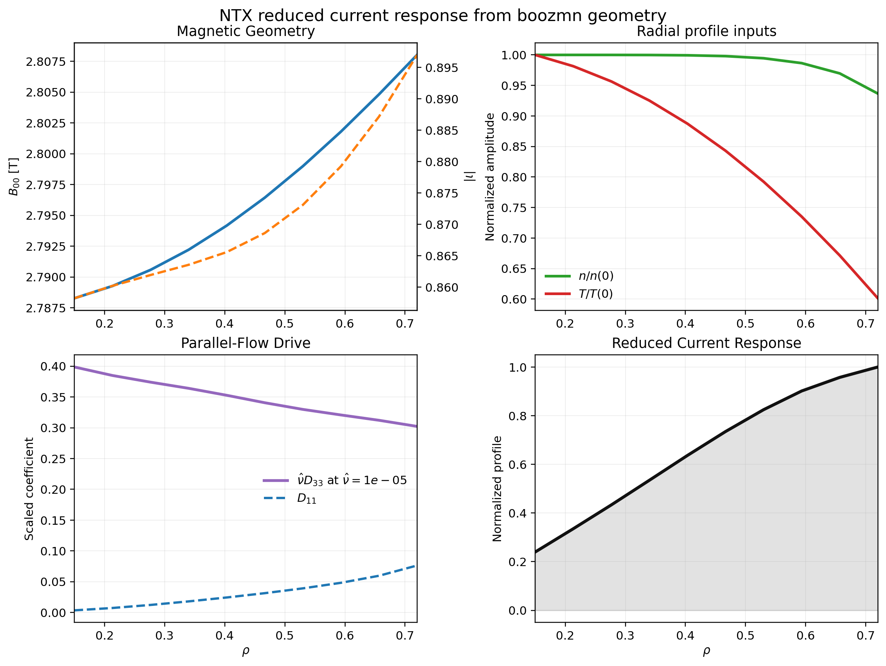
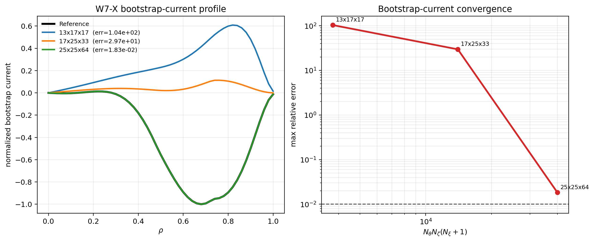
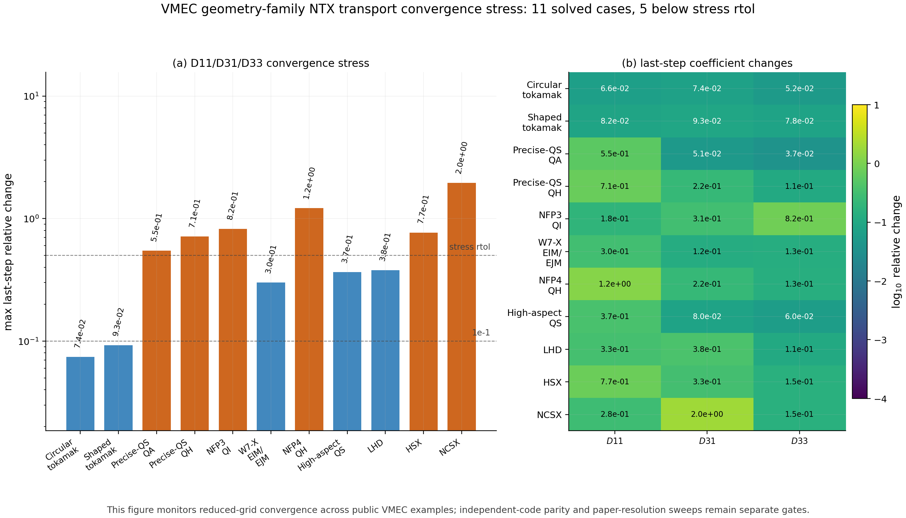
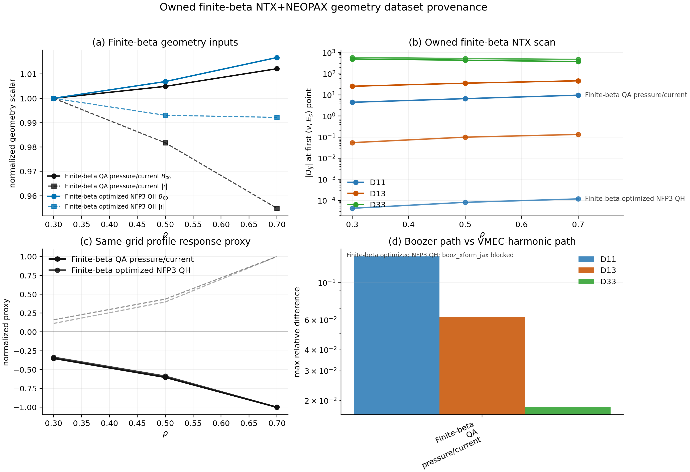
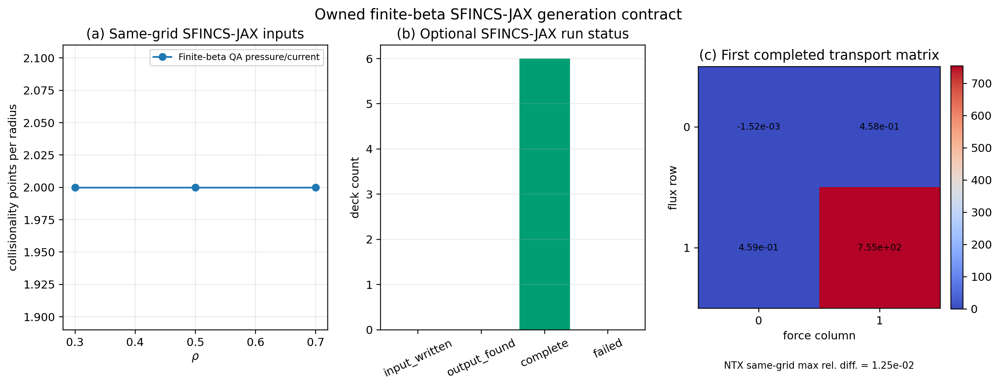
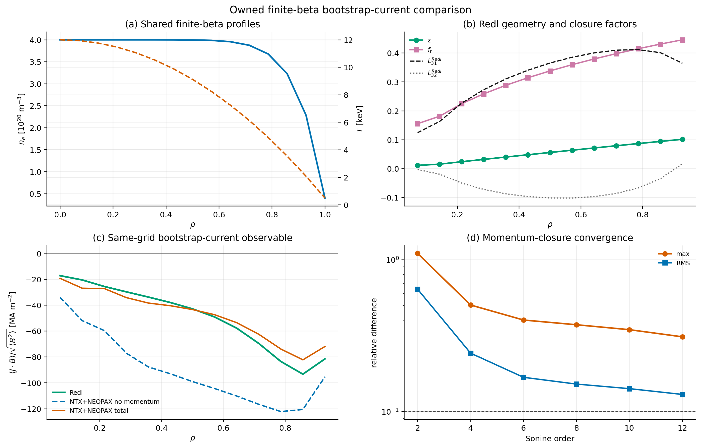
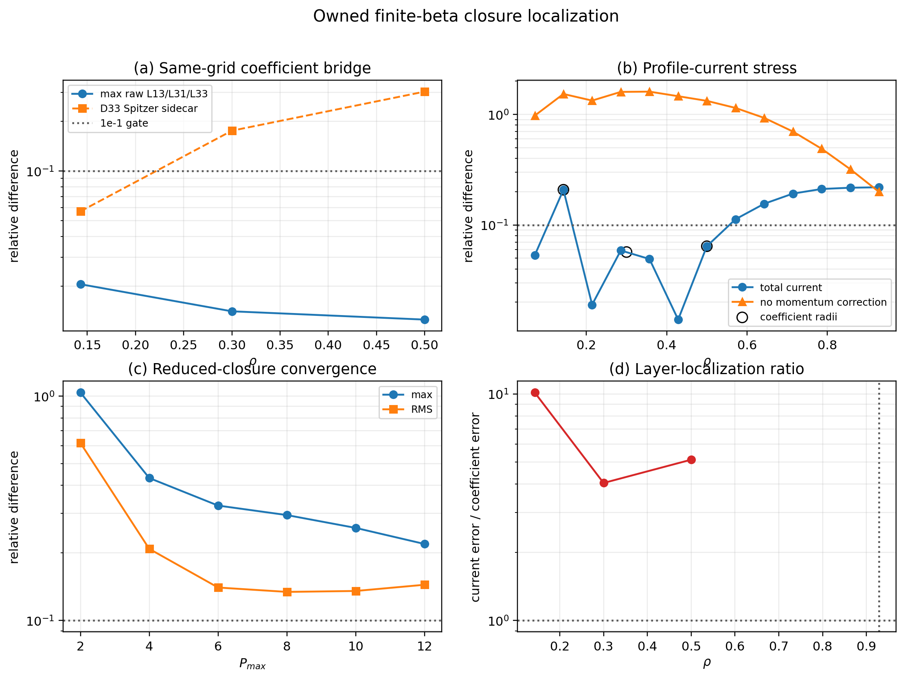
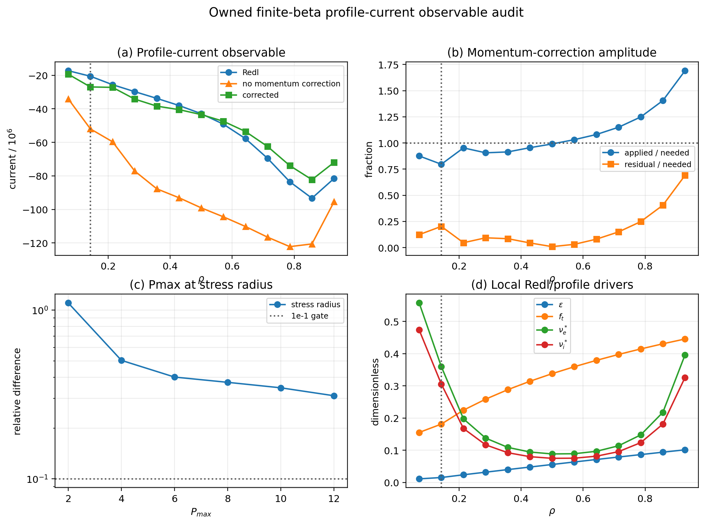
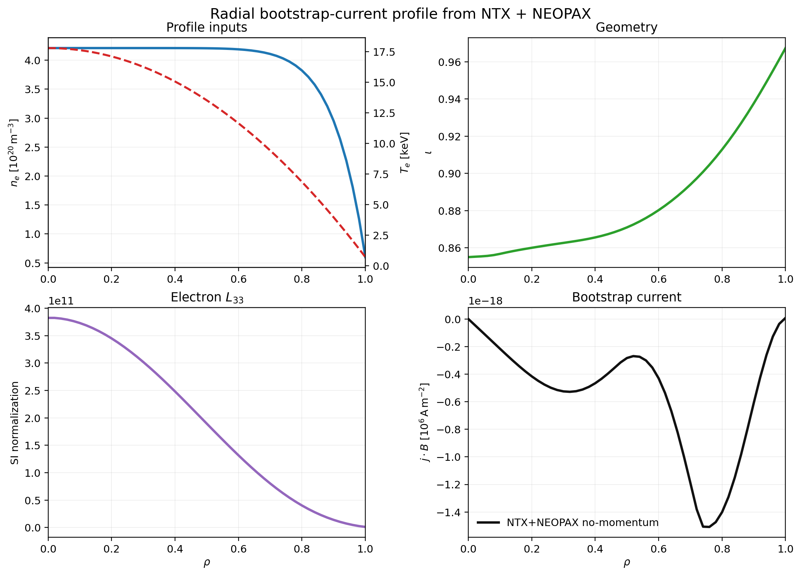
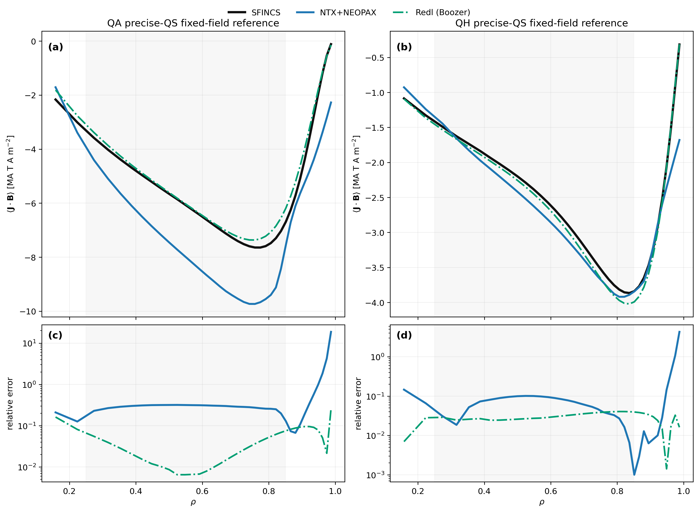

# Examples

This page lists the main ways to run NTX, from the smallest CLI solve to the
publication-figure scripts.

## 1. Simplest CLI Run

```bash
ntx examples/example_surface.toml --plot
```

This is the smallest end-to-end solve. It requires no external files and is the
best first command to confirm that NTX is installed correctly. It writes a
NetCDF payload and a PDF summary panel under `examples/outputs/`.

## 2. DKES-Style CLI Run

```bash
ntx examples/sample_dkes.toml
```

This writes a NetCDF result under `examples/outputs/`. Use
`--output examples/outputs/sample_dkes.npz` when a compact NumPy archive is
preferred.

## 3. VMEC CLI Run

```bash
ntx examples/sample_vmec.toml
```

This exercises the VMEC normalization path on the bundled sample `wout` file.

## 4. Open And Plot An Output File

```bash
python examples/plot_output_file.py examples/outputs/sample_dkes.nc
```

This reads an NTX `.nc`, `.npz`, or `.h5` payload and writes:

- `docs/_static/output_file_summary.png`
- `docs/_static/output_file_summary.pdf`

The output figure contains:

- magnetic-field strength on the angular grid
- the radial-drift source on the same grid
- the solved transport coefficients
- a run-summary panel with key diagnostics

## 5. Python Single-Case Solve

```python
from ntx import GridSpec, MonoenergeticCase, load_vmec_surface, solve_monoenergetic

surface = load_vmec_surface("wout.nc", psi_n=0.25)
grid = GridSpec(n_theta=9, n_zeta=11, n_xi=12)
case = MonoenergeticCase(nu_hat=1e-3, er_hat=1e-3)
result = solve_monoenergetic(surface, grid, case)
```

## 6. NEOPAX Mapping

```bash
python examples/neopax_with_ntx.py
```

This example:

- loads a VMEC equilibrium
- builds an NTX monoenergetic scan
- maps that scan into NEOPAX-style arrays

Use it as the minimal reference for NTX-to-NEOPAX coupling.

## 7. Bootstrap Current From VMEC Or Boozmn

```bash
python examples/bootstrap_current_from_vmec_or_boozmn.py
```

This example is the shortest NTX-only workflow:

- start from a VMEC `wout` file and use `vmec_jax`
- or, if a Boozer `boozmn` file already exists, use `booz_xform_jax` output directly
- solve a fixed-collisionality NTX radial family
- plot magnetic geometry, radial profile inputs, `D11`, `nu_hat * D33`, and a compact
  interior bootstrap-current proxy

All user inputs live at the top of the file. The script prefers direct Boozer
input in `auto` mode when a `boozmn` file is available and otherwise falls back
to the VMEC-harmonic lane. The density and temperature derivatives are taken
analytically in the example so the figure reflects the transport response rather
than finite-difference edge noise.

It writes:

- `docs/_static/bootstrap_current_from_vmec_or_boozmn.png`
- `docs/_static/bootstrap_current_from_vmec_or_boozmn.pdf`
- `docs/_static/bootstrap_current_from_vmec_or_boozmn.json`



## 8. W7-X Bootstrap-Current Convergence Audit

```bash
python examples/bootstrap_current_reference_audit_w7x.py
```

This optional audit script rebuilds a reduced W7-X scan at several NTX
resolutions, evaluates the resulting bootstrap-current profile through the
imported workflow, and writes a convergence figure:

- `docs/_static/bootstrap_current_reference_audit_w7x.png`
- `docs/_static/bootstrap_current_reference_audit_w7x.pdf`
- `docs/_static/bootstrap_current_reference_audit_w7x.json`



## 9. VMEC Geometry-Family Transport Convergence

```bash
python examples/geometry_family_transport_convergence.py --preset paper
```

This optional artifact discovers local public VMEC examples from `vmec_jax`,
STELLOPT, and SIMSOPT checkouts, then runs a `D11/D31/D33` convergence ladder.
It is a reduced NTX stress diagnostic across available geometry families, not
an independent-code parity claim.

It writes:

- `docs/_static/geometry_family_transport_convergence.png`
- `docs/_static/geometry_family_transport_convergence.pdf`
- `docs/_static/geometry_family_transport_convergence.json`



## Owned JAX-Native NTX+NEOPAX Dataset

```bash
python examples/owned_geometry_neopax_dataset.py
python examples/owned_finite_beta_sfincs_jax_inputs.py
python examples/owned_finite_beta_bootstrap_comparison.py
python examples/owned_finite_beta_closure_localization.py
python examples/owned_finite_beta_profile_current_observable_audit.py
```

These optional provenance artifacts prioritize local finite-beta stellarator
input/wout pairs. The NTX/NEOPAX script builds finite-beta QA surfaces through
`vmec_jax -> booz_xform_jax` with the physical VMEC edge-flux scale passed
explicitly as `psi_p`, writes NEOPAX-style HDF5 scan tables, stores compact
profile flux/current proxies from those same tables, and compares that path
with the direct VMEC-harmonic interpolation path on the same radial and
collisionality grid. Optimized finite-beta QH/QI cases are retained as direct
wout-harmonic stress cases until their current-profile representation is
supported by the JAX geometry stack.

The SFINCS-JAX script writes owned `RHSMode=3` input decks for the same
finite-beta `wout`, `rho`, collisionality, electric-field, and resolution
contract. Use `--run-sfincs-jax` for explicit local runs; completed HDF5
outputs are ingested into the JSON sidecar with the SFINCS-reported
`nuPrime -> nu_n` bridge and a coefficient-level NTX `L13/L31/L33`
comparison. The committed artifact now contains a six-point same-grid
finite-beta QA ladder; use it as a smoke-resolution transport-coefficient
localization tool, not as a bootstrap-current parity claim.

The finite-beta bootstrap-current script runs Redl and `NTX+NEOPAX` on the
same QA pressure/current `wout`, Boozer transform, analytic profile contract,
radial grid, adaptive physical `nu/v` support, and current normalization. It
is a production-resolution reduced-closure stress audit for this QA case; the
current JSON sidecar records the remaining inner-radius Redl/`NTX+NEOPAX` gap
and a Sonine-order convergence scan instead of promoting the figure as parity.
The closure-localization script then overlays these two committed sidecars. It
shows that the inner-radius same-grid `L13/L31/L33` coefficient difference is
about `2.1e-2`, while the profile-current difference at the same radius remains
about `3.1e-1`; the open lane is therefore the reduced profile-current
observable rather than the monoenergetic coefficient bridge.
The profile-current observable audit decomposes the same stress radius into the
no-momentum current, applied momentum correction, correction needed to match the
Redl target, Pmax trend, and local profile/geometry drivers.

It writes:

- `docs/_static/owned_geometry_neopax_dataset.png`
- `docs/_static/owned_geometry_neopax_dataset.pdf`
- `docs/_static/owned_geometry_neopax_dataset.json`
- `examples/outputs/owned_geometry_neopax_dataset/*.h5`
- `docs/_static/owned_finite_beta_sfincs_jax_inputs.png`
- `docs/_static/owned_finite_beta_sfincs_jax_inputs.pdf`
- `docs/_static/owned_finite_beta_sfincs_jax_inputs.json`
- `examples/outputs/owned_finite_beta_sfincs_jax_inputs/**/input.namelist`
- `docs/_static/owned_finite_beta_bootstrap_comparison.png`
- `docs/_static/owned_finite_beta_bootstrap_comparison.pdf`
- `docs/_static/owned_finite_beta_bootstrap_comparison.json`
- `docs/_static/owned_finite_beta_closure_localization.png`
- `docs/_static/owned_finite_beta_closure_localization.pdf`
- `docs/_static/owned_finite_beta_closure_localization.json`
- `docs/_static/owned_finite_beta_profile_current_observable_audit.png`
- `docs/_static/owned_finite_beta_profile_current_observable_audit.pdf`
- `docs/_static/owned_finite_beta_profile_current_observable_audit.json`
- `examples/outputs/owned_finite_beta_bootstrap_comparison/*.h5`











## 10. Bootstrap Current With NEOPAX

```bash
python examples/bootstrap_current_with_neopax.py
```

This is the shortest user-facing `NTX + NEOPAX` radial-profile workflow. It:

- loads the W7-X reference equilibrium from the local NEOPAX checkout
- builds an NTX monoenergetic scan on the archived `(\rho, \nu_v, E_r)` axes
- maps that scan into NEOPAX monoenergetic arrays
- evaluates the bootstrap-current profile with the no-momentum closure
- optionally overlays the momentum-correction branch

It writes:

- `docs/_static/bootstrap_current_with_neopax.png`
- `docs/_static/bootstrap_current_with_neopax.pdf`
- `docs/_static/bootstrap_current_with_neopax.json`



## 10. Fixed-Field Bootstrap-Current Validation

```bash
python examples/bootstrap_current_fixed_field_validation.py
```

This local archive-backed benchmark compares:

- archived Fortran SFINCS
- SFINCS-JAX reruns of the archived inputs
- Redl on the same precise-QS QA/QH reference family
- `NTX+NEOPAX` on the same equilibria and archived profiles

It writes:

- `docs/_static/bootstrap_current_fixed_field_validation.png`
- `docs/_static/bootstrap_current_fixed_field_validation.pdf`
- `docs/_static/bootstrap_current_fixed_field_validation.json`

Use this script for the fixed-field validation figure that is shown in the
README. The figure intentionally overlays only bootstrap-current profiles; the
interior-window relative-error gates are stored in the JSON artifact and checked
by the physics-gate tests. The current artifact keeps both the Redl analytic
comparison and the reduced `NTX+NEOPAX` total-current stress comparison below
the `1e-1` gate.



## 11. Autodiff Inverse Problem

```bash
python examples/autodiff_inverse_problem.py
```

This writes `docs/_static/autodiff_inverse_problem.{png,pdf}` and demonstrates
recovery of a Boozer harmonic from synthetic transport data using JAX
gradients.

## 12. Precise-QS Redl Versus SFINCS Audit

```bash
python examples/precise_qs_redl_sfincs_audit.py
```

This local archive-backed audit uses the fixed-field Landreman--Paul QA/QH
reference family from the Zenodo bundle and writes:

- `examples/outputs/precise_qs_redl_sfincs_audit/precise_qs_redl_sfincs_audit.png`
- `examples/outputs/precise_qs_redl_sfincs_audit/precise_qs_redl_sfincs_audit.pdf`
- `examples/outputs/precise_qs_redl_sfincs_audit/precise_qs_redl_sfincs_audit.json`

It compares the archived SFINCS bootstrap-current profiles against:

- Redl with the VMEC-side trapped-fraction path
- Redl with a Boozer-side trapped-fraction path reconstructed through
  `booz_xform_jax`

Use this script when auditing the analytic fixed-field benchmark itself, not
the integrated `NTX+NEOPAX` workflow. The plot is an overlay-only
bootstrap-current comparison; the relative-error metrics remain in the JSON
artifact.

## 13. Fixed-Field Transport-Matrix Audit

```bash
python examples/fixed_field_transport_matrix_audit.py
```

This local audit writes:

- `examples/outputs/fixed_field_transport_matrix_audit/fixed_field_transport_matrix_audit.png`
- `examples/outputs/fixed_field_transport_matrix_audit/fixed_field_transport_matrix_audit.pdf`
- `examples/outputs/fixed_field_transport_matrix_audit/fixed_field_transport_matrix_audit.json`

It runs SFINCS-JAX in `RHSMode=3` on the same fixed-field QA/QH reference
family and compares `L13`, `L31`, and `L33` against NTX candidate channels.
This audit now:

- reproduces the exact SFINCS `RHSMode=3` monoenergetic overwrite for `nu_n`
- uses archive-backed Landreman/H. Smith bridge factors for the `L13/L31/L33`
  channels
- narrows the remaining blocker to the `L33` bridge rather than a generic sign
  or family-selection problem

This is still the coefficient-side gate for the public `NTX+NEOPAX`
bootstrap-current validation figure.

## 14. Autodiff Derivative Audit

```bash
python examples/derivative_audit.py
```

This writes `docs/_static/derivative_audit.{png,pdf}` and compares direct JAX
gradients of the dense solve against centered finite differences for:

- `D11` and `D33` sensitivities to a Boozer harmonic amplitude
- `D11` and `D33` sensitivities to the radial electric field

This is the validation baseline for the current prepared implicit-adjoint
derivative implementation.

## 15. Prepared-Derivative Benchmark

```bash
python examples/derivative_path_benchmark.py
```

This writes `docs/_static/derivative_path_benchmark.{png,pdf}` and times:

- direct reverse-mode through `solve_prepared_coefficient_vector(...)`
- the prepared custom-VJP path through
  `solve_prepared_coefficient_vector_vjp(...)`

on the same `D33` electric-field derivative scan.

It also writes `docs/_static/derivative_path_benchmark.json` for manuscript
tables and reproducibility notes.

## 16. Autodiff NEOPAX Profiles

```bash
python examples/neopax_autodiff_profiles.py
```

This writes `docs/_static/autodiff_neopax_profiles.{png,pdf}` and demonstrates
a low-dimensional electric-field profile inversion on NEOPAX-style
monoenergetic arrays.

## 17. Autodiff Profile Uncertainty

```bash
python examples/autodiff_profile_uncertainty.py
```

This writes `docs/_static/autodiff_profile_uncertainty.{png,pdf,json}` and
compares linearized covariance propagation against a small Monte Carlo ensemble
for the differentiable NEOPAX-style profile fit under a prescribed Gaussian
parameter perturbation.

## 18. Robust Bootstrap-Current Optimization

```bash
python examples/bootstrap_current_robust_optimization.py
```

This writes `docs/_static/bootstrap_current_robust_optimization.{png,pdf,json}`
and compares deterministic versus robust optimization of the scalar
bootstrap-current proxy under a prescribed Gaussian control uncertainty.

## 19. Ambipolar Profile

```bash
python examples/ambipolar_profile.py
```

This writes:

- `docs/_static/ambipolar_profile.png`
- `docs/_static/ambipolar_profile.pdf`

and demonstrates:

- building a radial NTX scan from explicit in-memory surfaces
- defining two species profiles with `A1(r)`, `A3(r)`, and `\nu_v(r)`
- visualizing the residual landscape over the scanned `E_r` axis
- solving a smooth ambipolar `E_r(r)` profile with radial regularization
- evaluating the resulting bootstrap-current proxy profile

## 20. Ambipolar Profile Family

```bash
python examples/ambipolar_profile_family.py
```

This writes:

- `docs/_static/ambipolar_profile_family.png`
- `docs/_static/ambipolar_profile_family.pdf`

and demonstrates:

- solving a small family of ambipolar closures on one NTX radial scan
- comparing the integrated residual landscapes across explicit profile controls
- evaluating a bootstrap-current objective across that family
- selecting the best control point from a scalar objective landscape

## 19. Science Case: Bootstrap-Current Optimization

```bash
python examples/bootstrap_current_optimization.py
```

This writes `docs/_static/bootstrap_current_optimization.{png,pdf}` and shows a
differentiable geometry-control problem:

- a VMEC-derived radial surface family
- one dominant non-axisymmetric harmonic used as the control variable
- autodiff optimization of a weighted bootstrap-current proxy
- explicit serial-versus-multiprocess timing annotations

This is the main application/science-case figure for a methods paper centered
on bootstrap-current analysis and optimization.

It also writes `docs/_static/bootstrap_current_optimization.json` for the
manuscript table builder.

## 20. Profile-Control Optimization

```bash
python examples/profile_control_optimization.py
```

This writes:

- `docs/_static/profile_control_optimization.png`
- `docs/_static/profile_control_optimization.pdf`

and demonstrates:

- building a differentiable scalar control on top of the profile closure
- optimizing that control directly against a bootstrap-current objective
- reusing the ambipolar solve inside a JAX optimization loop

## 21. Profile-Basis Optimization

```bash
python examples/profile_basis_optimization.py
```

This writes:

- `docs/_static/profile_basis_optimization.png`
- `docs/_static/profile_basis_optimization.pdf`

and demonstrates:

- using a small radial basis to perturb the profile closure
- optimizing several control amplitudes simultaneously
- retaining a compact, publication-grade figure for a higher-dimensional
  optimization workflow

## 22. Profile Transport Loop

```bash
python examples/profile_transport_loop.py
```

This writes:

- `docs/_static/profile_transport_loop.png`
- `docs/_static/profile_transport_loop.pdf`

and demonstrates:

- iterating a simple self-consistent profile closure on top of the ambipolar
  solve
- updating `A1(r)` and `A3(r)` directly from transport mismatches
- tracking accepted-step transport-loss descent together with the ambipolar closure
- smoothing the updated force profiles radially before the next ambipolar solve

## 23. Primitive Profile Transport

```bash
python examples/primitive_profile_transport.py
```

This writes:

- `docs/_static/primitive_profile_transport.png`
- `docs/_static/primitive_profile_transport.pdf`

and demonstrates:

- reconstructing `A1(r)` and `A3(r)` from primitive density and temperature
  profiles
- comparing initial and final residual/current profiles for the primitive closure
- updating density and temperature instead of force proxies directly
- enforcing explicit density/temperature source-target closure terms in addition
  to the transport mismatch
- exposing the derived monoenergetic force profiles alongside the final primitive state

## 24. Performance Scaling

```bash
python examples/performance_scaling.py --cpu-json ... --gpu-json ...
```

This writes publication-style CPU/GPU scaling figures from benchmark JSON
payloads.

## 25. Prepared-Geometry Reuse Profile

```bash
python examples/prepared_geometry_reuse_profile.py --preset paper
```

This writes:

- `docs/_static/prepared_geometry_reuse_profile.png`
- `docs/_static/prepared_geometry_reuse_profile.pdf`
- `docs/_static/prepared_geometry_reuse_profile.json`

and profiles direct repeated solves, prepared geometry reuse, and a compiled
prepared solver on one fixed geometry. It is a performance artifact for
optimization workflows, not a physics-parity claim.

## 26. Profile Force Reconstruction Audit

```bash
python examples/profile_force_reconstruction_audit.py
```

This writes:

- `docs/_static/profile_force_reconstruction_audit.png`
- `docs/_static/profile_force_reconstruction_audit.pdf`
- `docs/_static/profile_force_reconstruction_audit.json`

and validates the primitive-profile reconstruction path against the archived
precise-QS QA/QH benchmark family by comparing NTX-reconstructed `A1(\rho)` and
`A3(\rho)` against the exact derivatives implied by the archived density,
temperature, and normalized electric-field inputs. This is a monitored
benchmark-family stress test for the current primitive-profile builder, not a
parity claim.

## 26. Validation Summary

```bash
python examples/validation_summary.py
```

This writes:

- `docs/_static/validation_summary.png`
- `docs/_static/validation_summary.pdf`
- `docs/_static/validation_summary.json`

It is the recommended core validation figure for a methods paper because it
combines transport trends, Onsager closure, and Legendre convergence on the
same DKES-style and VMEC benchmark surfaces. This benchmark is anchored to the
monoenergetic convergence/benchmarking literature of Escoto et al. 2024 and to
the low-collisionality regime discussion of Helander, Parra, and Newton 2017.

The JSON sidecar freezes the plotted curves, low-collisionality tail slopes,
and convergence metrics so the benchmark can be reused in tests and manuscript
artifacts without scraping the figure.

## 27. Full Publication Bundle

```bash
python examples/make_publication_figures.py
```

This regenerates the manuscript-ready figure bundle and writes a manifest to
`docs/_static/publication_figure_manifest.json`.

For the frozen paper subsets:

```bash
python examples/make_publication_figures.py --figures main_text
python examples/make_publication_figures.py --figures supplement
```

To build manuscript tables and reproducibility metadata from the current
validated assets, run:

```bash
python scripts/build_manuscript_artifacts.py
```
