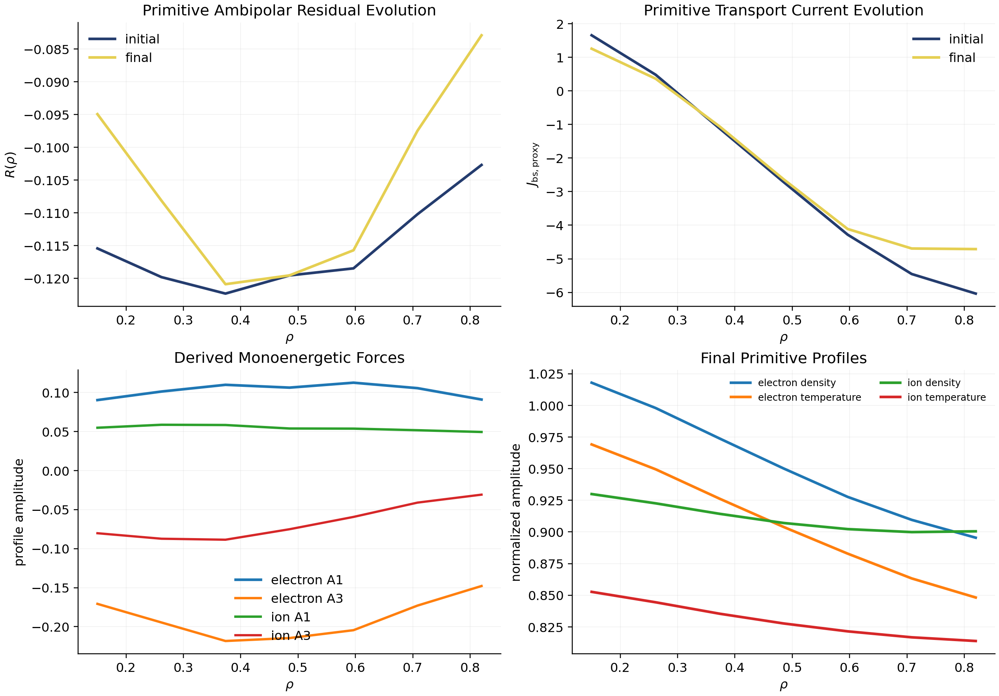

# Manuscript Figures

NTX now includes a manuscript-ready figure bundle built directly from repository
examples.

## Curated Figure Set

### Main Text

1. `validation_summary.{png,pdf,json}`
2. `closure_validation_report.{png,pdf,json,txt}`
3. `bootstrap_current_reference_audit_w7x.{png,pdf}`
4. `derivative_path_benchmark.{png,pdf,json}`
5. `bootstrap_current_optimization.{png,pdf,json}`
6. `performance_scaling_heavy.{png,pdf}`
7. `primitive_profile_transport.{png,pdf}`

### Supplement

1. `autodiff_inverse_problem.{png,pdf}`
2. `autodiff_neopax_profiles.{png,pdf}`
3. `autodiff_profile_uncertainty.{png,pdf,json}`
4. `geometry_control_derivative_benchmark.{png,pdf,json}`
5. `file_backed_geometry_control_derivative_benchmark.{png,pdf,json}`
6. `boundary_forward_mode_current_derivative_benchmark.{png,pdf,json}`
7. `implicit_equilibrium_forward_mode_derivative_benchmark.{png,pdf,json}`
8. `explicit_relaxed_boundary_current_derivative_benchmark.{png,pdf,json}`
9. `geometry_family_breadth_summary.{png,pdf,json}`
10. `bootstrap_current_from_vmec_or_boozmn.{png,pdf,json}`
11. `bootstrap_current_robust_optimization.{png,pdf,json}`
12. `performance_scaling_smoke.{png,pdf}`
13. `ambipolar_profile.{png,pdf}`
14. `ambipolar_profile_family.{png,pdf}`
15. `profile_force_reconstruction_audit.{png,pdf,json}`
16. `profile_control_optimization.{png,pdf}`
17. `profile_basis_optimization.{png,pdf}`
18. `profile_transport_loop.{png,pdf}`

## Full Figure Inventory

1. `validation_summary.{png,pdf,json}`
   - transport-curve behavior on the sample DKES-style and VMEC surfaces
   - Onsager closure
   - Legendre convergence
   - machine-readable benchmark metrics for the literature-anchored methods lane
2. `closure_validation_report.{png,pdf,json,txt}`
   - fixed-field precise-QS Redl gate and monitored NTX+NEOPAX closure stress
     metric in the same manuscript-facing validation report
3. `autodiff_inverse_problem.{png,pdf}`
   - inverse recovery of a surface harmonic from synthetic transport data
4. `autodiff_neopax_profiles.{png,pdf}`
   - autodiff-based profile inversion on NEOPAX-style arrays
5. `autodiff_profile_uncertainty.{png,pdf,json}`
   - linearized versus Monte Carlo uncertainty propagation on the same
     differentiable profile fit under a prescribed Gaussian parameter
     perturbation
6. `geometry_control_derivative_benchmark.{png,pdf,json}`
   - three-harmonic geometry-control derivative audit against centered finite
     differences; tracked as an autodiff stress benchmark
7. `file_backed_geometry_control_derivative_benchmark.{png,pdf,json}`
   - file-backed Boozer and VMEC geometry-control derivative audit against
     centered finite differences; stronger than the owned-surface stress test
     but still below a reusable geometry-family claim
8. `boundary_forward_mode_current_derivative_benchmark.{png,pdf,json}`
   - low-dimensional boundary controls propagated through boundary-projected
     `vmec_jax -> booz_xform_jax -> NTX` and an `NTX+NEOPAX` integrated-current
     objective under forward mode
9. `implicit_equilibrium_forward_mode_derivative_benchmark.{png,pdf,json}`
   - low-dimensional boundary controls propagated through the implicit
     fixed-boundary `vmec_jax` residual solve, `booz_xform_jax`, and an NTX
     monoenergetic transport proxy under forward mode, with the reverse-mode
     Boozer failure recorded in the JSON artifact
10. `explicit_relaxed_boundary_current_derivative_benchmark.{png,pdf,json}`
   - low-dimensional boundary controls propagated through an explicitly relaxed
     fixed-boundary `vmec_jax -> booz_xform_jax -> NTX` path and an
     `NTX+NEOPAX` integrated-current objective, with ordinary-versus-explicit
     primal-volume agreement recorded on committed QA and QH family cases
11. `geometry_family_breadth_summary.{png,pdf,json}`
   - artifact-backed breadth summary across analytic, file-backed,
     boundary-projected, explicit-relaxed, and implicit-equilibrium derivative
     paths; this is a stress summary and not a broad geometry-family
     validation claim
12. `derivative_path_benchmark.{png,pdf}`
   - prepared-derivative timing and agreement against direct reverse-mode
13. `bootstrap_current_optimization.{png,pdf}`
   - science/application figure for differentiable bootstrap-current
     optimization
14. `bootstrap_current_robust_optimization.{png,pdf,json}`
   - deterministic versus robust optimization under a prescribed control
     uncertainty; tracked as an open robust-design lane
15. `bootstrap_current_from_vmec_or_boozmn.{png,pdf}`
   - NTX-only bootstrap-current-proxy profile from VMEC/Boozer input
16. `bootstrap_current_reference_audit_w7x.{png,pdf}`
   - W7-X imported-workflow bootstrap-current convergence audit
17. `performance_scaling_smoke.{png,pdf}`
   - CPU/GPU scaling on the repository smoke grid
18. `performance_scaling_heavy.{png,pdf}`
   - heavier-grid scaling where throughput effects are visible
19. `ambipolar_profile.{png,pdf}`
   - profile-grade ambipolar electric-field solve and bootstrap-current proxy
20. `ambipolar_profile_family.{png,pdf}`
   - control-parameter family of ambipolar closures and scalar bootstrap-current objective
21. `profile_force_reconstruction_audit.{png,pdf,json}`
   - archived precise-QS QA/QH primitive-to-force reconstruction audit
22. `profile_control_optimization.{png,pdf}`
   - differentiable optimization of a scalar profile control on top of the ambipolar closure
23. `profile_basis_optimization.{png,pdf}`
   - low-dimensional radial-basis optimization of the same profile closure
24. `profile_transport_loop.{png,pdf}`
   - explicit self-consistent transport-relaxation iteration on the same profile closure
25. `primitive_profile_transport.{png,pdf}`
   - primitive density/temperature transport iteration mapped back to ambipolar-field and bootstrap-current evolution

Together these figures cover:

- formulation and numerical behavior
- validation and convergence
- fixed-field Redl validation and reduced-closure stress reporting
- differentiable inverse and profile problems
- differentiable uncertainty propagation on the same profile map
- multi-parameter geometry-control derivative auditing
- file-backed Boozer and VMEC geometry-control derivative auditing
- boundary-to-output forward-mode auditing on projected `vmec_jax` geometry
- implicit-equilibrium derivative diagnostics that isolate where parity is lost:
  equilibrium volume matches, but Boozer geometry and NTX transport are closed
  as non-shipping diagnostics
- equilibrium-relaxed boundary-to-current forward-mode auditing on committed QA/QH family cases
- artifact-backed geometry-breadth status across the committed derivative
  families, with unresolved implicit objectives kept out of promoted claims
- a deterministic robust-design stress benchmark for differentiable current optimization
- derivative cost for prepared optimization workflows
- a science-facing bootstrap-current optimization workflow
- a pure NTX radial-profile figure
- a profile-grade ambipolar and bootstrap-current-proxy workflow
- a control-parameter family view of the same profile-grade closure
- a literature-anchored primitive-to-force reconstruction audit on the precise-QS profile family
- a direct optimization view of the profile-grade closure
- a low-dimensional multi-parameter version of that optimization
- a self-consistent transport-relaxation view of the same closure
- a primitive-profile transport view with positive density and temperature updates
- a W7-X imported-workflow convergence figure
- practical performance guidance

## Manuscript Tables And Reproducibility

```bash
python scripts/build_manuscript_artifacts.py
```

This writes:

```text
docs/_static/manuscript_artifacts.json
docs/_static/manuscript_tables.md
docs/_static/manuscript_claims.md
```

These artifacts collect the current NTX commit, software environment, the
validated W7-X convergence numbers, derivative benchmark summaries, heavy-grid
CPU/GPU performance tables, geometry-control derivative stress metrics,
bootstrap-current optimization summaries, and the exact commands needed to
regenerate the figures and validation subset used in the manuscript.

## One-Command Figure Bundle

```bash
python examples/make_publication_figures.py
```

This writes the full figure set into `docs/_static/` and also creates:

```text
docs/_static/publication_figure_manifest.json
```

Generate the frozen main-text set:

```bash
python examples/make_publication_figures.py --figures main_text
```

Generate the supplement set:

```bash
python examples/make_publication_figures.py --figures supplement
```

## Science Figure

```bash
python examples/bootstrap_current_optimization.py
```

The science/application figure is written to:

```text
docs/_static/bootstrap_current_optimization.png
docs/_static/bootstrap_current_optimization.pdf
docs/_static/bootstrap_current_optimization.json
```

It uses:

- a VMEC-derived radial surface family
- a dominant non-axisymmetric harmonic as the control parameter
- a weighted bootstrap-current proxy based on the current-response coefficients
- JAX autodiff to optimize that control directly

The committed JSON artifact is also a monitored benchmark-matrix and
physics-gate entry: the optimized weighted-current proxy must remain at least
as large as the baseline before the manuscript cites the gain. Broader
stellarator-design claims still require reusable geometry-family controls and
their derivative audits.

This is the recommended figure for a paper focused on differentiable bootstrap
current analysis and optimization with NTX.

## Prepared-Derivative Efficiency Figure

```bash
python examples/derivative_path_benchmark.py
```

This writes:

```text
docs/_static/derivative_path_benchmark.png
docs/_static/derivative_path_benchmark.pdf
docs/_static/derivative_path_benchmark.json
```

Use this figure when the paper needs an explicit statement of how NTX moves from
plain reverse-mode to a prepared differentiable workflow that is better suited
to repeated optimization scans.

## NTX Bootstrap-Current Proxy Figure

```bash
python examples/bootstrap_current_from_vmec_or_boozmn.py
```

This writes:

```text
docs/_static/bootstrap_current_from_vmec_or_boozmn.png
docs/_static/bootstrap_current_from_vmec_or_boozmn.pdf
docs/_static/bootstrap_current_from_vmec_or_boozmn.json
```

It is the recommended figure when the paper needs a compact NTX-only radial
profile panel without bringing in the external database workflow. The panel
stays close to directly interpretable quantities: geometry, profile inputs,
parallel-flow drive, and the resulting interior bootstrap-current proxy built
from analytic profile gradients.


## Ambipolar Profile Figure

```bash
python examples/ambipolar_profile.py
```

This writes:

```text
docs/_static/ambipolar_profile.png
docs/_static/ambipolar_profile.pdf
```

Use this figure when the paper needs a profile-grade closure panel built
entirely from NTX scan data, including the ambipolar residual landscape over
the scanned `E_r` axis and the resulting bootstrap-current proxy.


## Ambipolar Profile Family Figure

```bash
python examples/ambipolar_profile_family.py
```

This writes:

```text
docs/_static/ambipolar_profile_family.png
docs/_static/ambipolar_profile_family.pdf
```

Use this figure when the paper needs an optimization-facing profile figure that
shows how a scalar control changes the residual landscape and the
bootstrap-current proxy profiles, while also exposing a one-dimensional
objective landscape.


## Profile-Control Optimization Figure

```bash
python examples/profile_control_optimization.py
```

This writes:

```text
docs/_static/profile_control_optimization.png
docs/_static/profile_control_optimization.pdf
```

Use this figure when the paper needs a direct optimization panel on top of the
profile closure itself, rather than the separate geometry-control science
figure.


## Profile-Basis Optimization Figure

```bash
python examples/profile_basis_optimization.py
```

This writes:

```text
docs/_static/profile_basis_optimization.png
docs/_static/profile_basis_optimization.pdf
```

Use this figure when the paper needs a profile-control optimization panel beyond
one scalar amplitude while still keeping the optimization space compact and
interpretable.


## Profile Transport Loop Figure

```bash
python examples/profile_transport_loop.py
```

This writes:

```text
docs/_static/profile_transport_loop.png
docs/_static/profile_transport_loop.pdf
```

Use this figure when the paper needs a self-consistent profile-transport panel
instead of a pure control-optimization panel. It shows how the ambipolar
residual, bootstrap-current proxy, and thermodynamic-force profiles evolve
under an accepted-step transport-relaxation iteration.


## Primitive Profile Transport Figure

```bash
python examples/primitive_profile_transport.py
```

This writes:

```text
docs/_static/primitive_profile_transport.png
docs/_static/primitive_profile_transport.pdf
```

Use this figure when the paper needs to move beyond direct `A1/A3` proxy
updates and show a primitive profile workflow in which density and temperature
remain positive, respond to explicit source-target closure terms, and feed back
into the ambipolar closure through reconstructed thermodynamic forces. The
panel is now framed around initial-versus-final closure profiles and the
derived monoenergetic forces rather than a noisy iteration trace.



## W7-X Bootstrap-Current Convergence Figure

```bash
python examples/bootstrap_current_reference_audit_w7x.py
```

This writes:

```text
docs/_static/bootstrap_current_reference_audit_w7x.png
docs/_static/bootstrap_current_reference_audit_w7x.pdf
docs/_static/bootstrap_current_reference_audit_w7x.json
```

Use this figure when the paper needs an explicit W7-X imported-workflow
bootstrap-current convergence panel alongside the NTX-only methods figures.


