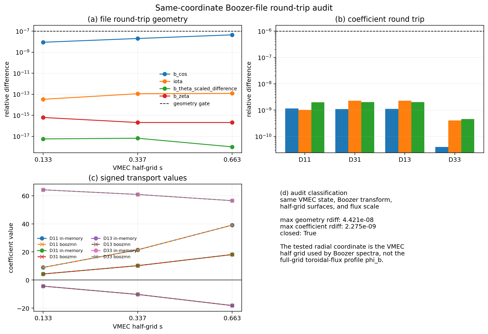

# NEOPAX

NTX can act as the monoenergetic coefficient provider for
[NEOPAX](https://github.com/uwplasma/NEOPAX) workflows.

This page describes the interfaces exposed by [`src/ntx/neopax.py`](../src/ntx/neopax.py)
and when to use each of them.

## Main Objects

### `NeopaxScan`

Structured scan payload storing:

- `rho`
- `nu_v`
- `Er`
- `Es`
- `drds`
- `D11`
- `D13`
- `D33`

plus optional metadata and normalization arrays.

### `NeopaxMonoenergeticArrays`

Pure-array payload designed for imported JAX workflows. This is the preferred
object when the caller wants to stay in array land and avoid a hard dependency
on the NEOPAX Python package.

## Main Helpers

- `build_ntx_neopax_scan(...)`
- `build_ntx_neopax_scan_from_surfaces(...)`
- `scan_to_neopax_arrays(...)`
- `to_neopax_monoenergetic(...)`
- `write_neopax_scan_hdf5(...)`
- `load_neopax_reference_scan(...)`
- `build_differentiable_neopax_field_from_vmec_booz_files(...)`

The imported profile layer in [`src/ntx/profiles.py`](../src/ntx/profiles.py)
builds directly on `NeopaxScan` when the next step is an ambipolar or
reduced bootstrap-current response solve instead of immediate export into the
external package object.

For end-to-end examples, see:

- [`examples/neopax_with_ntx.py`](../examples/neopax_with_ntx.py) for the
  smallest scan-to-array workflow
- [`examples/owned_geometry_neopax_dataset.py`](../examples/owned_geometry_neopax_dataset.py)
  for an owned finite-beta `vmex -> booz_xform_jax -> NTX -> NEOPAX`
  dataset, direct wout-harmonic stress cases, and interpolation-path audit
- [`examples/owned_finite_beta_sfincs_jax_inputs.py`](../examples/owned_finite_beta_sfincs_jax_inputs.py)
  for same-grid SFINCS-JAX input generation, completed-output ingestion, and
  coefficient-level NTX comparison before any finite-beta `SFINCS`/Redl/
  `NTX+NEOPAX` parity promotion
- [`examples/owned_finite_beta_sfincs_jax_resolution_audit.py`](../examples/owned_finite_beta_sfincs_jax_resolution_audit.py)
  for the production stress-radius coefficient-resolution and harmonic-cutoff
  audit that keeps the finite-beta current gap out of hidden numerical knobs
- [`examples/owned_finite_beta_sfincs_jax_production_ladder_audit.py`](../examples/owned_finite_beta_sfincs_jax_production_ladder_audit.py)
  for the production radius/collisionality coefficient ladder that localizes
  the remaining finite-beta stress to the profile-current closure layer
- [`examples/owned_finite_beta_sfincs_jax_profile_current_audit.py`](../examples/owned_finite_beta_sfincs_jax_profile_current_audit.py)
  for the direct RHSMode=1 profile-current diagnostic on the same finite-beta
  VMEC/profile contract used by Redl and `NTX+NEOPAX`
- [`examples/owned_finite_beta_sfincs_jax_profile_current_resolution_audit.py`](../examples/owned_finite_beta_sfincs_jax_profile_current_resolution_audit.py)
  for the pitch Legendre truncation audit that closes the finite-beta
  reduced-closure stress lane at the documented high-`Nxi` tolerance
- [`examples/owned_finite_beta_bootstrap_comparison.py`](../examples/owned_finite_beta_bootstrap_comparison.py)
  for an owned finite-beta Redl and `NTX+NEOPAX` bootstrap-current stress
  audit on the same VMEC wout, Boozer transform, profiles, radial grid, and
  current normalization
- [`examples/owned_finite_beta_closure_localization.py`](../examples/owned_finite_beta_closure_localization.py)
  for the sidecar that separates same-grid coefficient error from the remaining
  finite-beta profile-current closure gap
- [`examples/owned_finite_beta_profile_current_observable_audit.py`](../examples/owned_finite_beta_profile_current_observable_audit.py)
  for the finite-beta stress-radius observable decomposition into no-momentum
  current, momentum correction, correction needed to match Redl, species-current
  cancellation scale, and Pmax trend
- [`examples/owned_finite_beta_current_conditioning_audit.py`](../examples/owned_finite_beta_current_conditioning_audit.py)
  for the cancellation-conditioned coefficient-precision requirement that must
  be met before the finite-beta net-current residual is assigned to a reduced
  closure change
- [`examples/owned_finite_beta_closure_quadrature_audit.py`](../examples/owned_finite_beta_closure_quadrature_audit.py)
  for the Sonine-order versus velocity-quadrature audit that rejects
  under-integrated apparent finite-beta current-gate passes
- [`examples/owned_finite_beta_source_channel_audit.py`](../examples/owned_finite_beta_source_channel_audit.py)
  for the stress-radius physical source-channel decomposition of the same
  momentum-restoring linear system
- [`examples/owned_finite_beta_source_response_profile_audit.py`](../examples/owned_finite_beta_source_response_profile_audit.py)
  for the profile-wide effective-temperature source-response map against Redl
  collisionality and geometry drivers
- [`examples/owned_finite_beta_closure_target_audit.py`](../examples/owned_finite_beta_closure_target_audit.py)
  for the closure-target driver ranking that turns the profile source-response
  map into a runtime-neutral design diagnostic
- [`examples/bootstrap_current_with_neopax.py`](../examples/bootstrap_current_with_neopax.py)
  for a radial bootstrap-current profile built from an NTX scan and evaluated
  through NEOPAX
- [`examples/bootstrap_current_fixed_field_validation.py`](../examples/bootstrap_current_fixed_field_validation.py)
  for the local precise-QS fixed-field comparison against SFINCS, SFINCS-JAX,
  and Redl
- [`examples/build_neopax_scan_from_ertilde.py`](../examples/build_neopax_scan_from_ertilde.py)
  for generating a NEOPAX-style HDF5 coefficient database directly from
  VMEC/Boozer files and a user-provided `rho`, `nu_v`, and `Er_tilde` grid
- [`examples/boozmn_backend_validation_audit.py`](../examples/boozmn_backend_validation_audit.py)
  for dumping the direct Boozer-file geometry, radial-drift source, operator
  channels, and transport coefficients against the validated VMEC-harmonic path
- [`examples/boozmn_same_coordinate_roundtrip_audit.py`](../examples/boozmn_same_coordinate_roundtrip_audit.py)
  for the same-coordinate VMEC half-grid Boozer-file round-trip gate that
  validates direct `boozmn` loading before representation-comparison claims

## Typical Imported Workflow

```python
import jax.numpy as jnp
from ntx import (
    GridSpec,
    build_ntx_neopax_scan,
    scan_to_neopax_arrays,
    surface_from_vmex_vmec_wout_file,
)

rho = jnp.linspace(0.2, 0.8, 5)
nu_v = jnp.logspace(-5, -2, 8)
Es = jnp.zeros((rho.size, 6))
Er = jnp.zeros_like(Es)
drds = jnp.ones_like(rho)

def surface_loader(rho_value: float):
    return surface_from_vmex_vmec_wout_file("wout.nc", s=float(rho_value**2))

scan = build_ntx_neopax_scan(
    surface_loader,
    rho=rho,
    nu_v=nu_v,
    Es=Es,
    Er=Er,
    drds=drds,
    grid=GridSpec(n_theta=17, n_zeta=25, n_xi=32),
)

arrays = scan_to_neopax_arrays(scan, a_b=1.0)
```

By default, the conversion keeps the raw `D33` database convention used by the
integrated workflow:

```python
arrays = scan_to_neopax_arrays(scan, a_b=1.0, d33_mode="raw")
```

The `d33_mode="spitzer"` and `d33_mode="conductivity_difference"` branches are
explicit audit choices. They are useful for fixed-field closure stress tests,
but they are not the public default because they do not satisfy the integrated
W7-X transfer gate.

## DKES-Like `Er_tilde` Database Export

When the downstream workflow expects a file-backed coefficient database, use
the `Er_tilde` export example instead of hand-editing HDF5 payloads:

```bash
python examples/build_neopax_scan_from_ertilde.py \
  --wout path/to/wout.nc \
  --booz path/to/boozmn.nc \
  --rho 0.25,0.5,0.75 \
  --nu-v 1e-5,3e-5,1e-4,3e-4,1e-3 \
  --er-tilde 0.0,1e-5,3e-5 \
  --surface-backend vmec \
  --device-backend cpu \
  --scan-batch-size 32 \
  --output examples/outputs/neopax_scan_from_ertilde/scan.h5 \
  --plot
```

The script validates the input files and grids, computes `Er`, `Es`, and
normalization metadata from the supplied VMEC/Boozer files, solves the NTX
monoenergetic coefficient tables, writes `write_neopax_scan_hdf5(...)` output,
and can emit per-radius coefficient panels for quick sanity checks.
Use the VMEC surface backend for validation and benchmark generation. The
`boozmn` backend is available as an explicit geometry-backend audit path, but
it is not the default validation path.

`--scan-batch-size` bounds memory inside each radial-surface scan. It is not
itself a CPU parallelism switch. For CPU-only laptops, expose multiple JAX host
devices before Python imports JAX, then request sharding explicitly:

```bash
XLA_FLAGS=--xla_force_host_platform_device_count=4 \
python examples/build_neopax_scan_from_ertilde.py \
  --wout path/to/wout.nc \
  --booz path/to/boozmn.nc \
  --surface-backend vmec \
  --device-backend cpu \
  --parallel-devices 4 \
  --scan-batch-size 32 \
  --output examples/outputs/neopax_scan_from_ertilde/scan.h5
```

If `--device-backend gpu` is requested on a CPU-only laptop, the script now
fails with the available JAX platforms and tells the user to switch to
`--device-backend cpu`. Also check
`python examples/build_neopax_scan_from_ertilde.py --help`: if
`--scan-batch-size` and `--parallel-devices` are missing, the local NTX checkout
or installed package is stale.

For the QI finite-beta hires example used in downstream database generation,
the full-surface vectorized scan is GPU-friendly but memory-heavy on CPU. On
the local CPU reference run, `25 x 25 x 60` with one radial surface and the
default `16 x 12` `(nu_v, Er_tilde)` grid took `64.7 s` and about `5.0 GB`
peak RSS. Adding `--scan-batch-size 32` reduced that to `55.9 s` and about
`1.46 GB` peak RSS for the same coefficients. Smaller batches such as `16`
lower memory further but were slower in this probe, so `32` is the recommended
CPU fallback for this case. Leave the option unset on GPU unless device memory
is the limiting factor.

### Direct Boozer-File Backend Audit

`boozmn` spectra and Boozer radial profiles are half-grid quantities. The
direct loader therefore selects and interpolates packed `B_{mn}` surfaces using
`s_in`, `s_b`, or `jlist = compute_surfs + 2`, not the full-grid toroidal-flux
profile `phi_b`. The same-coordinate round-trip gate is the first check:

```bash
python examples/boozmn_same_coordinate_roundtrip_audit.py
```

This script generates a Boozer file from a VMEC `wout`, reloads the same
half-grid surfaces through `load_boozmn_surface(...)`, and compares geometry
metadata plus `D11/D31/D13/D33` with the in-memory
`vmex -> booz_xform_jax -> NTX` path. A passing gate validates the direct
file loader. It does not imply that a VMEC-harmonic representation and a
direct Boozer-coordinate representation have identical source channels.



The direct Boozer-file path and the VMEC-harmonic path do not expose identical
coordinate channels. The direct Boozer helper represents the magnetic field in
Boozer coordinates with flux-function covariant components, while the
VMEC-harmonic helper reads the signed VMEC Jacobian and angle-dependent
covariant/contravariant channels from the `wout` file. Because the NTX
monoenergetic source contains

```{math}
v_{m,\psi} \propto
\frac{B_\theta \partial_\zeta B - B_\zeta \partial_\theta B}
     {\sqrt{g}\,B^3},
```

backend promotion must be based on this source channel, not only on close
`B_{00}` or `D_{33}` values.

Run the backend audit before using direct `boozmn` surfaces for benchmark
claims:

```bash
python examples/boozmn_backend_validation_audit.py \
  --wout path/to/wout.nc \
  --boozmn path/to/boozmn.nc \
  --rho 0.5 \
  --nu-hat 1e-2 \
  --epsi-hat 0.0
```

The audit writes JSON plus PNG/PDF panels with the surface metadata, geometry
statistics, `s1/s3` source norms, `k=1` operator-channel norms, signed
`D11/D31/D13/D33` values, and relative differences against the VMEC-harmonic
path. Direct Boozer-file output should stay in audit mode unless both the
transport-coefficient and radial-drift source differences pass on owned
same-coordinate cases. A failing audit localizes a convention or interpolation
gap; it is not a reason to introduce fitted closure constants.

When converting NEOPAX parallel-flow output into current, use one charge
conversion only. If the workflow uses `species.charge`, that array already
contains the signed physical charge in Coulombs. If the workflow uses
`species.charge_qp`, multiply by one elementary-charge factor:

```python
current = elementary_charge * np.sum(species.charge_qp[:, None] * upar, axis=0)
```

## JAX-Native Geometry Workflows

Use the matching VMEC input and `wout` when the geometry should stay inside the
JAX geometry stack and the Boozer transform should be owned by the same run:

```python
import jax.numpy as jnp
from ntx import GridSpec, build_ntx_neopax_scan_from_surfaces, surface_from_vmex_wout

rho = jnp.asarray([0.35, 0.65])
psi_p = 0.013346299916410087  # abs(phi_edge)/(2*pi) from the matching wout
surfaces = tuple(
    surface_from_vmex_wout(
        input_path="input.LandremanPaul2021_QA_lowres_pressure_current",
        wout_path="wout_LandremanPaul2021_QA_lowres_pressure_current.nc",
        s=float(rho_value**2),
        mboz=4,
        nboz=4,
        psi_p=psi_p,
    )
    for rho_value in rho
)

scan = build_ntx_neopax_scan_from_surfaces(
    surfaces,
    rho=rho,
    nu_v=jnp.asarray([1.0e-3, 1.0e-2]),
    Es=jnp.zeros((rho.size, 1)),
    drds=jnp.ones_like(rho),
    grid=GridSpec(7, 7, 6),
    source_name="owned-finite-beta-qa",
)
```

`surface_from_vmex_vmec_wout_file(...)` is still useful when only a `wout`
file is available. It reads the VMEC harmonic tables through `vmex` and
uses NTX's radial interpolation of those tables. That path is not identical to
the Boozer-transform path above, so the two should be compared only as an
interpolation/geometry-loader audit on the same owned input family.

For physical-current or NEOPAX database workflows, do not rely on the
low-level Boozer helper's default `psi_p=1`. Pass the VMEC edge toroidal flux
divided by `2*pi` explicitly. The owned finite-beta diagnostic records this
value in its JSON sidecar and uses it to keep the Boozer-coordinate and direct
VMEC-harmonic transport paths on the same flux normalization.

When building a NEOPAX-style field object from VMEC and `boozmn` files, use
`build_differentiable_neopax_field_from_vmec_booz_files(...)`. Boozer `B00`
profiles are tabulated on normalized radius, so the helper evaluates `B00` on
`rho` and converts the derivative with `dB00/dr = (dB00/d rho)/a_b`. This is the
normalization used by the finite-beta bootstrap-current stress artifacts.

For in-memory differentiable studies, avoid file-backed geometry loops and use
`build_ntx_neopax_scan_from_vmex_state(...)` or
`build_ntx_neopax_scan_from_vmex_boundary_params(...)`. Those helpers keep
the VMEC state, Boozer transform, NTX scan, and NEOPAX-style arrays on the
JAX-facing path used by the derivative examples.

## Explicit-Surface Workflow

If the surfaces are already in memory, avoid the callback boundary:

```python
from ntx import build_ntx_neopax_scan_from_surfaces

scan = build_ntx_neopax_scan_from_surfaces(
    surfaces,
    rho=rho,
    nu_v=nu_v,
    Es=Es,
    Er=Er,
    drds=drds,
    grid=grid,
)
```

This is the cleaner choice for JAX-native surface-generation pipelines.

## HDF5 Workflow

Load a NEOPAX-style monoenergetic table:

```python
from ntx import load_neopax_reference_scan

scan = load_neopax_reference_scan("monoenergetic.h5")
```

Write one:

```python
from ntx import write_neopax_scan_hdf5

write_neopax_scan_hdf5(scan, "monoenergetic_out.h5")
```

The writer stores uncompressed numeric datasets with HDF5 object timestamps
disabled. That keeps repeated database regeneration fast and avoids needless
binary churn from file metadata.

## Conversion Layers

### JAX-friendly path

`scan_to_neopax_arrays(...)`

Use this when:

- the next step is still JAX-based
- gradients matter
- the caller wants direct access to the normalized arrays

### Convenience object path

`to_neopax_monoenergetic(...)`

Use this when the NEOPAX package is installed and the goal is to hand the data
to NEOPAX directly as a Python object.

## What NTX Supplies To NEOPAX

NTX supplies the monoenergetic geometric coefficients on the requested radial,
collisionality, and electric-field grid. NEOPAX then uses those tables in its
own higher-level transport workflow.

That separation of responsibility is deliberate:

- NTX owns the monoenergetic solve
- NEOPAX owns the radial multi-species transport layer

## Profile-Grade Imported Workflows

When the next step is still inside NTX, use the profile helpers on top of the
scan payload:

- `evaluate_scan_channel(...)`
- `evaluate_species_particle_flux(...)`
- `evaluate_species_current_response(...)`
- `ambipolar_residual_profile(...)`
- `solve_ambipolar_er_profile(...)`
- `solve_ambipolar_profile_family(...)`
- `bootstrap_current_objective(...)`
- `apply_profile_control(...)`
- `optimize_profile_control(...)`
- `apply_profile_basis_control(...)`
- `optimize_profile_basis_control(...)`
- `advance_profile_transport(...)`
- `profile_transport_loss(...)`
- `solve_profile_transport_loop(...)`

Those helpers are documented on the [Profiles](profiles.md) page.
