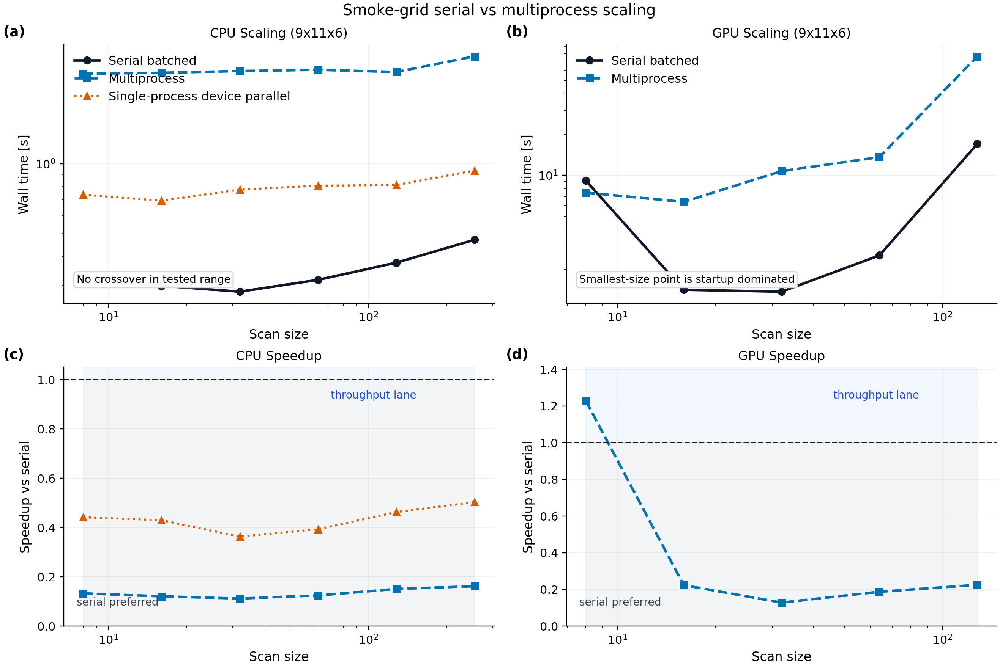
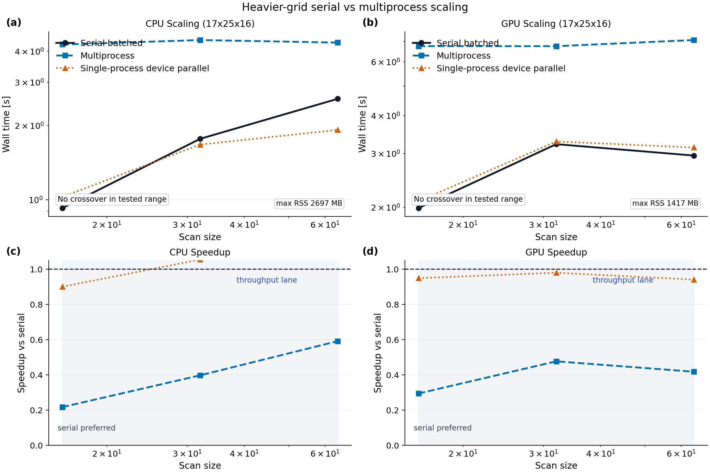
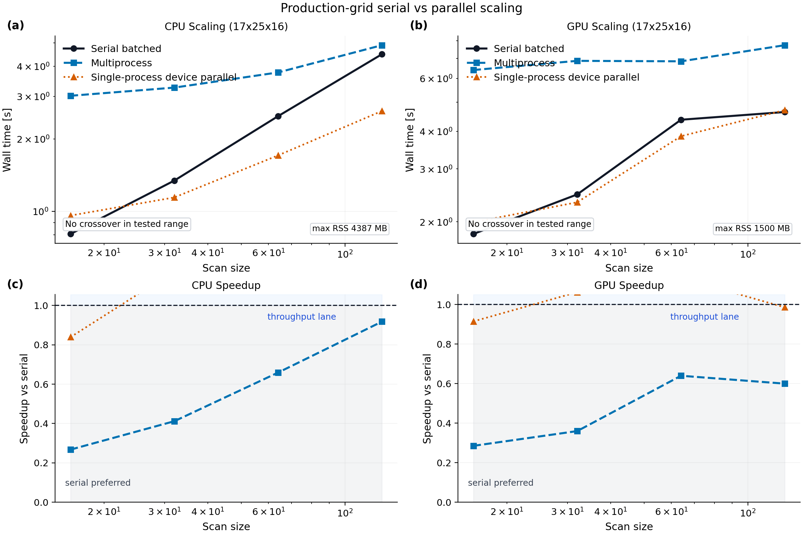
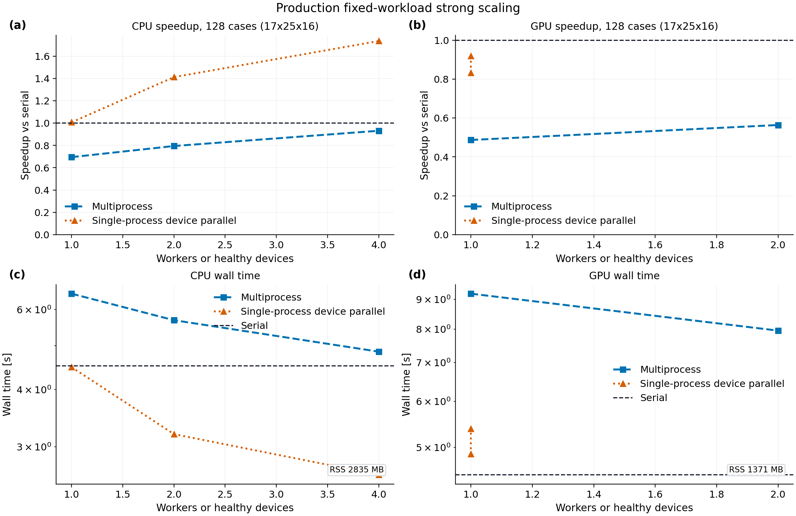
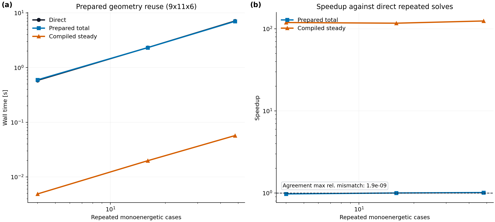

# Performance

NTX now includes explicit scaling benchmarks and figure-generation helpers for
serial batched scans and the multiprocess throughput lane. It also now includes
workflow profilers for the archive-backed fixed-field closure audit and the
corrected integrated W7-X workflow.

## File-Backed Run Path

The TOML/CLI path prepares the geometry and derivative operators once, then
reuses that prepared system for the solve and output writer. This avoids the
old double geometry evaluation in file-backed single-case runs and lowers both
runtime and peak transient array pressure. Verbose CLI runs print separate
prepare, solve, write, plot, and total timings.

NetCDF and HDF5 outputs are written uncompressed for fast inspection and
cross-code exchange. Use `.npz` when smaller Python-only artifacts matter more
than write speed:

```bash
ntx input.toml --output outputs/run.nc --plot
ntx input.toml --output outputs/run.npz
```

## Benchmark Scripts

Collect scaling data:

```bash
python scripts/benchmark_scaling.py --backend cpu --surface dkes --sizes 8,16,32,64
python scripts/benchmark_scaling.py --backend gpu --surface dkes --sizes 16,32,64 --workers 2
python scripts/benchmark_strong_scaling.py --backend cpu --surface dkes --num-cases 64
```

Generate publication-style figures:

```bash
python examples/performance_scaling.py \
  --cpu-json docs/_static/performance_scaling_cpu_smoke.json \
  --gpu-json docs/_static/performance_scaling_gpu_smoke.json \
  --figure-title "Smoke-grid serial vs multiprocess scaling" \
  --output-prefix docs/_static/performance_scaling_smoke

python examples/performance_strong_scaling.py \
  --cpu-json docs/_static/performance_strong_scaling_cpu_production.json \
  --gpu-json docs/_static/performance_strong_scaling_gpu_production.json \
  --figure-title "Production fixed-workload strong scaling" \
  --output-prefix docs/_static/performance_strong_scaling_production
```

The example writes PNG, PDF, and JSON summary outputs. The summary JSON records
CPU/GPU crossover cases, process peak resident memory, device counts, and
serial-vs-parallel coefficient deltas.

For the committed production-grid map:

```bash
XLA_FLAGS=--xla_force_host_platform_device_count=4 \
python scripts/benchmark_scaling.py \
  --backend cpu --surface dkes --sizes 16,32,64,128 \
  --workers 4 --n-theta 17 --n-zeta 25 --n-xi 16 \
  --output-json docs/_static/performance_scaling_cpu_production.json

python examples/performance_scaling.py \
  --cpu-json docs/_static/performance_scaling_cpu_production.json \
  --gpu-json docs/_static/performance_scaling_gpu_production.json \
  --figure-title "Production-grid serial vs parallel scaling" \
  --output-prefix docs/_static/performance_scaling_production

XLA_FLAGS=--xla_force_host_platform_device_count=4 \
python scripts/benchmark_strong_scaling.py \
  --backend cpu --surface dkes --num-cases 128 \
  --worker-counts 1,2,4 --device-counts 1,2,4 \
  --n-theta 17 --n-zeta 25 --n-xi 16 \
  --output-json docs/_static/performance_strong_scaling_cpu_production.json
```

Profile the corrected integrated W7-X workflow:

```bash
python scripts/profile_w7x_integrated_workflow.py \
  --output-json examples/outputs/profile_w7x_integrated_workflow/profile.json \
  --cprofile-out examples/outputs/profile_w7x_integrated_workflow/profile.pstats \
  --trace-dir examples/outputs/profile_w7x_integrated_workflow/trace
```

The script records:

- cached scan/database timings
- first-call and steady-state closure timings
- resident memory
- a Python `cProfile` dump
- a TensorFlow/JAX trace that can be opened in TensorBoard or Perfetto

## Smoke-Grid Scaling

Figure assets:

```text
docs/_static/performance_scaling_smoke.png
docs/_static/performance_scaling_smoke.pdf
docs/_static/performance_scaling_smoke.json
```



Interpretation:

- on the repository smoke grid `9 x 11 x 6`, serial batched JAX is the default
  choice on both CPU and GPU for small and medium scans
- the smallest GPU point is startup dominated and should not be interpreted as a
  real throughput crossover
- on the refreshed local CPU run, the multiprocess and single-process
  device-parallel lanes are numerically correct but still slower than serial
  over the tested smoke-grid range
- the refreshed CPU smoke artifact reports process peak resident memory of
  about `1.76 GB`
- the refreshed office GPU smoke artifact reports process peak resident memory
  of about `1.29 GB`, with one of two GPUs passing the single-process
  device-parallel smoke filter

## Heavier-Grid Scaling

Figure assets:

```text
docs/_static/performance_scaling_heavy.png
docs/_static/performance_scaling_heavy.pdf
docs/_static/performance_scaling_heavy.json
```



Interpretation:

- on the heavier DKES grid `17 x 25 x 16`, the refreshed local CPU artifact
  shows the single-process device-parallel lane crossing serial by `32` cases,
  while the 4-worker CPU multiprocess lane remains slower through `64` cases
- on the same heavier grid, the office 2-GPU multiprocess lane remains slower
  than serial in the tested range under the current shared-office software and
  hardware stack
- the refreshed CPU heavy artifact reports process peak resident memory of
  about `2.70 GB`
- the refreshed office GPU heavy artifact reports process peak resident memory
  of about `1.42 GB`, again with one healthy single-process device
- the practical guidance from these measurements is:
  - use serial batched JAX for small and medium studies
  - use the single-process device-parallel lane on CPU only after checking that
    the target grid/scan size has crossed over
  - use the multiprocess lane only when a measured workload shows enough
    amortization of process startup on the target machine
  - treat office multi-GPU multiprocess execution as a robust isolation path
    first, and as a throughput path only after benchmarking the specific
    production workload

## Production-Grid Scaling

Figure assets:

```text
docs/_static/performance_scaling_production.png
docs/_static/performance_scaling_production.pdf
docs/_static/performance_scaling_production.json
```



Interpretation:

- the committed production map uses the same `17 x 25 x 16` DKES-style grid as
  the heavier-grid artifact but extends the scan ladder to `128` cases
- with four logical CPU devices exposed to JAX, the single-process
  device-parallel lane crosses serial at `32` cases and reaches a best observed
  speedup of about `1.72x` at `128` cases
- the 4-worker CPU multiprocess lane remains below serial through `128` cases,
  reaching about `0.92x`; process startup and duplicated runtime state still
  dominate this workload
- the office two-GPU workstation run found two CUDA devices, but only one device
  passed the NTX smoke solve for single-process parallel execution under the
  tested software stack
- on that GPU workload, single-process device-parallel timing is characterized
  and numerically identical to serial for `D11`, but multiprocess remains below
  serial through `128` cases
- peak resident memory is about `4.39 GB` for the 4-device CPU run and
  `1.50 GB` for the tested GPU run

The production-grid guidance is therefore:

- use compiled prepared-geometry reuse first when the geometry and array shapes
  are fixed
- use single-process JAX device parallelism for CPU scan ladders after a local
  crossover measurement
- keep multiprocess and multi-GPU execution as workload-specific isolation or
  throughput paths until the exact target grid shows a measured win

## Production Strong Scaling

Figure assets:

```text
docs/_static/performance_strong_scaling_production.png
docs/_static/performance_strong_scaling_production.pdf
docs/_static/performance_strong_scaling_production.json
```



Interpretation:

- the committed strong-scaling map fixes the workload at `128` cases on the
  `17 x 25 x 16` DKES-style grid, then varies workers or requested devices
- on CPU, single-process device parallelism scales from `1.01x` at one exposed
  device to `1.74x` at four devices; the corresponding efficiency drops from
  startup parity to about `0.43` at four devices, so this is useful but not
  ideal strong scaling
- on CPU, the multiprocess lane improves with more workers but remains below
  serial at `0.93x` for four workers, which confirms that process startup and
  duplicated runtime state are still too costly for this fixed workload
- on the tested two-GPU workstation, both CUDA devices are visible but only one
  passes the NTX single-process smoke solve; the strong-scaling artifact
  therefore records one healthy parallel GPU and does not promote multi-GPU
  speedup
- all CPU and GPU strong-scaling lanes reproduce serial `D11` to the committed
  numerical tolerance; the largest GPU multiprocess delta is about `2.34e-8`
- peak resident memory is about `2.83 GB` for the CPU strong-scaling run and
  `1.37 GB` for the GPU strong-scaling run

This closes the first artifact-backed strong-scaling lane. The next performance
work should target device-health reproducibility and larger VMEC-family
workloads before claiming general multi-GPU scaling.

## Prepared-Geometry Reuse

The prepared-geometry reuse artifact isolates the repeated fixed-geometry solve
path from the multiprocess throughput lane:

```bash
python examples/prepared_geometry_reuse_profile.py --preset paper
```

For targeted trace capture:

```bash
python examples/prepared_geometry_reuse_profile.py \
  --preset smoke --case-counts 3 \
  --trace-dir examples/outputs/ntx_prepared_geometry_profile/cpu_smoke_trace \
  --perfetto \
  --device-memory-profile examples/outputs/ntx_prepared_geometry_profile/cpu_smoke_trace/device_memory.prof
```

Figure assets:

```text
docs/_static/prepared_geometry_reuse_profile.png
docs/_static/prepared_geometry_reuse_profile.pdf
docs/_static/prepared_geometry_reuse_profile.json
```



Current local CPU interpretation:

- direct repeated solves and un-jitted prepared solves are near parity after
  one warmup solve, so hoisting geometry arrays alone is not the main win on
  this grid
- the compiled prepared steady path reaches a best observed speedup of about
  `1.50e2x` against direct repeated solves with maximum coefficient mismatch
  below `2e-9`
- the first compiled call is still visible at about `0.43 s`, which confirms
  that optimization workflows should compile once per fixed geometry and reuse
  stable shapes across collisionality, electric-field, species, and radial axes
- the process peak resident memory in this run is about `1.24 GB`

This turns the speed lane into a concrete engineering target: stabilize and
reuse prepared compiled closures before deeper linear-algebra rewrites or
multi-process orchestration.

## Finite-Beta RHSMode=1 Profile-Current Profiling

The finite-beta profile-current lane now has a dedicated handoff note for the
same-contract SFINCS-JAX RHSMode=1 bottleneck:

```text
docs/sfincs-jax-rhsmode1-profile-current-handoff.md
```

The current profiling result is:

- SFINCS-JAX `1.1.0` at `df0c70d` completes the `13 x 15 x 8, Nx=5`
  three-radius smoke profile-current artifact in `24.7 s` total on local CPU;
  all three HDF5 outputs pass the true-residual metadata gate
- the same checkout completes the `17 x 21 x 12, Nx=5` inner-radius HDF5 output
  in `9.90 s` wall time with `1.55 GB` max RSS, `sparse_pc_gmres`, and
  true-residual/target `8.45e-7`
- a three-radius `25 x 31 x 17, Nx=11` production ladder completes in
  `383.16 s` with about `9.46 GB` max RSS and true-residual gates passing at
  every radius
- the pitch-resolution audit shows the remaining RHSMode=1 profile-current
  discrepancy is not a residual failure: high-`Nxi` even/odd Legendre
  truncations still differ by `1.323e-1`
- a same-grid `collisionOperator=0` full-collision probe timed out after
  `901.76 s` and about `9.97 GB` max RSS without a completed current output

The old sparse-solver runtime lane is closed.  The finite-beta current figure
should still not be promoted until the same-contract RHSMode=1 pitch truncation
and full-collision physics branches are converged.

## Reproducibility

The figure JSON payloads committed in `docs/_static/` are:

- `performance_scaling_cpu_smoke.json`
- `performance_scaling_gpu_smoke.json`
- `performance_scaling_cpu_heavy.json`
- `performance_scaling_gpu_heavy.json`
- `performance_scaling_cpu_production.json`
- `performance_scaling_gpu_production.json`
- `performance_scaling_production.json`
- `performance_strong_scaling_cpu_production.json`
- `performance_strong_scaling_gpu_production.json`
- `performance_strong_scaling_production.json`
- `prepared_geometry_reuse_profile.json`

Fresh runs of `scripts/benchmark_scaling.py` and
`scripts/profile_parallel_runtime.py` also record process peak resident memory
as `max_rss_mb`. That value is intentionally treated as a run-environment
metric rather than a parity target, but it keeps memory visible whenever timing
artifacts are regenerated. The committed CPU artifacts were refreshed locally;
the committed GPU artifacts were refreshed from a clean temporary checkout on
the office GPU workstation.
For CI smoke coverage, `scripts/profile_parallel_runtime.py` accepts
`--num-cases` and `--grid` so the serial/device-parallel correctness path can
run on a tiny grid while the default command remains the profiling workload.

They were collected on:

- local workstation CPU with `XLA_FLAGS=--xla_force_host_platform_device_count=4`
- office workstation GPU with `XLA_PYTHON_CLIENT_PREALLOCATE=false`

## Integrated W7-X Workflow

The corrected integrated W7-X raw branch is now the right profiling target
because the database normalization is closed there and the rebuilt workflow
matches the shipped reference current tightly.

Current local CPU profile, using the cached rebuilt W7-X scan:

- `reference_load_seconds`: `1.04e-2`
- `scan_prepare_seconds`: `2.94e-4`
- `rebuilt_scan_load_seconds`: `2.69e-3`
- `field_species_seconds`: `1.97`
- `database_seconds`: `2.55e-1`
- `no_momentum_first_seconds`: `8.64`
- `no_momentum_steady_seconds`: `2.63e-2`
- `momentum_correction_first_seconds`: `8.81`
- `momentum_correction_steady_seconds`: `1.58e-2`
- `current_reduction_seconds`: `3.29e-2`
- `max_rss_mb`: about `1847`

Interpretation:

- the corrected integrated workflow is compile-bound on first call, not
  arithmetic-bound
- the steady-state closure path is already fast on CPU once compiled
- the main performance priority is therefore to reduce recompiles and tracing,
  not to micro-optimize the final current reduction

The current `cProfile` dump is dominated by XLA compilation:

- about `15 s` in `backend_compile_and_load`
- about `20 s` total Python runtime

That points directly to the next speed lane:

- stabilize shapes and dtypes in the closure path
- hoist and reuse the compiled no-momentum and momentum-correction calls
- avoid retracing/vmap rebuilding across repeated workflow invocations
- then revisit deeper kernel/vectorization work only after those compile
  overheads are under control

A simple persistent compilation-cache experiment is now also bounded out as a
first-order fix. Re-running the same workflow in a fresh process with
`--compilation-cache-dir` enabled leaves the first-call latencies essentially
unchanged:

- cold cached process:
  - `no_momentum_first_seconds`: `1.17e+1`
  - `momentum_correction_first_seconds`: `1.24e+1`
- warm cached process:
  - `no_momentum_first_seconds`: `1.17e+1`
  - `momentum_correction_first_seconds`: `1.23e+1`

So the current integrated workflow is not being held back by a missing on-disk
compilation cache alone. The speed lane should stay focused on shape
stability, static-argument control, and reusable compiled closure calls rather
than on cache toggles by themselves.

## Research-Grade Performance Plan

The next performance work should stay evidence-driven:

1. measure compile time, first-call time, steady-state time, peak resident
   memory, and device memory separately;
2. keep small PR tests and large profiling campaigns separate;
3. profile the exact workload before changing linear algebra, vectorization, or
   dependencies;
4. prefer stable shapes and prepared data structures over dynamic Python control
   inside `jit`;
5. promote multi-process or multi-device paths only when a measured production
   grid crosses over from serial batched JAX.

JAX-specific rules for NTX:

- use `jax.vmap` for independent collisionality, electric-field, species, or
  radial scan axes when all mapped leaves have compatible shapes;
- use `jax.lax.scan` for fixed-length iterative loops that would otherwise be
  unrolled inside `jit`;
- keep static arguments hashable, immutable, and low-cardinality so they do not
  create unnecessary recompiles;
- consider buffer donation only at public call boundaries where the caller will
  not reuse the donated arrays;
- use `jax.profiler.trace` or XProf/Perfetto for targeted traces, and JAX memory
  profiling for OOM or retained-buffer investigations;
- for GPU sharing, set explicit memory policy such as
  `XLA_PYTHON_CLIENT_PREALLOCATE=false` or `XLA_PYTHON_CLIENT_MEM_FRACTION`
  before launching concurrent runs.

Lineax and Equinox are useful but not automatic wins:

- Lineax should be evaluated first on repeated structured solve or
  Jacobian-linear-operator workloads where reuse or memory reduction can be
  measured against the current prepared dense solve.
- Equinox should be evaluated for typed PyTree modules and filtered transforms
  only if it simplifies static-versus-dynamic argument handling or custom
  derivative APIs without destabilizing the public NTX API.

Do not use broad XLA dump passes as the default profiling loop on normal
workstations. They are useful for focused compiler investigations, but the
current project bottlenecks are better attacked with smaller traces, shape
audits, and cached closure-only profiling.
