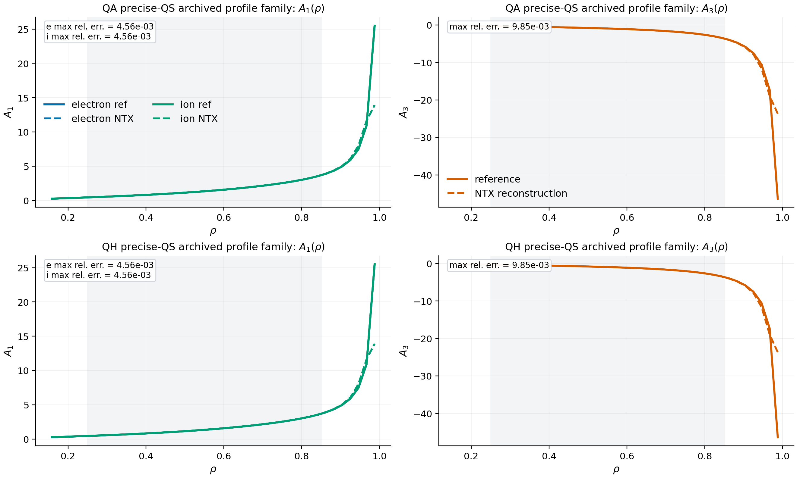

# Profiles

NTX now exposes a first imported profile workflow in
[`src/ntx/profiles.py`](../src/ntx/profiles.py). This layer sits above the
monoenergetic solve and above the radial scan builders, and it is intended for
ambipolar electric-field studies and bootstrap-current proxy analysis.

## Scope

This module does **not** replace a full multi-species transport code. It uses
the monoenergetic transport coefficients already produced by NTX and builds a
clean, differentiable profile-level closure around them.

The current closure uses:

- monoenergetic particle-flux proxies
- monoenergetic parallel-current proxies
- a smooth ambipolar electric-field profile solve on a precomputed NTX scan

## Main Objects

### `MonoenergeticSpeciesProfile`

One species is described by:

- `charge`
- `nu_v`
- `A1`
- `A3`
- `particle_weight`
- `current_weight`

where `A1(r)` and `A3(r)` are the thermodynamic-force proxies used in the
monoenergetic closure.

### `AmbipolarProfileResult`

The solver returns:

- `rho`
- `er_profile`
- `ambipolar_residual`
- `bootstrap_current_proxy`
- `species_particle_flux`
- `species_current_response`
- `loss_history`

## Proxy Model

For one species, NTX currently uses the monoenergetic closures

```{math}
\Gamma_a(r) = -w^{(\Gamma)}_a(r)\left[D_{11,a}(r) A_{1,a}(r) + D_{13,a}(r) A_{3,a}(r)\right],
```

```{math}
J_a(r) = -w^{(J)}_a(r)\left[D_{31,a}(r) A_{1,a}(r) + D_{33,a}(r) A_{3,a}(r)\right].
```

The ambipolar residual is then

```{math}
R(r) = \sum_a Z_a \Gamma_a(r),
```

so a charge-symmetric pair with identical particle-flux response must cancel
exactly. The fast physics-gate suite checks this local ambipolarity identity
before the nonlinear radial-electric-field solve is trusted.

and the current profile proxy is

```{math}
J_{\mathrm{bs,proxy}}(r) = \sum_a J_a(r).
```

The ambipolar electric-field profile is obtained by minimizing a smooth radial
objective on the precomputed `E_r` scan stored in the NTX scan payload:

```{math}
\mathcal L_E[\hat E_r]
=
\left\langle R(r;\hat E_r)^2 \right\rangle_r
+ \lambda_E
\left\langle
\left(\partial_r \hat E_r\right)^2
+ \tfrac12\left(\partial_r^2 \hat E_r\right)^2
\right\rangle_r,
```

where `\lambda_E` is the user-controlled smoothing weight exposed through
`smoothing_strength`. NTX then applies bounded backtracking updates to the full
profile vector rather than solving each radius independently. This suppresses
the checkerboard artifacts that appear when adjacent radii are updated without
any radial regularization.

Primitive density and temperature updates use exponential relaxation and a
strict positive floor. That preserves the physical state-space constraint
`n(r) > 0`, `T(r) > 0` even when a transport mismatch is large enough to
underflow an unconstrained explicit update.

## Main Helpers

- `evaluate_scan_channel(...)`
- `evaluate_species_particle_flux(...)`
- `evaluate_species_current_response(...)`
- `ambipolar_residual_profile(...)`
- `solve_ambipolar_er_profile(...)`
- `solve_ambipolar_profile_family(...)`
- `bootstrap_current_objective(...)`
- `apply_profile_control(...)`
- `optimize_profile_control(...)`
- `ProfileBasisControlSpec`
- `apply_profile_basis_control(...)`
- `optimize_profile_basis_control(...)`
- `ProfileTransportClosureSpec`
- `profile_transport_loss(...)`
- `advance_profile_transport(...)`
- `solve_profile_transport_loop(...)`

## Typical Workflow

```python
import jax.numpy as jnp
from ntx import (
    GridSpec,
    MonoenergeticSpeciesProfile,
    build_ntx_neopax_scan_from_surfaces,
    example_surface,
    solve_ambipolar_er_profile,
)

rho = jnp.linspace(0.2, 0.8, 6)
nu_v = jnp.asarray([3.0e-4, 1.0e-3, 3.0e-3, 1.0e-2])
er_axis = jnp.asarray([-3.0e-3, -1.0e-3, -3.0e-4, 0.0, 3.0e-4, 1.0e-3, 3.0e-3])
er_grid = jnp.tile(er_axis[None, :], (rho.size, 1))
surfaces = tuple(example_surface() for _ in range(rho.size))

scan = build_ntx_neopax_scan_from_surfaces(
    surfaces,
    rho=rho,
    nu_v=nu_v,
    Es=er_grid,
    Er=er_grid,
    drds=jnp.ones_like(rho),
    grid=GridSpec(7, 9, 6),
)

electron = MonoenergeticSpeciesProfile(
    charge=-1.0,
    nu_v=jnp.linspace(4.0e-4, 1.0e-3, rho.size),
    A1=1.1 - 0.25 * rho,
    A3=0.55 - 0.12 * rho,
    current_weight=-1.0,
    name="electron",
)
ion = MonoenergeticSpeciesProfile(
    charge=1.0,
    nu_v=jnp.linspace(2.0e-3, 5.0e-3, rho.size),
    A1=0.7 + 0.35 * rho,
    A3=0.24 + 0.08 * rho,
    particle_weight=1.08,
    current_weight=1.0,
    name="ion",
)

result = solve_ambipolar_er_profile(scan, (electron, ion), steps=12, damping=0.7)
```

## Example Script

The repository example

```bash
python examples/ambipolar_profile.py
```

writes:

```text
docs/_static/ambipolar_profile.png
docs/_static/ambipolar_profile.pdf
```

It shows:

- the ambipolar residual landscape over the scanned `E_r` axis
- the bootstrap-current proxy profile
- species particle-flux proxies and the charge-weighted residual
- the integrated ambipolar landscape used by the smooth-profile solver


## Control-Parameter Families

NTX also exposes a small family-solve layer:

```{math}
\mathcal J(c) = \int w(r) J_{\mathrm{bs,proxy}}(r;c)^2\,dr,
```

where `c` is any explicit profile control and `w(r)` is an optional radial
weight.

Use:

- `solve_ambipolar_profile_family(...)` to solve several profile closures on the
  same NTX scan
- `bootstrap_current_objective(...)` to reduce one solved current profile to a
  scalar optimization objective

The repository example

```bash
python examples/ambipolar_profile_family.py
```

writes:

```text
docs/_static/ambipolar_profile_family.png
docs/_static/ambipolar_profile_family.pdf
```

It shows:

- the integrated residual landscape across the control family
- the resulting family of bootstrap-current proxies
- a scalar objective landscape across the control parameter
- the final ambipolar residual norm across that family


## Differentiable Profile-Control Optimization

On top of the family solve, NTX now exposes a scalar control optimization:

```{math}
\mathcal J(c) = \int w(r) J_{\mathrm{bs,proxy}}(r;c)^2\,dr
+ \lambda \left\langle R(r;c)^2 \right\rangle,
```

where `c` is a scalar profile control, `w(r)` is an optional radial weight, and
`\lambda` is a residual penalty.

The corresponding helpers are:

- `ProfileControlSpec`
- `apply_profile_control(...)`
- `optimize_profile_control(...)`

The scalar-control implementation lives in
`src/ntx/_profiles_control_scalar.py`; the compatibility facade
`src/ntx/_profiles_controls.py` preserves the existing public import surface.
The fast test suite gates the intended linear response: zero control leaves
`A1` and `A3` unchanged, and finite control multiplies each species profile by
the prescribed response factor.

The repository example

```bash
python examples/profile_control_optimization.py
```

writes:

```text
docs/_static/profile_control_optimization.png
docs/_static/profile_control_optimization.pdf
```

It shows:

- objective descent across optimization iterations
- scalar control updates
- the residual-profile reduction relative to the uncontrolled baseline
- the best bootstrap-current proxy profile

The implementation lives entirely in
[`src/ntx/profiles.py`](../src/ntx/profiles.py), so the optimization stays in
the imported JAX lane instead of leaving the NTX runtime.


## Low-Dimensional Radial Basis Controls

For richer profile optimization studies, NTX also exposes a low-dimensional
radial basis control:

```{math}
\delta A_{1,a}(r) = \sum_k c_k R^{(1)}_{a,k}\phi_k(r),
\qquad
\delta A_{3,a}(r) = \sum_k c_k R^{(3)}_{a,k}\phi_k(r),
```

where:

- `c_k` are the optimized basis amplitudes
- `\phi_k(r)` are user-supplied radial basis functions
- `R^{(1)}_{a,k}` and `R^{(3)}_{a,k}` map each basis function into each species

The profile objective then becomes

```{math}
\mathcal J(\mathbf c)
=
\int w(r) J_{\mathrm{bs,proxy}}(r;\mathbf c)^2\,dr
+ \lambda \left\langle R(r;\mathbf c)^2 \right\rangle
+ \mu \|\mathbf c\|_2^2.
```

In the current implementation, the optimization step is stabilized in two ways:

- the control update uses a normalized gradient direction rather than the raw
  gradient magnitude
- a small backtracking line search rejects steps that increase the objective

This keeps the public examples in a physically interpretable regime even when
the bootstrap-current proxy changes rapidly with control amplitude.

The corresponding helpers are:

- `ProfileBasisControlSpec`
- `apply_profile_basis_control(...)`
- `optimize_profile_basis_control(...)`

The radial-basis implementation lives in `src/ntx/_profiles_control_basis.py`.
The matching gate checks that the basis-control modifier is exactly the
contracted response-basis map, with zero control again preserving the original
thermodynamic-force profiles.

The repository example

```bash
python examples/profile_basis_optimization.py
```

writes:

```text
docs/_static/profile_basis_optimization.png
docs/_static/profile_basis_optimization.pdf
docs/_static/profile_basis_optimization.json
```

It shows:

- the basis-coefficient history
- the basis functions and the final optimized modifier
- the residual-profile reduction relative to the uncontrolled baseline
- the optimized bootstrap-current proxy profile

The JSON sidecar records the objective improvement, residual norm ratio, and
optimized basis coefficients so this profile-basis workflow can be tracked as a
stress artifact rather than only as a picture.


## Profile Transport Relaxation Loop

The next step beyond explicit control families is a simple self-consistent
transport-relaxation loop. NTX now exposes

- `ProfileTransportClosureSpec`
- `profile_transport_loss(...)`
- `advance_profile_transport(...)`
- `solve_profile_transport_loop(...)`

The closure updates the profile-force proxies explicitly after each ambipolar
solve, using prescribed source and target channels:

```{math}
A_{1,a}^{(n+1)}(r) =
A_{1,a}^{(n)}(r) -
\alpha^{(\Gamma)}_a(r)\,
\widetilde{\Delta\Gamma}_a^{(n)}(r),
```

```{math}
A_{3,a}^{(n+1)}(r) =
A_{3,a}^{(n)}(r) -
\alpha^{(J)}_a(r)\,
\widetilde{\Delta J}_a^{(n)}(r),
```

where the normalized mismatches are

```{math}
\Delta\Gamma_a^{(n)}(r) =
\Gamma_a^{(n)}(r)
- \Gamma_{a,\mathrm{target}}(r)
- \Gamma_{a,\mathrm{source}}(r),
```

```{math}
\Delta J_a^{(n)}(r) =
J_a^{(n)}(r)
- J_{a,\mathrm{target}}(r)
- J_{a,\mathrm{source}}(r),
```

```{math}
\widetilde{\Delta\Gamma}_a^{(n)}(r) =
\mathrm{clip}\!\left(
\frac{\Delta\Gamma_a^{(n)}(r)}
{\max\!\bigl(\sqrt{\langle (\Delta\Gamma_a^{(n)})^2\rangle_r},\,\epsilon_a^{(\Gamma)}(r)\bigr)},
-u_{\max,a}^{(\Gamma)}(r),
u_{\max,a}^{(\Gamma)}(r)
\right),
```

```{math}
\widetilde{\Delta J}_a^{(n)}(r) =
\mathrm{clip}\!\left(
\frac{\Delta J_a^{(n)}(r)}
{\max\!\bigl(\sqrt{\langle (\Delta J_a^{(n)})^2\rangle_r},\,\epsilon_a^{(J)}(r)\bigr)},
-u_{\max,a}^{(J)}(r),
u_{\max,a}^{(J)}(r)
\right).
```

The loop records a quadratic transport mismatch loss,

```{math}
\mathcal L_{\mathrm{transport}}^{(n)} =
\left\langle
\sum_a
\left(\Delta\Gamma_a^{(n)}\right)^2 +
\left(\Delta J_a^{(n)}\right)^2
\right\rangle_r,
```

Each explicit update is then checked with a short backtracking acceptance rule:
the next state is kept only if the recomputed transport loss does not increase.
This makes the shipped workflow materially stronger than the older pure proxy
relaxation loop and removes the large runaway profiles that were easy to
trigger in coarse public examples.

The closure-spec fields are therefore:

- `particle_relaxation`
- `current_relaxation`
- `particle_target`
- `current_target`
- `particle_source`
- `current_source`
- `normalization_floor`
- `max_normalized_update`
- `radial_smoothing_strength`

The simple default update is still explicit, but it is now much more robust for
publication-facing profile studies.

The corresponding helpers are:

- `ProfileTransportClosureSpec`
- `profile_transport_loss(...)`
- `advance_profile_transport(...)`
- `solve_profile_transport_loop(...)`
- `PrimitiveSpeciesProfile`
- `build_species_profile_from_primitives(...)`
- `build_species_profiles_from_primitives(...)`
- `primitive_profile_transport_loss(...)`
- `advance_primitive_profile_transport(...)`
- `solve_primitive_profile_transport_loop(...)`

The old raw-update form,

```{math}
A_{1,a}^{(n+1)}(r) =
A_{1,a}^{(n)}(r) -
\alpha^{(\Gamma)}_a(r)\left[\Gamma_a^{(n)}(r)-\Gamma_{a,\mathrm{target}}(r)\right],
```

```{math}
A_{3,a}^{(n+1)}(r) =
A_{3,a}^{(n)}(r) -
\alpha^{(J)}_a(r)\left[J_a^{(n)}(r)-J_{a,\mathrm{target}}(r)\right].
```

is retained only as intuition. The shipped implementation uses the normalized
source/target mismatch form above.

The repository example

```bash
python examples/profile_transport_loop.py
```

writes:

```text
docs/_static/profile_transport_loop.png
docs/_static/profile_transport_loop.pdf
```

It shows:

- the ambipolar residual evolution across accepted transport iterations
- the corresponding bootstrap-current proxy history
- the transport-loss and ambipolar-residual histories
- the final `A1(r)` and `A3(r)` profiles for each species


## Primitive Density And Temperature Transport

NTX also now supports a stronger imported workflow in which the thermodynamic
forces are reconstructed from primitive density and temperature profiles rather
than updated directly. For one species,

```{math}
A_{3,a}(r) = \frac{d \ln T_a}{dr},
```

```{math}
A_{1,a}(r) =
\frac{d \ln n_a}{dr}
- \frac{3}{2}\frac{d \ln T_a}{dr}
+ C_{E,a}(r) Z_a E_r(r),
```

where `C_{E,a}(r)` is the user-supplied electrostatic prefactor. This mapping
is covered by a fast analytical physics gate and implemented by:

- `PrimitiveSpeciesProfile`
- `build_species_profile_from_primitives(...)`
- `build_species_profiles_from_primitives(...)`

The primitive closure uses the same normalized transport mismatches as the
explicit `A1/A3` loop, augments them with explicit density and temperature
source-target channels, and updates the primitive fields multiplicatively:

```{math}
n_a^{(n+1)}(r)
=
n_a^{(n)}(r)
\exp\!\left[
-\alpha_a^{(\Gamma)}(r)\widetilde{\Delta\Gamma}_a^{(n)}(r)
-\alpha_a^{(n)}(r)\widetilde{\Delta n}_a^{(n)}(r)
\right],
```

```{math}
T_a^{(n+1)}(r)
=
T_a^{(n)}(r)
\exp\!\left[
-\alpha_a^{(J)}(r)\widetilde{\Delta J}_a^{(n)}(r)
-\alpha_a^{(T)}(r)\widetilde{\Delta T}_a^{(n)}(r)
\right].
```

Here

```{math}
\Delta n_a^{(n)}(r) =
n_a^{(n)}(r) - n_{a,\mathrm{target}}(r) - n_{a,\mathrm{source}}(r),
\qquad
\Delta T_a^{(n)}(r) =
T_a^{(n)}(r) - T_{a,\mathrm{target}}(r) - T_{a,\mathrm{source}}(r),
```

with the same normalized-and-clipped structure used for the monoenergetic
transport channels. NTX then applies radial smoothing to the updated primitive
profiles before reconstructing `A1(r)` and `A3(r)` for the next ambipolar solve.
This keeps density and temperature positive, suppresses coarse-grid spikes, and
still feeds their gradients back into the ambipolar closure through `A1(r)` and
`A3(r)`.

The additional primitive-closure fields on `ProfileTransportClosureSpec` are:

- `density_relaxation`
- `temperature_relaxation`
- `density_target`
- `temperature_target`
- `density_source`
- `temperature_source`
- `primitive_normalization_floor`
- `max_primitive_normalized_update`
- `radial_smoothing_strength`

The repository example

```bash
python examples/primitive_profile_transport.py
```

writes:

```text
docs/_static/primitive_profile_transport.png
docs/_static/primitive_profile_transport.pdf
```

and shows:

- the initial-versus-final primitive ambipolar residual and current profiles
- the derived monoenergetic force profiles reconstructed from the primitive state
- final density and temperature profiles for each species


## Literature-Anchored Primitive-To-Force Audit

The repository also includes a benchmark-family audit for the primitive profile
reconstruction itself:

```bash
python examples/profile_force_reconstruction_audit.py
```

This writes:

```text
docs/_static/profile_force_reconstruction_audit.png
docs/_static/profile_force_reconstruction_audit.pdf
docs/_static/profile_force_reconstruction_audit.json
```

It compares the reconstructed

```{math}
A_3 = \partial_\rho \ln T,
\qquad
A_1 = \partial_\rho \ln n - \tfrac32 \partial_\rho \ln T + Z \alpha \hat E_r
```

profiles against the exact derivatives implied by the archived precise-QS QA/QH
profile family. This is the first literature-anchored validation surface for
the imported primitive-profile workflow itself, but it should be read as a
coarse benchmark-family stress test for the current reconstruction scheme, not
as a parity gate. It is still the right figure to carry into the paper when
discussing how NTX reconstructs monoenergetic force profiles from archived
benchmark inputs.



## Source-Code Map

- scan construction: [`src/ntx/neopax.py`](../src/ntx/neopax.py)
- channel interpolation and profile closure: [`src/ntx/profiles.py`](../src/ntx/profiles.py)
- low-level monoenergetic solve: [`src/ntx/solver.py`](../src/ntx/solver.py)
