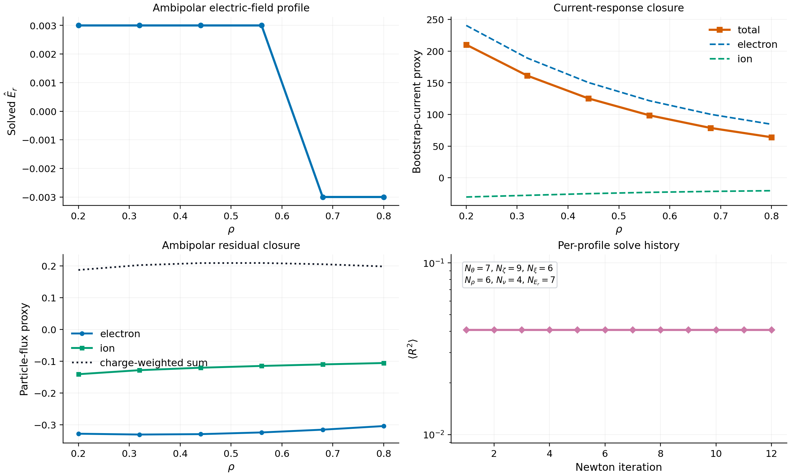
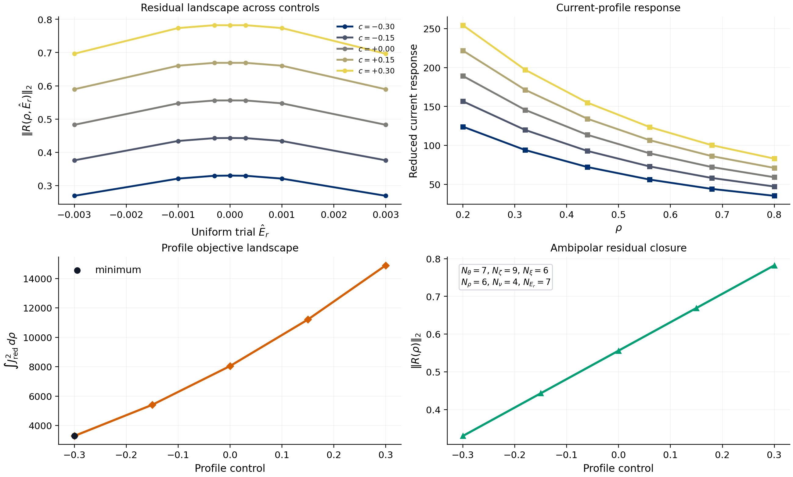
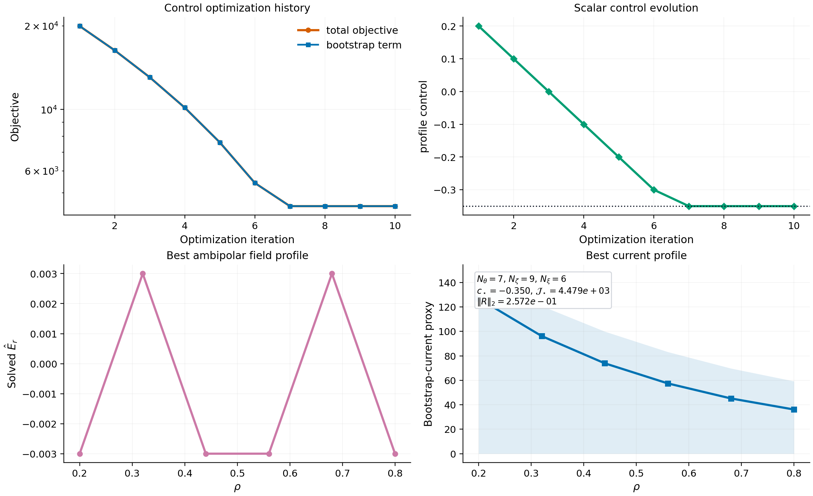
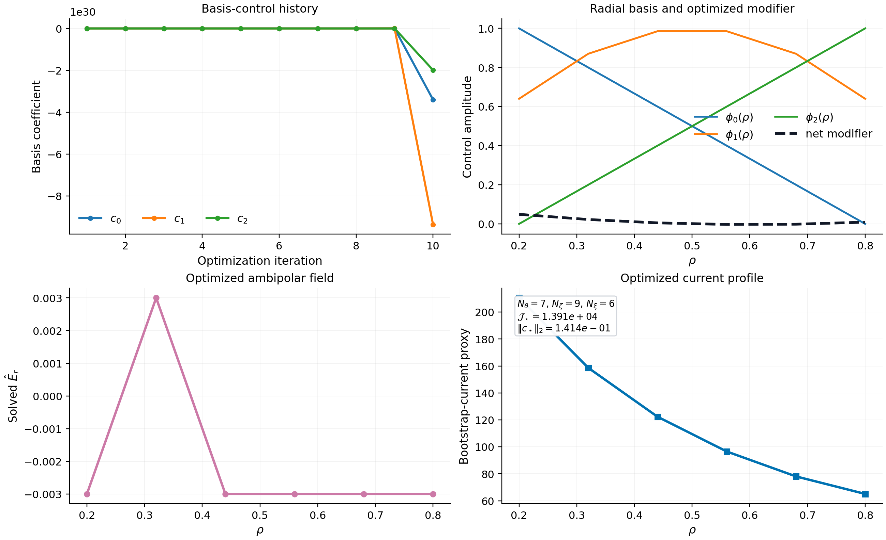
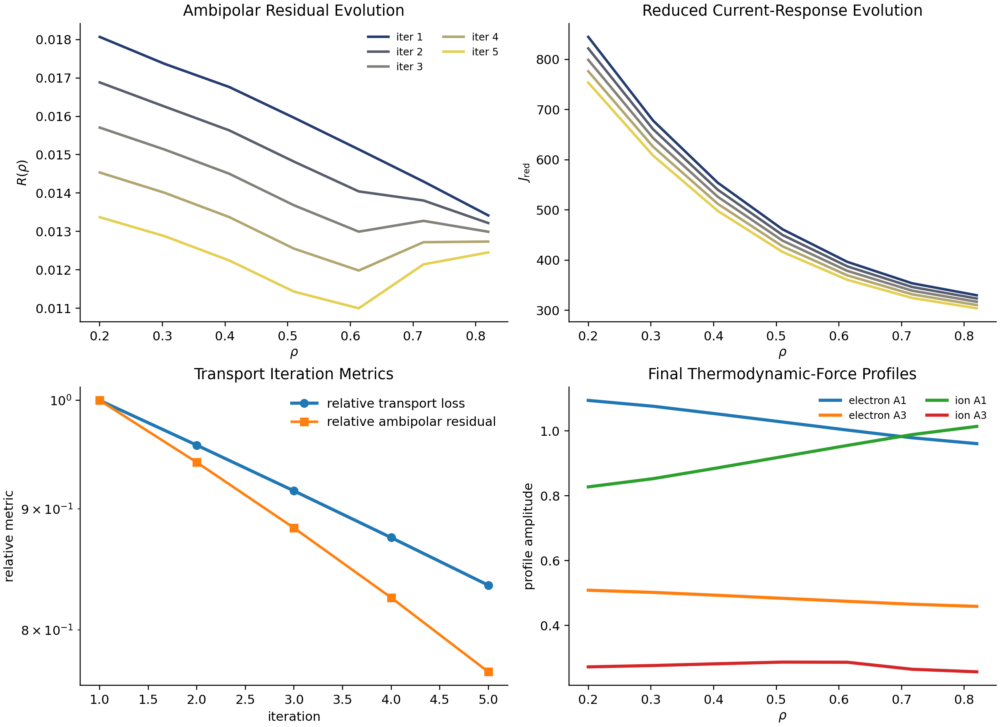

# Profiles

NTX now exposes a first imported profile workflow in
[`src/ntx/profiles.py`](../src/ntx/profiles.py). This layer sits above the
monoenergetic solve and above the radial scan builders, and it is intended for
ambipolar electric-field studies and bootstrap-current proxy analysis.

## Scope

This module does **not** replace a full multi-species transport code. It uses
the monoenergetic transport coefficients already produced by NTX and builds a
clean, differentiable profile-level closure around them.

The current closure uses:

- monoenergetic particle-flux proxies
- monoenergetic parallel-current proxies
- a per-radius ambipolar electric-field solve on a precomputed NTX scan

## Main Objects

### `MonoenergeticSpeciesProfile`

One species is described by:

- `charge`
- `nu_v`
- `A1`
- `A3`
- `particle_weight`
- `current_weight`

where `A1(r)` and `A3(r)` are the thermodynamic-force proxies used in the
monoenergetic closure.

### `AmbipolarProfileResult`

The solver returns:

- `rho`
- `er_profile`
- `ambipolar_residual`
- `bootstrap_current_proxy`
- `species_particle_flux`
- `species_current_response`
- `loss_history`

## Proxy Model

For one species, NTX currently uses the monoenergetic closures

```{math}
\Gamma_a(r) = -w^{(\Gamma)}_a(r)\left[D_{11,a}(r) A_{1,a}(r) + D_{13,a}(r) A_{3,a}(r)\right],
```

```{math}
J_a(r) = -w^{(J)}_a(r)\left[D_{31,a}(r) A_{1,a}(r) + D_{33,a}(r) A_{3,a}(r)\right].
```

The ambipolar residual is then

```{math}
R(r) = \sum_a Z_a \Gamma_a(r),
```

and the current profile proxy is

```{math}
J_{\mathrm{bs,proxy}}(r) = \sum_a J_a(r).
```

The per-radius electric-field solve currently applies damped Newton updates to
`R(r)` on the precomputed `E_r` scan stored in the NTX scan payload.

## Main Helpers

- `evaluate_scan_channel(...)`
- `evaluate_species_particle_flux(...)`
- `evaluate_species_current_response(...)`
- `ambipolar_residual_profile(...)`
- `solve_ambipolar_er_profile(...)`
- `solve_ambipolar_profile_family(...)`
- `bootstrap_current_objective(...)`
- `apply_profile_control(...)`
- `optimize_profile_control(...)`
- `ProfileBasisControlSpec`
- `apply_profile_basis_control(...)`
- `optimize_profile_basis_control(...)`
- `ProfileTransportClosureSpec`
- `profile_transport_loss(...)`
- `advance_profile_transport(...)`
- `solve_profile_transport_loop(...)`

## Typical Workflow

```python
import jax.numpy as jnp
from ntx import (
    GridSpec,
    MonoenergeticSpeciesProfile,
    build_ntx_neopax_scan_from_surfaces,
    example_surface,
    solve_ambipolar_er_profile,
)

rho = jnp.linspace(0.2, 0.8, 6)
nu_v = jnp.asarray([3.0e-4, 1.0e-3, 3.0e-3, 1.0e-2])
er_axis = jnp.asarray([-3.0e-3, -1.0e-3, -3.0e-4, 0.0, 3.0e-4, 1.0e-3, 3.0e-3])
er_grid = jnp.tile(er_axis[None, :], (rho.size, 1))
surfaces = tuple(example_surface() for _ in range(rho.size))

scan = build_ntx_neopax_scan_from_surfaces(
    surfaces,
    rho=rho,
    nu_v=nu_v,
    Es=er_grid,
    Er=er_grid,
    drds=jnp.ones_like(rho),
    grid=GridSpec(7, 9, 6),
)

electron = MonoenergeticSpeciesProfile(
    charge=-1.0,
    nu_v=jnp.linspace(4.0e-4, 1.0e-3, rho.size),
    A1=1.1 - 0.25 * rho,
    A3=0.55 - 0.12 * rho,
    current_weight=-1.0,
    name="electron",
)
ion = MonoenergeticSpeciesProfile(
    charge=1.0,
    nu_v=jnp.linspace(2.0e-3, 5.0e-3, rho.size),
    A1=0.7 + 0.35 * rho,
    A3=0.24 + 0.08 * rho,
    particle_weight=1.08,
    current_weight=1.0,
    name="ion",
)

result = solve_ambipolar_er_profile(scan, (electron, ion), steps=12, damping=0.7)
```

## Example Script

The repository example

```bash
python examples/ambipolar_profile.py
```

writes:

```text
docs/_static/ambipolar_profile.png
docs/_static/ambipolar_profile.pdf
```

It shows:

- the solved `E_r(r)` profile
- the bootstrap-current proxy profile
- species particle-flux proxies and the charge-weighted residual
- the nonlinear solve history



## Control-Parameter Families

NTX also exposes a small family-solve layer:

```{math}
\mathcal J(c) = \int w(r) J_{\mathrm{bs,proxy}}(r;c)^2\,dr,
```

where `c` is any explicit profile control and `w(r)` is an optional radial
weight.

Use:

- `solve_ambipolar_profile_family(...)` to solve several profile closures on the
  same NTX scan
- `bootstrap_current_objective(...)` to reduce one solved current profile to a
  scalar optimization objective

The repository example

```bash
python examples/ambipolar_profile_family.py
```

writes:

```text
docs/_static/ambipolar_profile_family.png
docs/_static/ambipolar_profile_family.pdf
```

It shows:

- the family of solved `E_r(r)` profiles
- the resulting family of bootstrap-current proxies
- a scalar objective landscape across the control parameter
- the final ambipolar residual norm across that family



## Differentiable Profile-Control Optimization

On top of the family solve, NTX now exposes a scalar control optimization:

```{math}
\mathcal J(c) = \int w(r) J_{\mathrm{bs,proxy}}(r;c)^2\,dr
+ \lambda \left\langle R(r;c)^2 \right\rangle,
```

where `c` is a scalar profile control, `w(r)` is an optional radial weight, and
`\lambda` is a residual penalty.

The corresponding helpers are:

- `ProfileControlSpec`
- `apply_profile_control(...)`
- `optimize_profile_control(...)`

The repository example

```bash
python examples/profile_control_optimization.py
```

writes:

```text
docs/_static/profile_control_optimization.png
docs/_static/profile_control_optimization.pdf
```

It shows:

- objective descent across optimization iterations
- scalar control updates
- the best solved ambipolar field profile
- the best bootstrap-current proxy profile

The implementation lives entirely in
[`src/ntx/profiles.py`](../src/ntx/profiles.py), so the optimization stays in
the imported JAX lane instead of leaving the NTX runtime.



## Low-Dimensional Radial Basis Controls

For richer profile optimization studies, NTX also exposes a low-dimensional
radial basis control:

```{math}
\delta A_{1,a}(r) = \sum_k c_k R^{(1)}_{a,k}\phi_k(r),
\qquad
\delta A_{3,a}(r) = \sum_k c_k R^{(3)}_{a,k}\phi_k(r),
```

where:

- `c_k` are the optimized basis amplitudes
- `\phi_k(r)` are user-supplied radial basis functions
- `R^{(1)}_{a,k}` and `R^{(3)}_{a,k}` map each basis function into each species

The profile objective then becomes

```{math}
\mathcal J(\mathbf c)
=
\int w(r) J_{\mathrm{bs,proxy}}(r;\mathbf c)^2\,dr
+ \lambda \left\langle R(r;\mathbf c)^2 \right\rangle
+ \mu \|\mathbf c\|_2^2.
```

The corresponding helpers are:

- `ProfileBasisControlSpec`
- `apply_profile_basis_control(...)`
- `optimize_profile_basis_control(...)`

The repository example

```bash
python examples/profile_basis_optimization.py
```

writes:

```text
docs/_static/profile_basis_optimization.png
docs/_static/profile_basis_optimization.pdf
```

It shows:

- the basis-coefficient history
- the basis functions and the final optimized modifier
- the optimized ambipolar `E_r(r)` profile
- the optimized bootstrap-current proxy profile



## Profile Transport Relaxation Loop

The next step beyond explicit control families is a simple self-consistent
transport-relaxation loop. NTX now exposes

- `ProfileTransportClosureSpec`
- `profile_transport_loss(...)`
- `advance_profile_transport(...)`
- `solve_profile_transport_loop(...)`

The closure updates the profile-force proxies explicitly after each ambipolar
solve:

```{math}
A_{1,a}^{(n+1)}(r) =
A_{1,a}^{(n)}(r) -
\alpha^{(\Gamma)}_a(r)\left[\Gamma_a^{(n)}(r)-\Gamma_{a,\mathrm{target}}(r)\right],
```

```{math}
A_{3,a}^{(n+1)}(r) =
A_{3,a}^{(n)}(r) -
\alpha^{(J)}_a(r)\left[J_a^{(n)}(r)-J_{a,\mathrm{target}}(r)\right].
```

The loop also records a quadratic transport mismatch loss,

```{math}
\mathcal L_{\mathrm{transport}}^{(n)} =
\left\langle
\sum_a
\left(\Gamma_a^{(n)}-\Gamma_{a,\mathrm{target}}\right)^2 +
\left(J_a^{(n)}-J_{a,\mathrm{target}}\right)^2
\right\rangle_r,
```

so the user can inspect whether the profile closure is converging before moving
to a more complete transport model.

The repository example

```bash
python examples/profile_transport_loop.py
```

writes:

```text
docs/_static/profile_transport_loop.png
docs/_static/profile_transport_loop.pdf
```

It shows:

- the evolution of the solved ambipolar `E_r(r)` profile across transport
  iterations
- the corresponding bootstrap-current proxy history
- the transport-loss and ambipolar-residual histories
- the final `A1(r)` and `A3(r)` profiles for each species



## Source-Code Map

- scan construction: [`src/ntx/neopax.py`](../src/ntx/neopax.py)
- channel interpolation and profile closure: [`src/ntx/profiles.py`](../src/ntx/profiles.py)
- low-level monoenergetic solve: [`src/ntx/solver.py`](../src/ntx/solver.py)
