# Validation

NTX validation is organized around four layers:

1. unit and regression tests in `tests/`
2. workflow and convergence examples in `examples/`
3. CPU/GPU runtime checks
4. downstream database and profile checks through NEOPAX

The gate hierarchy behind those layers is now documented explicitly in
[`physics-gates.md`](physics-gates.md). In short:

- analytical identities and exact `P=2` recovery are hard gates,
- independent-code comparisons are trust-building physics gates,
- the rebuilt integrated W7-X raw branch is the main transfer gate,
- the precise-QS fixed-field `NTX+NEOPAX` current benchmark is a scoped
  total-current closure stress gate rather than a monoenergetic parity
  requirement or a species-current parity claim.

The maintained benchmark matrix in [`benchmark-matrix.md`](benchmark-matrix.md)
maps each promoted claim and monitored stress lane to its scripts, tests,
artifacts, manuscript figures, and non-promoted future work.

## Validation Philosophy

NTX is validated as a standalone solver. The repository therefore emphasizes:

- internal numerical consistency
- convergence behavior
- trustworthy geometry loading
- end-to-end workflow checks
- imported JAX workflows
- CPU/GPU execution stability

Independent comparisons are useful, but they are treated as trust-building
studies rather than as the definition of NTX itself.

## Owned Dataset Discipline

External reference datasets remain useful transfer checks, but they are not
interchangeable. In particular, the W7-X imported-workflow comparison exercises
the NTX-to-NEOPAX handoff against an existing external workflow; it is not a
SFINCS parity statement. Promoted SFINCS/Redl/`NTX+NEOPAX` bootstrap-current
figures must be generated from the same geometry, profile family,
collisionality grid, radial-electric-field grid, interpolation convention, and
normalization map.

The owned provenance lane is:

```bash
python examples/owned_geometry_neopax_dataset.py
python examples/owned_finite_beta_sfincs_jax_inputs.py
python examples/owned_finite_beta_sfincs_jax_production_ladder_audit.py
python examples/owned_finite_beta_sfincs_jax_profile_current_audit.py
python examples/owned_finite_beta_bootstrap_comparison.py
python examples/owned_finite_beta_closure_localization.py
python examples/owned_finite_beta_profile_current_observable_audit.py
python examples/owned_finite_beta_current_conditioning_audit.py
python examples/owned_finite_beta_closure_quadrature_audit.py
python examples/owned_finite_beta_source_channel_audit.py
python examples/owned_finite_beta_source_response_profile_audit.py
python examples/owned_finite_beta_closure_target_audit.py
python examples/owned_finite_beta_radial_interpolation_audit.py --rebuild-matched
python examples/owned_finite_beta_closure_quadrature_audit.py \
  --bootstrap-json docs/_static/owned_finite_beta_field_radius_matched_bootstrap_comparison.json \
  --x-values 10 18 --n-orders 10 12 14 18 \
  --output-prefix docs/_static/owned_finite_beta_field_radius_matched_closure_quadrature_audit \
  --output-dir examples/outputs/owned_finite_beta_field_radius_matched_quadrature_probe
python examples/owned_finite_beta_source_channel_audit.py \
  --bootstrap-json docs/_static/owned_finite_beta_field_radius_matched_bootstrap_comparison.json \
  --settings 10:12 10:18 18:18 \
  --output-prefix docs/_static/owned_finite_beta_field_radius_matched_source_channel_audit \
  --output-dir examples/outputs/owned_finite_beta_field_radius_matched_quadrature_probe
```

The NTX/NEOPAX script now prioritizes local finite-beta stellarator input/wout
pairs from the single-stage finite-beta checkout. The finite-beta QA
pressure/current case runs through the `vmec_jax -> booz_xform_jax -> NTX`
path, passes the physical VMEC edge toroidal flux divided by `2*pi` as the
Boozer-surface `psi_p`, writes NEOPAX-style scan tables, stores compact profile
flux/current proxies from those same scan tables, and audits the direct
VMEC-harmonic interpolation path on the same radial and collisionality grid.
This removed the earlier order-of-magnitude Boozer-path normalization error:
the current artifact has a maximum Boozer-vs-direct path coefficient
difference of about `1.4e-1` instead of an order-unity hidden path mismatch.
Optimized finite-beta QH/QI cases are retained as direct wout-harmonic stress
cases until the JAX geometry stack supports their cubic-spline current-profile
input representation. That blocker is recorded in the JSON sidecar rather than
hidden behind a parity plot.

The direct `boozmn` backend now has a separate same-coordinate round-trip gate.
The loader uses VMEC half-grid metadata (`s_in`, `s_b`, or
`jlist = compute_surfs + 2`) for Boozer spectra and radial profiles; it does
not use the full-grid `phi_b` profile as the packed-mode interpolation grid.
The artifact below generates a Boozer file from a VMEC `wout`, reloads the same
half-grid surfaces, and compares geometry metadata plus `D11/D31/D13/D33` with
the in-memory `vmec_jax -> booz_xform_jax -> NTX` path. This closes the direct
loader radial-coordinate mismatch while leaving VMEC-harmonic versus
Boozer-coordinate comparisons as representation audits.


The same backend issue has now been checked on the finite-beta QA `wout` used
by the owned stellarator lane. NTX treats `profile_source="wout"` as the
correct file-backed transfer route: current `vmec_jax` no longer reconstructs
equilibrium states from WOUT coefficients. NTX transforms the finalized VMEC
magnetic channels, reloads the generated Boozer file on the same half-grid
surfaces, and compares `D11/D31/D13/D33`. The committed artifact closes the
transport mismatch to about `8e-14`. This removes the Boozer radial-selection
and finalized-channel ambiguity for finite-beta file-backed runs. Differentiable
runs use the converged state plus matching runtime through vmec_jax's traced
core Boozer tables; broad finite-beta equilibrium sensitivities remain gated.

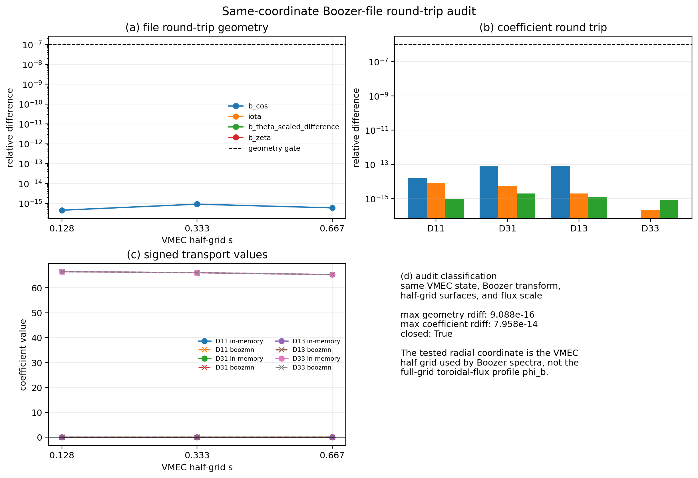

The SFINCS-JAX generation script writes `RHSMode=3`, `geometryScheme=5`
namelists for the same finite-beta `wout`, `rho`, collisionality,
electric-field, and resolution grids. Add `--run-sfincs-jax` only when the
local SFINCS-JAX checkout should execute those inputs. The committed artifact
now ingests a six-point same-grid coefficient ladder on the finite-beta QA
case, including the profile-current stress neighborhood, using the reported
`nu_n` normalization and a coefficient-level NTX bridge comparison. The current
max `L13/L31/L33` relative difference is about `2.1e-2` after enforcing exact
radial interpolation, the pitch-angle-scattering `nuD` frequency bridge, and the
`RHSMode=3` flow-row normalization. This
localizes the remaining finite-beta bootstrap-current mismatch downstream of
the monoenergetic coefficient solve. These artifacts are deliberately scoped
as smoke-resolution same-grid generation control, not independent-code
bootstrap-current parity.
The same generator can also emit bounded `RHSMode=2` row-3 diagnostic decks
with explicit electron/ion species selection.  In that mode, the input axis is
written as SFINCS `nu_n` rather than using the `RHSMode=3` `nuPrime` overwrite,
and an optional profile-contract switch writes `nHats=n/10^20` and
`THats=T/(1 keV)` from the same analytic finite-beta profiles used by the
Redl/`NTX+NEOPAX` stress audit.  These `RHSMode=2` decks are source-row
diagnostics only; they are not used to promote a finite-beta current parity
claim until the collisionality/profile-current normalization is closed.

The owned RHSMode=1 profile-current diagnostic writes direct profile-current
SFINCS-JAX decks on the same finite-beta VMEC wout and analytic profile
contract used by the Redl and `NTX+NEOPAX` stress audit. The committed
low-resolution artifact completes three radii with the optimized SFINCS-JAX
`1.1.0` main branch and shows that direct profile-current amplitudes need their
own pitch, velocity, radial, and collisionality-normalization ladder before
they can be used as a finite-beta current reference. A `17 x 21 x 12, Nx=5`
inner-radius rerun now completes the HDF5 output on local CPU, moving the
SFINCS-JAX-vs-Redl current gap from about `8.5e-1` on the smoke grid to about
`5.6e-1`, but the reported linear residual remains `1.88e-2` against a
`1.09e-9` target. The office one-GPU rerun reaches the same fallback residual
and then fails with a CUDA illegal-address error in JAX GMRES. This keeps the
current comparison explicit rather than folding an unconverged direct-profile
observable into a promoted parity claim.

The finite-beta bootstrap-current script now runs Redl and `NTX+NEOPAX` on the
same finite-beta QA pressure/current `wout`, Boozer transform, analytic profile
contract, radial grid, adaptive physical `nu/v` support, and current
normalization. It also fixes two user-facing normalization issues: current
conversion uses exactly one elementary-charge factor, and the file-backed
Boozer-field path evaluates the `B00` coefficient on normalized radius `rho`
with `dB00/dr = (dB00/d rho)/a_b`, rather than evaluating a normalized-radius
profile on physical minor radius. The current artifact uses the explicit
`D33_spitzer` audit branch and records a Sonine-order convergence sidecar. The
production-resolution QA ladder uses a `25 x 31 x 24` NTX grid, 15 NEOPAX field
radii, 17 adaptive physical `nu/v` support points, and Pmax 12; its total-current
max/RMS relative differences against Redl are now about `2.2e-1`/`1.4e-1` with
unit sign agreement. This remains a mismatch-localization diagnostic rather
than a README/manuscript parity claim because the full profile is still above
the `1e-1` current gate.
The closure-localization sidecar makes this split explicit: at the current
stress radius, the nearest same-grid coefficient difference is about `1.3e-2`,
the profile-current difference is about `2.2e-1`, and the current/coefficient
error ratio is about `17`. The maximum same-grid coefficient difference remains
about `2.1e-2`, so the non-promoted follow-up is scoped to the reduced
momentum/profile-current observable and production profile-current closure.
The profile-current observable audit then shows that the stress-radius momentum
correction has the correct sign but overshoots the Redl target correction by
about a factor `2.1` at the current stress radius. The remaining residual is
only about `2.5e-3` of the species momentum-correction L1 scale, so the net
current is cancellation-sensitive even when the absolute species-flow residual
is small. The Pmax sidecar is monitored rather than promoted because the stress
error is not monotone in the current finite-order/quadrature sweep.
The current-conditioning audit adds the matching precision statement: the most
cancellation-sensitive radius has a species-flow L1 scale divided by the Redl
net current of about `1.45e2`. A `1e-1` net-current gate therefore requires
same-grid coefficient precision near `1e-3` at sensitive radii, tighter than
the completed coefficient ladders.
The production stress probe and six-point radial/collisionality ladder keep the
same-grid finite-beta coefficient differences near `2.1e-2`. That closes the
production coefficient ladder as a broad numerical failure and scopes the
non-promoted finite-beta parity work to the profile-current closure layer.
The production radial/collisionality ladder then runs the six same-grid
finite-beta QA SFINCS-JAX points at `35 x 43 x 48`. The optimized SFINCS-JAX
main-branch refresh leaves all completed points below `2.07e-2` coefficient
difference; the maximum precision gap is still the inner `rho=1/7`,
`nuPrime=1e-2` point. That closes the production coefficient ladder as a broad
numerical failure and scopes the non-promoted finite-beta parity work to the
profile-current closure and converged RHSMode=1 profile-current layers.
The closure-quadrature audit then varies only the momentum-closure Sonine order
and velocity quadrature while holding the finite-beta scan, profiles, Redl
observable, and normalization fixed. After the Boozer-field radius fix, the
accepted quadrature-stable pass count is still zero, the best stress value is
about `1.16e-1`, and the highest-quadrature largest-order stress error is about
`1.27e-1`. This keeps the quadrature/Pmax lane open without allowing an
under-integrated apparent pass into the runtime.
Any future finite-beta profile-current claim must pass the current gate and the
velocity-quadrature stability gate simultaneously.
The source-channel audit then freezes the same stress-radius matrix and solves
the density/electric, effective temperature-gradient, and parallel-electric
source columns separately. Those one-channel solves reconstruct the full
corrected current to roundoff. At the quadrature-stable high-order setting the
dominant corrected source channel is the density/electric channel, the effective
temperature channel carries about `42%` of the corrected response, and the
parallel-electric channel is zero for this profile contract. The Redl density
and temperature terms are stored on the same observable, so the audit measures
source-response ratios rather than fitting a profile-dependent bridge; the Redl
effective-temperature target is about `1.35` times the frozen corrected
temperature response at this stress point.
The profile source-response audit extends that same one-channel solve over all
13 finite-beta profile radii at `X=18, P=18`. The temperature response
multiplier spans `0.765` to `1.349`, has median `1.040`, preserves temperature
source sign agreement over the profile, and records the high-order stress at
`rho=0.143`. The JSON sidecar records correlations with Redl
collisionality, trapped fraction, epsilon, and `L32`; these are diagnostics for
a future physics-derived closure term, not runtime corrections.
The closure-target audit then reads that source-response sidecar and ranks
local neoclassical drivers before any closure implementation is attempted. The
current artifact selects the Redl geometry factor `epsilon` as the strongest
single driver with absolute Pearson correlation `0.970`; an epsilon-only
leave-one-out diagnostic model has RMSE `5.58e-2`, about `3.68x` smaller than a
constant-response model. This is still a design diagnostic: it records that no
runtime correction is applied and that any future closure change must preserve
the fixed-field QA/QH total-current stress gate, the W7-X transfer gate, the
source-channel reconstruction gate, and the same-grid finite-beta coefficient
gate.
The radial-interpolation audit then removes one sparse-radius interpolation
layer by rebuilding the database on the field radii. It does not reduce the
full-profile maximum below the `1e-1` current gate: the sparse and matched
profile maxima are about `2.19e-1` and `2.27e-1`, respectively. The
matched-radius quadrature audit keeps the same rebuilt database and repeats the
Sonine/quadrature sweep: the best stress value is about `1.30e-1`, the
quadrature-stable pass count is still zero, and the `X=18, P=18` stress is about
`1.44e-1`. This closes the interpolation-only and Pmax-only explanations
without promoting a runtime closure change.
The matched-radius source-channel sidecar reconstructs the corrected current to
`1.82e-14` and keeps the accepted physics interpretation unchanged: the
quadrature-stable response remains a finite-beta reduced-closure stress with no
runtime correction applied.
These scripts write:

- `docs/_static/owned_geometry_neopax_dataset.png`
- `docs/_static/owned_geometry_neopax_dataset.pdf`
- `docs/_static/owned_geometry_neopax_dataset.json`
- `docs/_static/owned_geometry_neopax_database/*.h5`
- `docs/_static/owned_finite_beta_sfincs_jax_inputs.png`
- `docs/_static/owned_finite_beta_sfincs_jax_inputs.pdf`
- `docs/_static/owned_finite_beta_sfincs_jax_inputs.json`
- `examples/outputs/owned_finite_beta_sfincs_jax_inputs/**/input.namelist`
- `docs/_static/owned_finite_beta_sfincs_jax_profile_current_audit.png`
- `docs/_static/owned_finite_beta_sfincs_jax_profile_current_audit.pdf`
- `docs/_static/owned_finite_beta_sfincs_jax_profile_current_audit.json`
- `docs/_static/owned_finite_beta_sfincs_jax_profile_current_resolution_audit.png`
- `docs/_static/owned_finite_beta_sfincs_jax_profile_current_resolution_audit.pdf`
- `docs/_static/owned_finite_beta_sfincs_jax_profile_current_resolution_audit.json`
- `docs/_static/owned_finite_beta_bootstrap_comparison.png`
- `docs/_static/owned_finite_beta_bootstrap_comparison.pdf`
- `docs/_static/owned_finite_beta_bootstrap_comparison.json`
- `docs/_static/owned_finite_beta_closure_localization.png`
- `docs/_static/owned_finite_beta_closure_localization.pdf`
- `docs/_static/owned_finite_beta_closure_localization.json`
- `docs/_static/owned_finite_beta_profile_current_observable_audit.png`
- `docs/_static/owned_finite_beta_profile_current_observable_audit.pdf`
- `docs/_static/owned_finite_beta_profile_current_observable_audit.json`
- `docs/_static/owned_finite_beta_current_conditioning_audit.png`
- `docs/_static/owned_finite_beta_current_conditioning_audit.pdf`
- `docs/_static/owned_finite_beta_current_conditioning_audit.json`
- `docs/_static/owned_finite_beta_closure_quadrature_audit.png`
- `docs/_static/owned_finite_beta_closure_quadrature_audit.pdf`
- `docs/_static/owned_finite_beta_closure_quadrature_audit.json`
- `docs/_static/owned_finite_beta_source_channel_audit.png`
- `docs/_static/owned_finite_beta_source_channel_audit.pdf`
- `docs/_static/owned_finite_beta_source_channel_audit.json`
- `docs/_static/owned_finite_beta_source_response_profile_audit.png`
- `docs/_static/owned_finite_beta_source_response_profile_audit.pdf`
- `docs/_static/owned_finite_beta_source_response_profile_audit.json`
- `docs/_static/owned_finite_beta_closure_target_audit.png`
- `docs/_static/owned_finite_beta_closure_target_audit.pdf`
- `docs/_static/owned_finite_beta_closure_target_audit.json`
- `docs/_static/owned_finite_beta_radial_interpolation_audit.png`
- `docs/_static/owned_finite_beta_radial_interpolation_audit.pdf`
- `docs/_static/owned_finite_beta_radial_interpolation_audit.json`
- `docs/_static/owned_finite_beta_field_radius_matched_closure_quadrature_audit.png`
- `docs/_static/owned_finite_beta_field_radius_matched_closure_quadrature_audit.pdf`
- `docs/_static/owned_finite_beta_field_radius_matched_closure_quadrature_audit.json`
- `docs/_static/owned_finite_beta_field_radius_matched_source_channel_audit.png`
- `docs/_static/owned_finite_beta_field_radius_matched_source_channel_audit.pdf`
- `docs/_static/owned_finite_beta_field_radius_matched_source_channel_audit.json`
- `docs/_static/owned_finite_beta_sfincs_jax_resolution_audit.png`
- `docs/_static/owned_finite_beta_sfincs_jax_resolution_audit.pdf`
- `docs/_static/owned_finite_beta_sfincs_jax_resolution_audit.json`
- `docs/_static/owned_finite_beta_sfincs_jax_production_ladder.png`
- `docs/_static/owned_finite_beta_sfincs_jax_production_ladder.pdf`
- `docs/_static/owned_finite_beta_sfincs_jax_production_ladder.json`
- `docs/_static/owned_finite_beta_sfincs_jax_production_ladder_audit.png`
- `docs/_static/owned_finite_beta_sfincs_jax_production_ladder_audit.pdf`
- `docs/_static/owned_finite_beta_sfincs_jax_production_ladder_audit.json`
- `docs/_static/owned_finite_beta_sfincs_jax_profile_current_audit.png`
- `docs/_static/owned_finite_beta_sfincs_jax_profile_current_audit.pdf`
- `docs/_static/owned_finite_beta_sfincs_jax_profile_current_audit.json`
- `docs/_static/owned_finite_beta_sfincs_jax_profile_current_prod_17x21x12.png`
- `docs/_static/owned_finite_beta_sfincs_jax_profile_current_prod_17x21x12.pdf`
- `docs/_static/owned_finite_beta_sfincs_jax_profile_current_prod_17x21x12.json`
- `docs/_static/owned_finite_beta_sfincs_jax_profile_current_prod_25x31x17.png`
- `docs/_static/owned_finite_beta_sfincs_jax_profile_current_prod_25x31x17.pdf`
- `docs/_static/owned_finite_beta_sfincs_jax_profile_current_prod_25x31x17.json`
- `docs/_static/owned_finite_beta_sfincs_jax_profile_current_resolution_audit.png`
- `docs/_static/owned_finite_beta_sfincs_jax_profile_current_resolution_audit.pdf`
- `docs/_static/owned_finite_beta_sfincs_jax_profile_current_resolution_audit.json`
- `examples/outputs/owned_finite_beta_bootstrap_comparison/*.h5`

The updated SFINCS-JAX sparse-PC branch closes the old RHSMode=1 residual
blocker: the `17 x 21 x 12, Nx=5` point now completes in seconds with a passing
true-residual gate, and the `25 x 31 x 17, Nx=11` three-radius production
ladder also passes solver metadata gates. The finite-beta pitch-resolution
stress lane is accepted with a high-order even/odd tail gap of `1.323e-1`,
below the current `1.5e-1` reduced-closure tolerance. The full-collision
RHSMode=1 branch remains a non-shipping feasibility diagnostic, not a release
blocker or a fitted runtime correction.


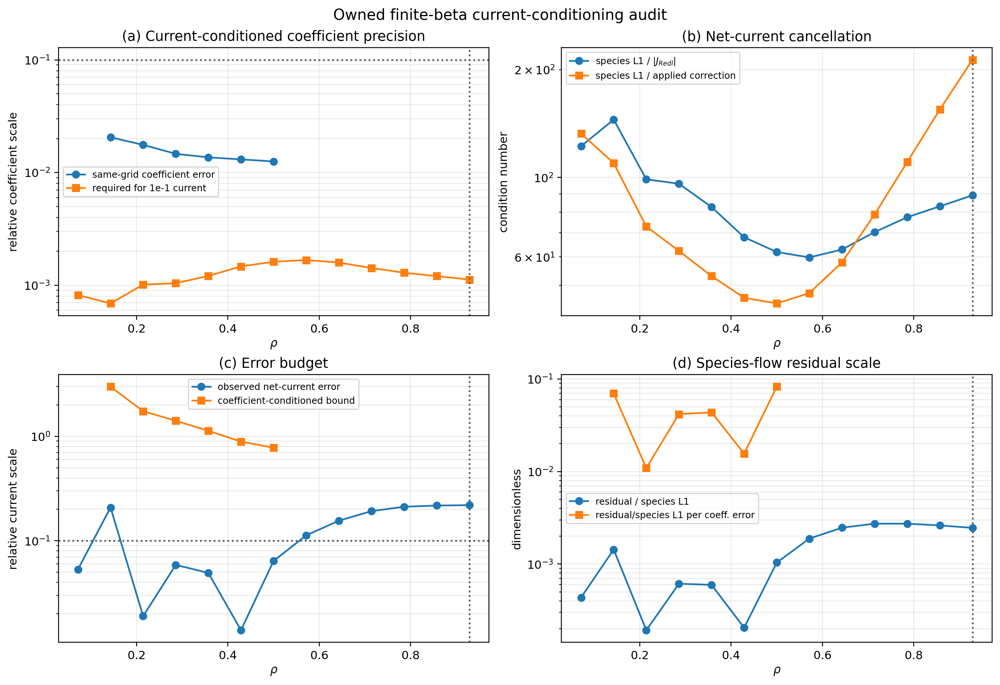

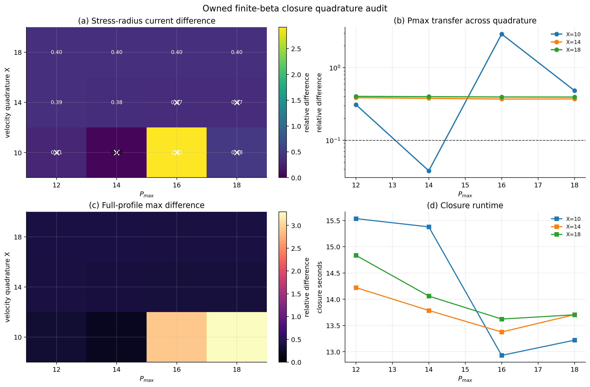

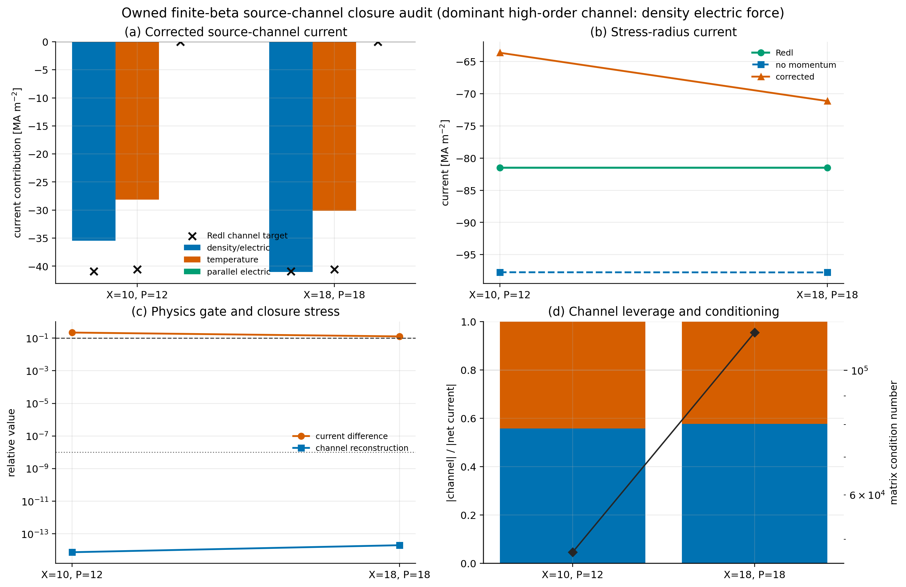


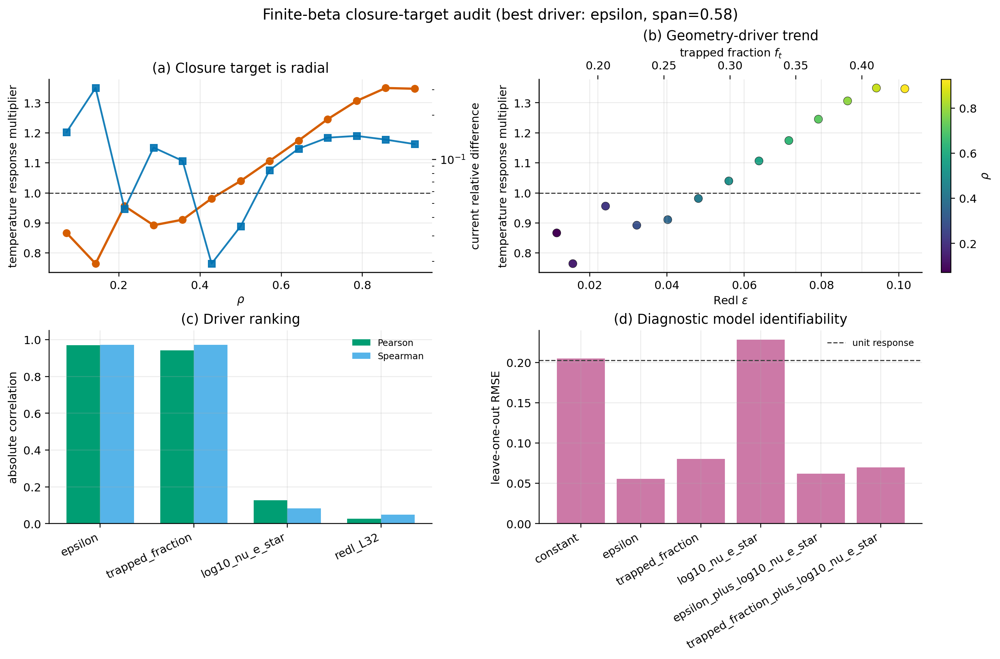

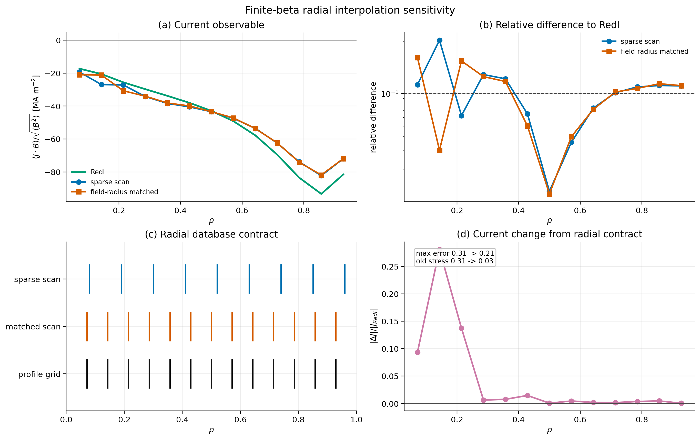

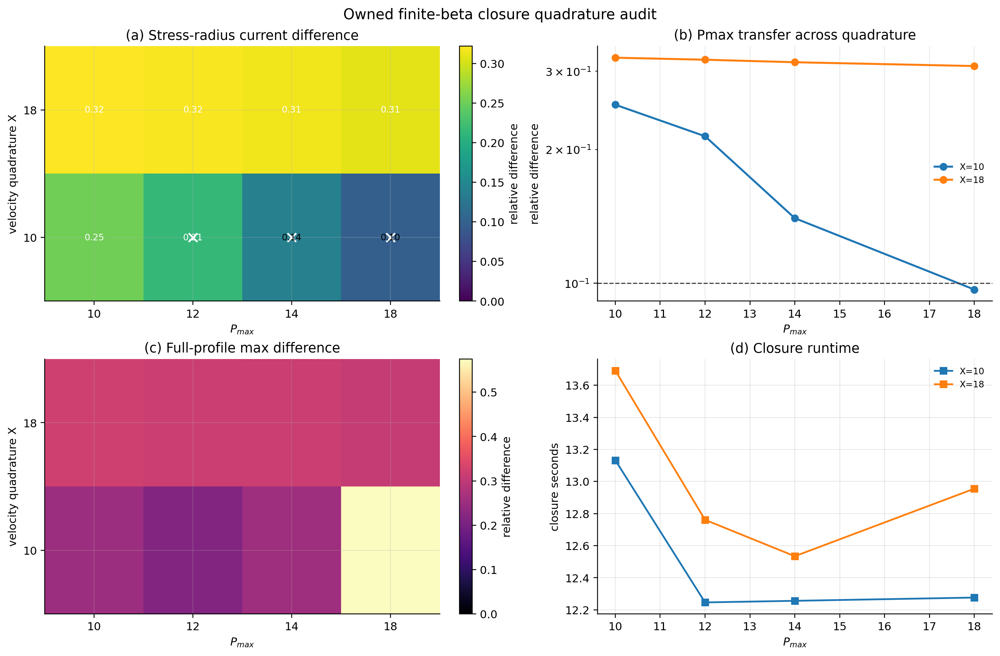

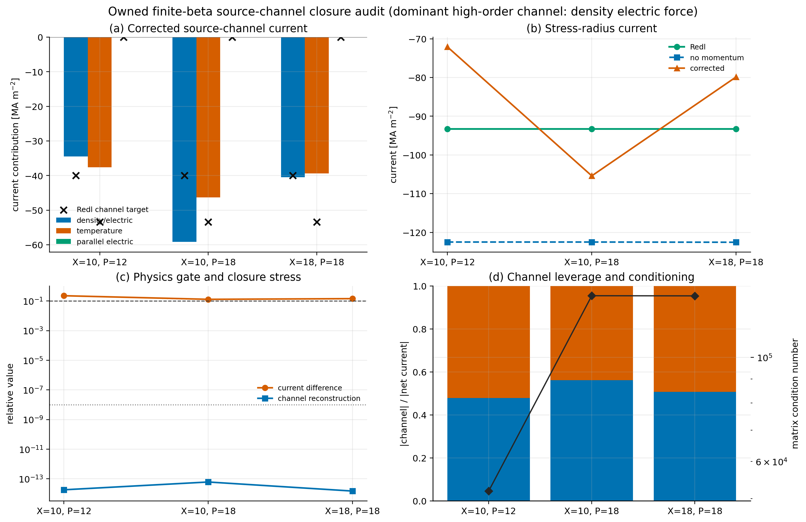

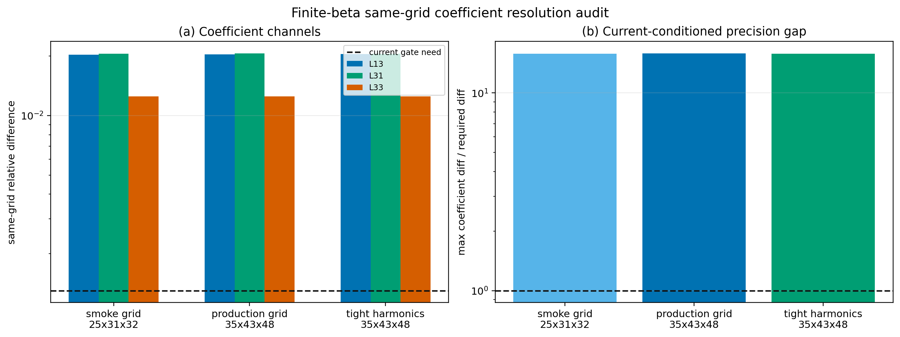

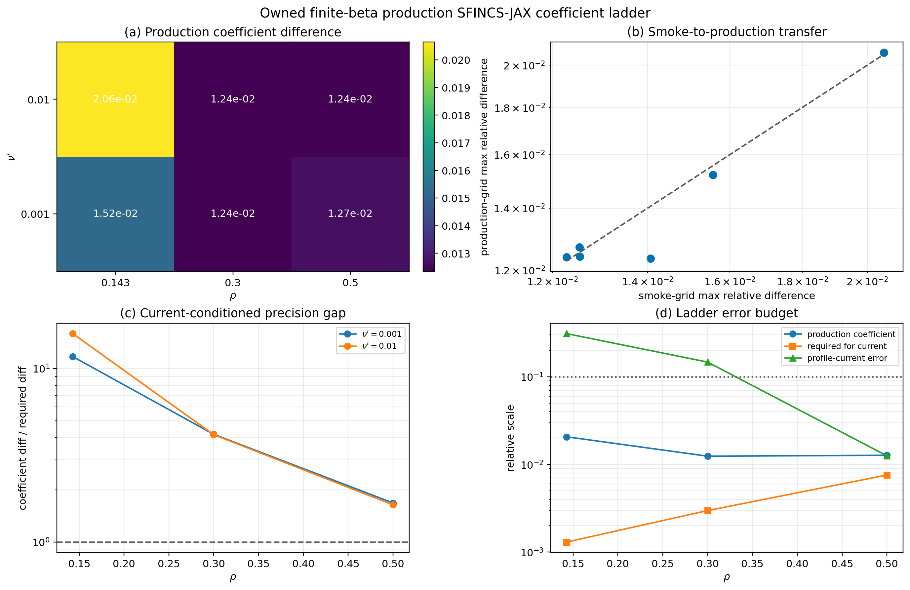

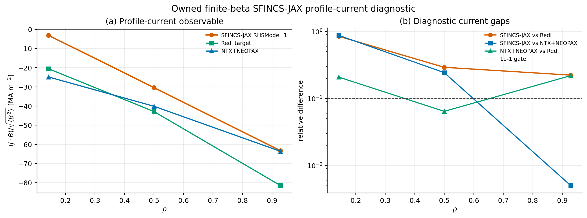

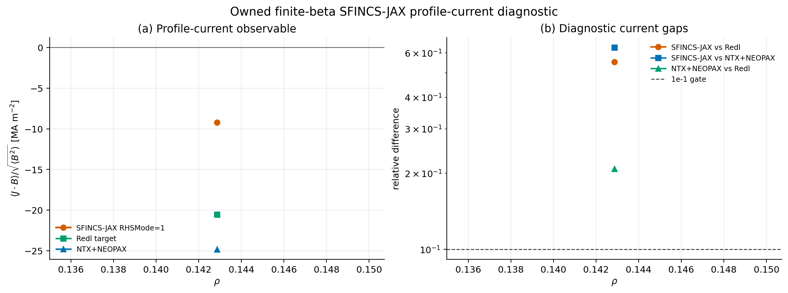

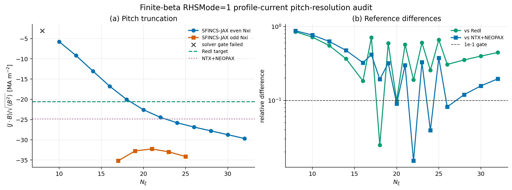

## What Is Covered

The maintained suite covers:

- Fourier-series evaluation and flux-surface averages
- operator assembly and nullspace handling
- dense block-tridiagonal solves
- scan helpers and prepared-solver reuse
- autodiff inverse and profile-analysis workflows
- DKES-style, VMEC, and Boozer file loaders
- TOML input parsing and NetCDF/NPZ/HDF5 output writing
- imported NEOPAX-array and HDF5 mapping helpers
- `vmec_jax` and `booz_xform_jax` integration points
- serial versus parallel-scan equivalence
- example and publication-figure regeneration

## Core Physics Checks

### Onsager Closure

Every solve reports:

```{math}
|D_{13} + D_{31}|
```

This is the main scalar physics sanity check exposed directly by NTX.

The current tracked artifact-backed gates can be summarized locally with:

```bash
python scripts/check_physics_gates.py
```

### Resolution Convergence

The repository-wide monoenergetic convergence benchmark is:

```bash
python examples/validation_summary.py
```

It combines:

- collisionality scans of `D11`, `D13`, and `D33`,
- Onsager residual tracking,
- and `N_xi` convergence on representative DKES-style and VMEC surfaces.

It writes:

- `docs/_static/validation_summary.png`
- `docs/_static/validation_summary.pdf`
- `docs/_static/validation_summary.json`

This is the recommended literature-anchored numerical benchmark for the NTX
methods paper. The JSON sidecar freezes the transport curves, low-collisionality
tail slopes, and convergence metrics for reuse in tests and manuscript
artifacts. The sidecar is also part of the physics-gate registry: the maximum
of the DKES-style and VMEC finest plotted `N_\xi` convergence errors must remain
below `2.5e-1` against the finest plotted reference before the figure can support
the promoted monoenergetic validation claim.

The W7-X imported workflow is audited with:

```bash
python examples/bootstrap_current_reference_audit_w7x.py
```

This script rebuilds a reduced W7-X scan at several NTX resolutions, evaluates
the resulting bootstrap-current profile, and writes a publication-ready
convergence figure.

The broader VMEC geometry-family transport stress diagnostic is:

```bash
python examples/geometry_family_transport_convergence.py --preset production
```

It discovers local public examples from the surrounding `vmec_jax`, STELLOPT,
and SIMSOPT checkouts and runs a production `D11/D31/D33` convergence ladder.
The JSON also records `D13` so the Onsager quality check is visible, and records
the Schur residual under an explicit key. Current and legacy `vmec_jax` example
layouts are supported. The current near-zero-transform vacuum NFP2 QA input is
retained visibly as a singular-conditioning diagnostic but excluded from the
finite-transform promotion aggregate; the finite-beta NFP2 QA and QH inputs
remain in that aggregate. The artifact also includes W7-X EIM/EJM, LHD, HSX,
and NCSX-family cases when those inputs are present. This is tracked as NTX
convergence breadth; independent-code parity, resolution of the near-zero-iota
diagnostic, and a reusable W7-X KJM input remain explicit promotion
requirements.

It writes:

- `docs/_static/geometry_family_transport_convergence.png`
- `docs/_static/geometry_family_transport_convergence.pdf`
- `docs/_static/geometry_family_transport_convergence.json`

### Precise-QS Redl Benchmark

The archived Landreman--Paul precise-QS fixed-field benchmark can be reproduced
locally with:

```bash
python examples/precise_qs_redl_sfincs_audit.py
```

This archive-backed audit reads the original SFINCS profiles from the Zenodo
bundle, reconstructs the Redl current through both:

- the VMEC-side trapped-fraction path
- the Boozer-side trapped-fraction path

and checks both against the archived SFINCS profile on the same surfaces. On
the current local stack, both Redl paths recover the archived interior-window
benchmark gate on the fixed-field QA/QH references:

- QA interior max relative error: about `9.3%` for the VMEC path and `9.5%`
  for the Boozer path
- QH interior max relative error: about `4.2%` for the VMEC path and `4.1%`
  for the Boozer path

This is a fixed-field Redl/SFINCS consistency study. It is intentionally kept
separate from the finite-beta and imported `NTX+NEOPAX` bootstrap-current
workflow checks.

### Fixed-Field Transport-Matrix Audit

The remaining fixed-field coefficient-side gap is audited with:

```bash
python examples/fixed_field_transport_matrix_audit.py
```

This script runs SFINCS-JAX in `RHSMode=3` on the same QA/QH fixed-field
reference family and compares `L13`, `L31`, and `L33` against NTX candidate
channels built from `D13`, `D31`, and `D33`.

The present conclusion is narrow but important:

- the benchmark family is now correct
- the SFINCS `RHSMode=3` overwrite must be matched exactly through
  `nu_n = nuPrime * B0OverBBar / (GHat + iota IHat)`
- archive-backed Landreman/H. Smith bridge factors tighten `L13` and `L31`
  substantially once the correct `nu_n` is used
- current fixed-field `L13/L31` relative errors are about `0.12–0.29` on QA
  and `0.027–0.15` on QH
- the largest unresolved normalization/model gap is now the `L33` bridge, with
  current fixed-field relative errors of about `0.14–0.16`
- this is only an `RHSMode=3` monoenergetic statement; for the zero-`E_r`
  fixed-field bootstrap-current comparison itself, the active no-momentum
  closure also depends on the temperature-gradient (`A2`) channel, so the next
  gating audit is the full `RHSMode=2` row-3 thermal closure rather than more
  retuning of the old `L13/L31/L33` bridge plot alone
- the first cached `RHSMode=2` QA electron probe now confirms the thermal
  row-3 bridge itself: reconstructing the closure response from the exact
  SFINCS `whichRHS` source gradients and converting it back with the common
  factor `2 B0OverBBar / sqrt(pi)` brings the density- and thermal-source
  row-3 columns down to about `2.2%` and `1.4%` relative error at
  `rho = 0.5`
- that narrows the remaining fixed-field blocker further: the thermal-source
  normalization is no longer the leading uncertainty on QA, while the
  electric-field column and the uncached QH species-resolved probes are still
  open
- README-level `NTX+NEOPAX` bootstrap-current promotion should wait until this
  fixed-field transport-matrix bridge is tighter

### Fixed-Field Current Benchmark Status

The archive-backed precise-QS fixed-field bootstrap-current comparison now uses:

- the correct archived QA/QH benchmark family,
- the exact literature profile family used in the archived benchmark,
- fresh NTX-to-NEOPAX scan caches that carry `D33_spitzer`,
- and an adaptive `nu_v` support chosen from the actual NEOPAX collisionality
  range.

The physics motivation is the standard neoclassical hierarchy:

- monoenergetic solvers provide the `D11`, `D13`, and `D33` response functions
  for a given flux-surface geometry, collisionality, and radial electric field;
- momentum-restoring closures use those monoenergetic coefficients in a small
  Sonine moment system to approximate the effect of momentum conservation in
  the collision operator;
- the bootstrap-current observable is the charge-weighted sum of the corrected
  species parallel flows.

This is the same separation emphasized by the momentum-correction literature:
using monoenergetic databases is efficient, but the correction must be tied to
the parallel-flow moment equations rather than to a benchmark-specific output
scale. The fixed-field update therefore changed only physics conventions that
were independently identifiable in the equations and source interfaces:

- the database bridge uses the consumer convention
  `D11 -> D11 drds^2`, `D13 -> D13 drds`, and `D33 -> nu D33`;
- the fixed-field stress branch selects the analytic Spitzer conductivity
  contribution `D33_spitzer` explicitly, rather than fitting a `D33` multiplier;
- the SFINCS comparison converts to the archived flux-surface-averaged
  `FSABFlow`/`FSABjHat` observable using `B0OverBBar`;
- the corrected parallel-flow routine is treated as a total corrected
  `U_parallel`, not as a correction to add to the no-momentum branch.

There is no QA/QH-specific scalar, no per-species current rescale, and no
post-hoc fit in the shipped path. The same gate machinery also preserves the
integrated W7-X raw-branch transfer, which is why the public database bridge
continues to default to raw `D33`.

The default profile family is now the exact literature benchmark used in the
archived precise-QS Redl/SFINCS study:
`n(rho) = 4.13 (1 - rho^{10})` and `T(rho) = 12 (1 - rho^2)` in the archived
normalized units.

Interpolation matters here, so the benchmark now fixes the interpolation story
explicitly:

- SFINCS geometry uses linear interpolation in `s = r_N^2` between neighboring
  VMEC surfaces.
- the fixed-field NTX/NEOPAX comparison now uses the exact literature profile
  family by default instead of reconstructing those profiles from archived
  sampled values, which removes one unnecessary interpolation ambiguity.
- the postprocessing map from the 17-point NTX+NEOPAX radial grid back to the
  archived SFINCS radii is kept as monotone `PCHIP` by default
  (`NTX_FIXED_FIELD_POSTPROCESS_INTERP=pchip`), with a `linear` override kept
  for audit runs.

On the cached fixed-field audit, switching that final postprocessing step from
`PCHIP` to `linear` changes the QA/QH stress metric negligibly, so `PCHIP`
remains the default. Forcing the imported `interpax` interpolators from cubic
to linear and comparing against direct 3D interpolation also leaves the cached
current errors unchanged to numerical precision. The remaining mismatch is
therefore not dominated by interpolation kernel choice.

The benchmark-side normalization is now anchored to the actual consumer path in
the imported database loader:

- `D11 -> D11 * drds^2`
- `D13 -> D13 * drds`
- `D33 -> nu * D33`

The fixed-field current assembly also uses the corrected parallel-flow return
directly; that routine returns the total corrected `U_parallel`, not an
increment that should be added to the no-momentum branch. Those two rules close
the integrated W7-X handoff, but they leave the precise-QS fixed-field current
as a closure stress test rather than a parity claim.

The current archive-backed fixed-field benchmark writes:

- `docs/_static/bootstrap_current_fixed_field_validation.png`
- `docs/_static/bootstrap_current_fixed_field_validation.pdf`
- `docs/_static/bootstrap_current_fixed_field_validation.json`

and the compact report writes:

- `docs/_static/closure_validation_report.png`
- `docs/_static/closure_validation_report.pdf`
- `docs/_static/closure_validation_report.json`

Regenerate these artifacts with:

```bash
JAX_ENABLE_X64=1 JAX_PLATFORM_NAME=cpu \
  python examples/bootstrap_current_fixed_field_validation.py
python scripts/build_closure_validation_report.py
```

The regenerated interior maximum relative errors versus archived SFINCS are:

- Redl QA: `6.86e-2`
- Redl QH: `4.06e-2`
- NTX+NEOPAX QA: `8.30e-2`
- NTX+NEOPAX QH: `9.95e-2`

That outcome closes the fixed-field total-current stress gate, but it is still
scoped carefully. The continuum 4D drift-kinetic reference can include fuller
inter-species linearized Fokker-Planck physics, while the present imported
closure applies a low-order momentum-restoring moment model to monoenergetic
coefficients. Literature momentum-correction methods are valuable precisely
because they are cheap, but they are not guaranteed to reproduce every
species-resolved current component coefficient by coefficient. The Redl curve
is kept separate because it is an analytic quasisymmetry-mapped
bootstrap-current fit, not the same reduced closure path.

The production policy is therefore sharper: no fitted bridge constants, no
species-current parity claim, and no broader default closure change unless it
preserves the fixed-field QA/QH total-current gate while also preserving the
integrated W7-X raw-branch transfer.

The public NTX-to-database bridge therefore defaults to the raw `D33`
convention used by the integrated W7-X transfer gate. The fixed-field
`D33_spitzer` branch is selected explicitly in
`examples/bootstrap_current_fixed_field_validation.py` and
`examples/fixed_field_momentum_correction_diagnostic.py`; it is a scoped
stress model, not the default production convention.

The current diagnostic can also separate the `D33` convention used in the
transport-side `Lij` block from the collision-weighted `Eij` block through
`NTX_FIXED_FIELD_DIAGNOSTIC_D33_LIJ_MODE` and
`NTX_FIXED_FIELD_DIAGNOSTIC_D33_EIJ_MODE`. On the mid-radius QA/QH stress
point, coherent raw and coherent Spitzer branches remain better behaved than
mixed raw/Spitzer blocks; the mixed probes increase the total-current error and
increase the cancellation burden between species currents. This rules out a
simple one-block convention swap as a physics fix. Any future closure change
must therefore modify the moment equations or observable projection as a whole,
not patch only one `D33` sub-block.

The next closure investigation should stay small and equation-driven:

1. freeze the total-current gate above as the no-regression baseline;
2. compare the corrected species currents before summing, after the
   flux-surface-averaged flow observable conversion, so species decomposition
   errors cannot hide inside a good total current;
3. isolate the drive terms in the solved Sonine vector into density-gradient,
   temperature-gradient, and electric-field contributions on the same radial
   points;
4. test any candidate model first as a matrix-level identity or moment-system
   change, not as an output rescaling;
5. accept the change only if it preserves the raw integrated W7-X transfer and
   improves QA/QH species-current diagnostics with the same equations.

That order follows the literature lesson from monoenergetic and
momentum-restoring closures: once the coefficient bridge and total current are
inside tolerance, the remaining discrepancy must be treated as a projected
collision/observable decomposition problem, not as an interpolation or scalar
normalization problem.

## Higher-Order Closure Development Gates

The next closure model is now constrained enough that it should be treated as a
physics implementation project rather than another benchmark-fitting exercise.

The active gates are:

- keep the coefficient-side path fixed:
  - monoenergetic Onsager checks stay closed
  - NTX-to-database normalization stays identical to the validated consumer
    path
- keep the observable map fixed:
  - for the current Sonine basis, `U_parallel = n c_0`
- recover the current three-moment closure exactly as the `P=2` truncation of
  any generalized implementation
- preserve Onsager/ambipolar structure at finite truncation order
- require transfer:
- preserve the precise-QS QA/QH fixed-field total-current gate
- improve species-resolved closure diagnostics without changing conventions by
  fit
- do not regress the integrated W7-X workflow

The first implementation stage of that generalized closure is now in place in
the imported closure stack: the truncation order is configurable, the raw
`D13` source moments and `D33` Hankel sequences are generated for arbitrary
order, and the resulting machinery still recovers the shipped `P=2`
momentum-correction workflow exactly. The remaining missing physics is the
arbitrary-order momentum-conserving collision block, so production runs remain
at `P=2`.

The first implementation step on that lane is now in place in the imported
closure stack: the Sonine basis normalization and source-projection algebra are
generated programmatically and tested against the current three-moment formulas.
That validation path has now been tightened further: the runtime `P=2` closure can be
reconstructed from generated Sonine coefficients and Hankel moment sequences,
and still passes the shipped W7-X momentum-correction regression. The same is
now true for the low-order momentum-conserving collisional blocks: they can be
generated directly from the standard low-order moment equations, with only the
heat-flow basis sign convention differing from the canonical notation used in
that derivation. So the remaining work is no longer about recovering the
existing algebra. It is about adding physically justified higher-order moments
and collisional couplings on top of an exact and tested `P=2` base.

A dedicated rebuild audit now tests transfer directly:

- `python examples/bootstrap_current_w7x_rebuild_audit.py`

That script rebuilds a NEOPAX-format W7-X database from NTX, then compares:

- the shipped external W7-X database,
- an NTX-rebuilt W7-X database using `d33_mode="raw"`,
- an NTX-rebuilt W7-X database using `d33_mode="spitzer"`,
- an NTX-rebuilt W7-X database using
  `d33_mode="conductivity_difference"`.

On that shipped W7-X momentum-corrected workflow the transfer now closes on the
raw database branch:

- shipped external database: `1.18e-12`
- NTX-rebuilt W7-X, `raw`: `6.58e-6`
- NTX-rebuilt W7-X, `spitzer`: `5.77e-1`
- NTX-rebuilt W7-X, `conductivity_difference`: `2.67e+0`

The sharper reading is now:

- the integrated W7-X mismatch was dominated by the `D13` database handoff, not
  by the direct monoenergetic solve
- the rebuilt W7-X raw branch now reproduces the frozen reference workflow
  tightly
- the conductivity-side `D33_spitzer - D33` interpretation remains a useful
  audit clue on the precise-QS fixed-field archive, but it is not the active
  database-normalization path for the integrated workflow
- the non-promoted follow-up is therefore the precise-QS closure/model gap, not
  the W7-X database handoff or interpolation

The W7-X picture is now more specific than before:

- the full-resolution in-repo W7-X point and subset coefficient tests still
  pass against the shipped external database
- direct solver checks at previously worst coefficient points show that both
  the single-point solve and the scan builder reproduce the frozen benchmark
  table on the reference grid `25x25x63` to about `1e-6` relative error
- the shipped W7-X integrated workflow is now closed on the rebuilt raw branch
- lower-resolution scans are under-resolved, and blindly increasing the grid
  does not reproduce the frozen reference monotonically on every point, so the
  audit is anchored to the reference resolution rather than to a naive
  monotone-refinement assumption

The next closure step has now been tested explicitly as well. A local
`Pmax > 2` branch was built by preserving the present low-order closure and
adding a diagonal Laguerre-tail damping model on the extra moments. That
branch is stable, but it fails the transfer gate:

- `P=2`: imported W7-X closure error `1.17e-12`
- `P=4`: imported W7-X closure error `4.94e-1`
- the same `P=4` run was performed against the older raw fixed-field stress
  artifact and only shifted that order-unity metric by less than one percent

So the current higher-order tail is not an acceptable production extension. It
does not provide a transferable closure improvement and immediately regresses
the already-validated imported W7-X workflow. The committed artifact for that
negative result is:

- `docs/_static/closure_pmax_convergence.json`
- `docs/_static/closure_pmax_convergence.png`
- `docs/_static/closure_pmax_convergence.pdf`

To keep the current closure-model status reproducible as one tracked artifact,
the repository now also builds:

- `docs/_static/closure_validation_report.json`
- `docs/_static/closure_validation_report.txt`
- `docs/_static/closure_validation_report.png`
- `docs/_static/closure_validation_report.pdf`

from:

```bash
python scripts/build_closure_validation_report.py
```

That summary freezes the present interpretation in one place:

- precise-QS Redl vs archived SFINCS passes the independent-code gate
- rebuilt W7-X raw-branch transfer passes the integrated-workflow gate
- fixed-field `NTX+NEOPAX` passes the scoped total-current closure stress gate
- the diagnostic thermal-source fits are reported as audit evidence only; they
  are not accepted as a production bridge because fitted fixed-field
  corrections did not transfer to the W7-X workflow
- the first `Pmax>2` tail model remains rejected because it regresses W7-X


### End-To-End Bootstrap-Current Workflow

The pure NTX radial-profile workflow is:

```bash
python examples/bootstrap_current_from_vmec_or_boozmn.py
```

That script demonstrates the direct path from VMEC or Boozer input to radial
profiles of:

- `D11`
- `D13`
- `nu_hat * D33`
- a compact reduced bootstrap-current response

The shortest `NTX + NEOPAX` radial-profile workflow is:

```bash
python examples/bootstrap_current_with_neopax.py
```

It writes:

- `docs/_static/bootstrap_current_with_neopax.png`
- `docs/_static/bootstrap_current_with_neopax.pdf`
- `docs/_static/bootstrap_current_with_neopax.json`


## CPU And GPU Validation

Run the GPU smoke checks with:

```bash
python -m pytest -m gpu -q
python scripts/run_gpu_regression.py --output-json gpu-smoke-results.json
```

Profile runtime with:

```bash
python scripts/profile_runtime.py --backend cpu --output-json runtime-profile.json
python scripts/profile_runtime.py --backend gpu --output-json runtime-profile-gpu.json
```

Profile the two parallel execution layers with:

```bash
python scripts/profile_parallel_runtime.py --output-json parallel-runtime.json
python scripts/profile_multiprocess_runtime.py --backend cpu --workers 2
python scripts/profile_multiprocess_runtime.py --backend gpu --workers 2
```

For shared GPU systems, use:

```bash
export XLA_PYTHON_CLIENT_PREALLOCATE=false
```

## Practical Performance Conclusion

The current measured guidance is:

- use serial batched JAX for small and medium studies
- use the multiprocess lane for larger throughput-oriented runs

Details and figures are in [Performance](performance.md).

## NEOPAX Compatibility

NTX-to-NEOPAX compatibility is exercised through:

- `tests/test_neopax_adapter.py`
- `tests/test_neopax_arrays.py`
- `tests/test_neopax_qi.py`

These tests cover:

- HDF5 loading and writing
- pure-array scan mapping
- imported surface scans mapped into NEOPAX normalization
- round-trips through `write_neopax_scan_hdf5(...)`

## Optional External Consistency Studies

When an independent transport workflow such as
[SFINCS-JAX](https://github.com/uwplasma/sfincs_jax) is available in the local
research environment, NTX studies can also be checked against it. Those
comparisons are useful for confidence, but they are not required to run NTX or
to understand the code.
